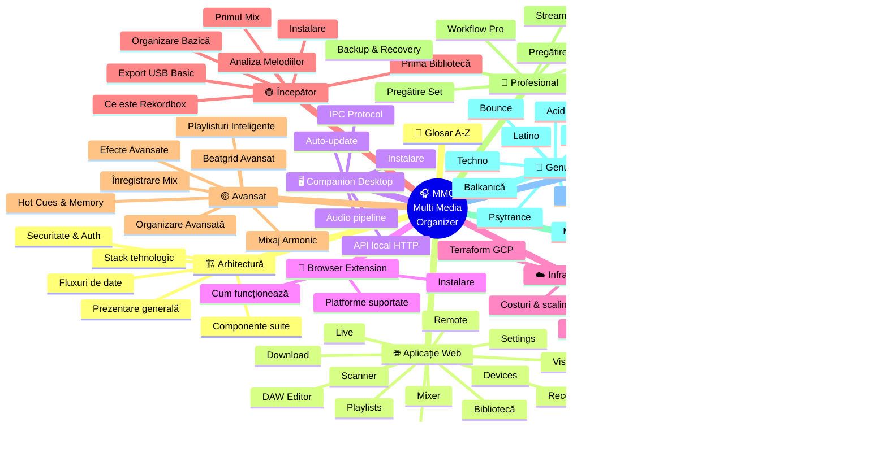

# 🗺️ Navigare Completă — MixAI (Multi Media Organizer)

> **Hartă completă** a tuturor documentelor din acest repository.
> Click pe orice link pentru a naviga direct.

[🏠 Home](README.md) · [🇬🇧 EN](README.en.md) · [🗺️ Plan platformă media](docs/followups/mixai-media-platform-plan.md) · [📜 ADR-uri](#-adr--decizii-arhitecturale) · [🎨 Design system](docs/design-system.md) · [📊 Tracker design](docs/mixai-design-tracker.md)

---

## 📋 Mindmap general

---

## 🏗️ Arhitectură (umbrella)

| Document | Descriere |
|----------|-----------|
| [Prezentare generală](docs/arhitectura/01-prezentare-generala.md) | Ce este suite-ul, scop, audiență |
| [Componente suite](docs/arhitectura/02-componente-suite.md) | Web App + Companion + Extension + Infra — cum se conectează |
| [Stack tehnologic](docs/arhitectura/03-stack-tehnologic.md) | Framework, librării, tooling, motivații |
| [Fluxuri de date](docs/arhitectura/04-fluxuri-date.md) | Web ↔ Companion ↔ Extension ↔ TURN ↔ DB |
| [Securitate & Auth](docs/arhitectura/05-securitate-auth.md) | Auth.js, TURN credentials, CORS, CSP, secrets |

---

## 🌐 Aplicație Web — Ghiduri pe modul

| Modul | Document | Sumar |
|---|---|---|
| 📚 Bibliotecă | [aplicatie/biblioteca.md](docs/aplicatie/biblioteca.md) | Track-uri, filtre, căutare, paginare |
| 🎚️ Mixer | [aplicatie/mixer.md](docs/aplicatie/mixer.md) | Mixer DJ 2-deck, waveform, EQ, FX |
| 🎛️ DAW Editor | [aplicatie/daw-editor.md](docs/aplicatie/daw-editor.md) | Timeline arrangement, clip editing |
| 🎤 Live | [aplicatie/live.md](docs/aplicatie/live.md) | Mod performance live |
| 📡 Remote | [aplicatie/remote.md](docs/aplicatie/remote.md) | Colaborare audio peer-to-peer (WebRTC) |
| 🌈 Visualizations | [aplicatie/visualizations.md](docs/aplicatie/visualizations.md) | Vizualizări audio-reactive |
| ⬇️ Download | [aplicatie/download.md](docs/aplicatie/download.md) | YouTube/SoundCloud/Bandcamp/etc. |
| 🔍 Scanner | [aplicatie/scanner.md](docs/aplicatie/scanner.md) | Watch folders, auto-import |
| 💿 Drive Manager | [aplicatie/drive-manager.md](docs/aplicatie/drive-manager.md) | Detectare drive-uri, format, export USB |
| 📋 Playlists | [aplicatie/playlists.md](docs/aplicatie/playlists.md) | Manuale, smart, recomandări |
| 🎙️ Recordings | [aplicatie/recordings.md](docs/aplicatie/recordings.md) | Salvare, redare, arhivare mixuri |
| 🔌 Devices | [aplicatie/devices.md](docs/aplicatie/devices.md) | Înregistrare & sync companion |
| ⚙️ Settings | [aplicatie/settings.md](docs/aplicatie/settings.md) | Watch folders, music root, preferințe |

---

## 🖥️ MMO Server / MixAI Companion (desktop Electron)

| Document | Descriere |
|----------|-----------|
| [companion/README.md](docs/companion/README.md) | Overview, instalare, UI 3.0, rulare headless pe PC |
| [companion/tunnel-setup.md](docs/companion/tunnel-setup.md) | Cloudflare Tunnel per device (`device-<id>.mixai.ro`) |
| [server/README.md § Endpoints](server/README.md#-endpoints-http-expuse) | HTTP endpoints expuse local pe `:17899` |
| [server/README.md § OpenSubsonic](server/README.md#-opensubsonic-api-rest) | API OpenSubsonic (`/rest/*`) |
| [server/README.md § Release flow](server/README.md#-release-flow) | Auto-update prin GitHub Releases, `companion-release.yml` |
| [aplicatie/pairing.md](docs/aplicatie/pairing.md) | Quick Connect / device-code login |
| [aplicatie/casting.md](docs/aplicatie/casting.md) | Casting (Google Cast, DLNA, Home Assistant) |

---

## 🧩 Browser Extension

| Document | Descriere |
|----------|-----------|
| [extension/README.md](docs/extension/README.md) | Overview & instalare |
| [extension/platforme-suportate.md](docs/extension/platforme-suportate.md) | YouTube, SoundCloud, Spotify, Bandcamp, etc. |
| [extension/cum-functioneaza.md](docs/extension/cum-functioneaza.md) | Content script + background worker |

---

## ☁️ Infrastructură

| Document | Descriere |
|----------|-----------|
| [infra/terraform/README.md](infra/terraform/README.md) | Coturn TURN/STUN pe GCP — provisioning |

---

## 🟢 Începător — Drumul de la Zero (rekordbox)

| # | Document | Descriere |
|---|----------|-----------|
| 1 | [Ce este Rekordbox](docs/incepator/01-ce-este-rekordbox.md) | Software, moduri, licențe |
| 2 | [Instalare & Configurare](docs/incepator/02-instalare-configurare.md) | Setup pas cu pas |
| 3 | [Prima Bibliotecă](docs/incepator/03-prima-biblioteca.md) | Import muzică |
| 4 | [Analiza Melodiilor](docs/incepator/04-analiza-melodiilor.md) | BPM, beatgrid, key |
| 5 | [Organizare Bazică](docs/incepator/05-organizare-bazica.md) | Playlisturi, taguri |
| 6 | [Primul Mix](docs/incepator/06-primul-mix.md) | DDJ-FLX4 primul mix |
| 7 | [Export USB Basic](docs/incepator/07-export-usb-basic.md) | Format & eject |

## 🟡 Avansat

| # | Document | Descriere |
|---|----------|-----------|
| 1 | [Beatgrid Avansat](docs/avansat/01-beatgrid-avansat.md) | Grile complexe, corectare |
| 2 | [Hot Cues & Memory](docs/avansat/02-hot-cues-memory.md) | Strategie cue-uri |
| 3 | [Playlisturi Inteligente](docs/avansat/03-playlisti-inteligente.md) | Smart playlists |
| 4 | [Mixaj Armonic](docs/avansat/04-mixaj-armonic.md) | Camelot wheel |
| 5 | [Efecte Avansate](docs/avansat/05-efecte-avansate.md) | FX chains |
| 6 | [Organizare Avansată](docs/avansat/06-organizare-avansata.md) | Tag system complex |
| 7 | [Înregistrare Mix](docs/avansat/07-inregistrare-mix.md) | Recording & export |

## 🔴 Profesional

| # | Document | Descriere |
|---|----------|-----------|
| 1 | [Workflow Pro](docs/profesional/01-workflow-pro.md) | Pipeline complet |
| 2 | [Pregătire Set](docs/profesional/02-pregatire-set.md) | Set ordering, flow |
| 3 | [Multi-Device](docs/profesional/03-multi-device.md) | CDJ, XDJ, DDJ |
| 4 | [Live Hybrid](docs/profesional/04-live-hybrid.md) | CT + Rekordbox |
| 5 | [Backup & Recovery](docs/profesional/05-backup-disaster.md) | Strategie backup |
| 6 | [Streaming Live](docs/profesional/06-streaming-live.md) | OBS, Twitch |
| 7 | [Pregătire Club](docs/profesional/07-preparare-club.md) | Checklist gig |

---

## 📁 Organizare muzică

| Document | Descriere |
|----------|-----------|
| [Structură Foldere](docs/organizare/structura-foldere.md) | Arhitectura folderelor |
| [Sistem Taguri](docs/organizare/sistem-taguri.md) | 7 dimensiuni de tagging |
| [Convenții Fișiere](docs/organizare/conventii-fisiere.md) | Naming + ID3 |
| [Workflow Scanare](docs/organizare/workflow-scanare.md) | Auto-scan, watch |
| [Gestionare Drive-uri](docs/organizare/gestionare-drive-uri.md) | Multi-drive |
| [Export USB](docs/organizare/export-usb.md) | FAT32, Pioneer folder |
| [BPM / Key / Energy](docs/organizare/bpm-key-energy.md) | Categorizare |
| [Index](docs/organizare/README.md) | Pagina principală secțiune |

---

## 🎵 Genuri muzicale

| Gen | BPM | Document |
|-----|-----|----------|
| Techno | 125–145 | [techno.md](docs/genuri/techno.md) |
| Tech House | 122–128 | [tech-house.md](docs/genuri/tech-house.md) |
| Acid | 125–140 | [acid.md](docs/genuri/acid.md) |
| Psytrance | 138–150 | [psytrance.md](docs/genuri/psytrance.md) |
| Bounce | 150–165 | [bounce.md](docs/genuri/bounce.md) |
| Manele | 85–130 | [manele.md](docs/genuri/manele.md) |
| Populară | 80–140 | [populara.md](docs/genuri/populara.md) |
| Balkanică | 90–160 | [balkanica.md](docs/genuri/balkanica.md) |
| Latino | 85–130 | [latino.md](docs/genuri/latino.md) |
| Fuziune | variabil | [fuziune.md](docs/genuri/fuziune.md) |
| [Index](docs/genuri/README.md) | — | Pagina principală |

---

## 🔌 Echipament

| Document | Descriere |
|----------|-----------|
| [DDJ-FLX4](docs/echipament/ddj-flx4.md) | Controller principal |
| [Circuit Tracks](docs/echipament/circuit-tracks.md) | Groovebox live |
| [MIDI Keyboard](docs/echipament/midi-keyboard.md) | Claviatură live |
| [Upgrade Path](docs/echipament/upgrade-path.md) | Drumul de upgrade |
| [Cabluri](docs/echipament/cabluri-conexiuni.md) | Conexiuni & signal flow |
| [Setup-uri](docs/echipament/setup-uri.md) | Configurații |

---

## 📖 Glosar

| Document | Descriere |
|----------|-----------|
| [Glosar A-Z](docs/glosar/glosar.md) | Toți termenii (DJ, audio, web, MIDI, WebRTC, etc.) |

---

## 💡 Concept & decizii

| Document | Descriere |
|----------|-----------|
| [concept/README.md](docs/concept/README.md) | Brief produs MMO |
| [concept/arhitectura.md](docs/concept/arhitectura.md) | Decizii arhitecturale & istorie |
| [concept/functionalitati.md](docs/concept/functionalitati.md) | Roadmap & feature matrix |
| [design-system.md](docs/design-system.md) | **Sistemul de design MixAI** — tokens OKLCH, dimensiuni de temă, `@mmo/ui`, reguli layout/motion/a11y |
| [mixai-design-tracker.md](docs/mixai-design-tracker.md) | Plan + tracker canonic al overhaul-ului de design (decizii D1–D14, WP0–WP9; CSV în același folder) |
| [concept/ui-ux.md](docs/concept/ui-ux.md) | UI/UX istoric (Music Organizer) — paletă veche, schițe layout |
| [concept/drive-manager.md](docs/concept/drive-manager.md) | Concept Drive Manager |
| [concept/scanner.md](docs/concept/scanner.md) | Concept Scanner |

---

## 📜 ADR — decizii arhitecturale

| ADR | Subiect |
|---|---|
| [0001](docs/adr/0001-naming-mixai-and-mmo-server.md) | Naming: MixAI (produs) + MMO Server (core self-hosted) |
| [0002](docs/adr/0002-mmo-server-headless-core.md) | MMO Server headless (fără Electron), Docker/Pi |
| [0003](docs/adr/0003-casting-strategy.md) | Casting: Google Cast + DLNA + Home Assistant |
| [0005](docs/adr/0005-opensubsonic-api.md) | API OpenSubsonic la `/rest/*` |
| [0006](docs/adr/0006-codai-as-default-ai-provider.md) | codai ca provider AI implicit |
| [0007](docs/adr/0007-licensing-agpl-core-mit-sdk.md) | Licențiere: AGPL core, SDK MIT, comercial pentru cloud |
| [0008](docs/adr/0008-design-system-and-theme-prefs.md) | Design system partajat: tokens OKLCH, Base UI, `mixai:prefs:v1` |
| [0009](docs/adr/0009-remove-third-party-embed-sources.md) | Eliminarea surselor embed terțe (vidsrc & co.) |

> ADR-0004 (aplicațiile TV — Compose/Media3 + Tizen web) e descris în
> [aplicatie/tv-android.md](docs/aplicatie/tv-android.md) și
> [aplicatie/tv-tizen.md](docs/aplicatie/tv-tizen.md).

---

## 📦 Componente repo (READMEs tehnici)

| Path | Descriere |
|------|-----------|
| [apps/web/README.md](apps/web/README.md) | Setup web app dev |
| [server/README.md](server/README.md) | Setup MMO Companion / MMO Server dev (scripts, `app.asar`, release flow) |
| [apps/extension/README.md](apps/extension/README.md) | Setup extensie dev |
| [packages/README.md](packages/README.md) | `@mmo/design-tokens`, `@mmo/ui`, `@mmo/db`, `@mmo/ai`, `@mmo/sdk` |
| [docs/arhitectura/03-stack-tehnologic.md](docs/arhitectura/03-stack-tehnologic.md) | Stack & versiuni livrate |
| [docs/companion/README.md](docs/companion/README.md) | Ghid utilizator Companion (UI 3.0, împachetare) |
| [infra/terraform/README.md](infra/terraform/README.md) | Provisioning infra |

---

## 📜 Documente moștenite (legacy)

> Conținut păstrat din versiunile anterioare ale repo-ului (înainte de extinderea la suite MMO).

| Document | Conținut original |
|----------|-------------------|
| [docs/legacy-readme-rekordbox.md](docs/legacy-readme-rekordbox.md) | README-ul original "rekordbox-mwrty" |
| [docs/legacy-navigare.md](docs/legacy-navigare.md) | NAVIGARE.md original |
| [concept/legacy-app-readme.md](docs/concept/legacy-app-readme.md) | concept/README.md original |
| [concept/legacy-arhitectura.md](docs/concept/legacy-arhitectura.md) | concept/arhitectura.md original (focus app web) |

---

[🏠 Înapoi la Home](README.md)
