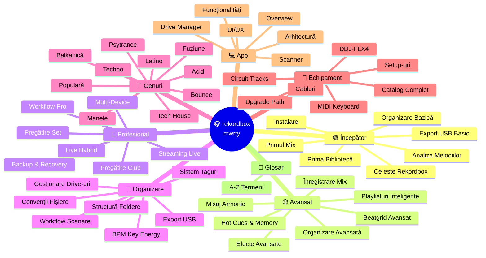

# 🗺️ Navigare Completă — Rekordbox mwrty

> **Hartă completă** a tuturor documentelor din acest repository.
> Click pe orice link pentru a naviga direct.

[🏠 Home](README.md)

---

## 📋 Index Complet

---

## 🟢 Începător — Drumul de la Zero

| # | Document | Descriere |
|---|----------|-----------|
| 1 | [Ce este Rekordbox](docs/incepator/01-ce-este-rekordbox.md) | Software-ul, moduri (Export/Performance), licențe |
| 2 | [Instalare & Configurare](docs/incepator/02-instalare-configurare.md) | Download, instalare, prima configurare |
| 3 | [Prima Bibliotecă](docs/incepator/03-prima-biblioteca.md) | Import muzică din H:\Music, structură |
| 4 | [Analiza Melodiilor](docs/incepator/04-analiza-melodiilor.md) | BPM, beatgrid, key detection, waveform |
| 5 | [Organizare Bazică](docs/incepator/05-organizare-bazica.md) | Playlisturi, foldere, taguri simple |
| 6 | [Primul Mix](docs/incepator/06-primul-mix.md) | Conectare DDJ-FLX4, primul mix |
| 7 | [Export USB Basic](docs/incepator/07-export-usb-basic.md) | Formatare USB, export, eject |

---

## 🟡 Avansat — Tehnici Avansate

| # | Document | Descriere |
|---|----------|-----------|
| 1 | [Beatgrid Avansat](docs/avansat/01-beatgrid-avansat.md) | Grile variabile, corectare manuală |
| 2 | [Hot Cues & Memory](docs/avansat/02-hot-cues-memory.md) | Strategie cue-uri, Intelligent Cues |
| 3 | [Playlisturi Inteligente](docs/avansat/03-playlisti-inteligente.md) | Smart playlists, Collection Radar |
| 4 | [Mixaj Armonic](docs/avansat/04-mixaj-armonic.md) | Camelot wheel, key compatibility |
| 5 | [Efecte Avansate](docs/avansat/05-efecte-avansate.md) | FX chains, Beat FX, Sound Color FX |
| 6 | [Organizare Avansată](docs/avansat/06-organizare-avansata.md) | My Tag, related tracks, rating |
| 7 | [Înregistrare Mix](docs/avansat/07-inregistrare-mix.md) | REC, export WAV/MP3, share |

---

## 🔴 Profesional — Nivel de Club

| # | Document | Descriere |
|---|----------|-----------|
| 1 | [Workflow Pro](docs/profesional/01-workflow-pro.md) | Pipeline complet: descoperire → performance |
| 2 | [Pregătire Set](docs/profesional/02-pregatire-set.md) | Dual Players, set ordering, flow |
| 3 | [Multi-Device](docs/profesional/03-multi-device.md) | CDJ-3000, XDJ-RX3, DDJ-1000 |
| 4 | [Live Hybrid](docs/profesional/04-live-hybrid.md) | CT + Rekordbox + MIDI live |
| 5 | [Backup & Recovery](docs/profesional/05-backup-disaster.md) | Backup bibliotecă, USB de urgență |
| 6 | [Streaming Live](docs/profesional/06-streaming-live.md) | OBS, Twitch/YT, recording pro |
| 7 | [Pregătire Club](docs/profesional/07-preparare-club.md) | Checklist gig, troubleshooting |

---

## 📁 Organizare

| Document | Descriere |
|----------|-----------|
| [Structură Foldere](organizare/structura-foldere.md) | Arhitectura folderelor pe disk |
| [Sistem Taguri](organizare/sistem-taguri.md) | Tag system complet rekordbox |
| [Convenții Fișiere](organizare/conventii-fisiere.md) | Naming conventions |
| [Workflow Scanare](organizare/workflow-scanare.md) | Auto-scan, watch folders |
| [Gestionare Drive-uri](organizare/gestionare-drive-uri.md) | H:\Music, USB-uri, backup |
| [Export USB](organizare/export-usb.md) | FAT32, Pioneer folder, workflow |
| [BPM / Key / Energy](organizare/bpm-key-energy.md) | Categorizare completă |

---

## 🎵 Genuri

| Gen | BPM | Link |
|-----|-----|------|
| Techno | 125–145 | [techno.md](genuri/techno.md) |
| Tech House | 122–128 | [tech-house.md](genuri/tech-house.md) |
| Acid | 125–140 | [acid.md](genuri/acid.md) |
| Psytrance | 138–150 | [psytrance.md](genuri/psytrance.md) |
| Bounce | 150–165 | [bounce.md](genuri/bounce.md) |
| Manele | 85–130 | [manele.md](genuri/manele.md) |
| Populară | 80–140 | [populara.md](genuri/populara.md) |
| Balkanică | 90–160 | [balkanica.md](genuri/balkanica.md) |
| Latino | 85–130 | [latino.md](genuri/latino.md) |
| Fuziune | variabil | [fuziune.md](genuri/fuziune.md) |

---

## 🔌 Echipament

| Document | Descriere |
|----------|-----------|
| [DDJ-FLX4](echipament/ddj-flx4.md) | Controller principal |
| [Circuit Tracks](echipament/circuit-tracks.md) | Groovebox live |
| [MIDI Keyboard](echipament/midi-keyboard.md) | Claviatură live |
| [Upgrade Path](echipament/upgrade-path.md) | Drumul de upgrade |
| [Catalog Complet](echipament/echipament-complet.md) | Toate echipamentele |
| [Cabluri](echipament/cabluri-conexiuni.md) | Conexiuni & signal flow |
| [Setup-uri](echipament/setup-uri.md) | Configurații recomandate |

---

## 💻 App

| Document | Descriere |
|----------|-----------|
| [Overview](app/README.md) | Concept aplicație |
| [Arhitectură](app/arhitectura.md) | Structura tehnică |
| [UI/UX](app/ui-ux.md) | Design interfață |
| [Funcționalități](app/functionalitati.md) | Features list |
| [Drive Manager](app/drive-manager.md) | Modul drive-uri |
| [Scanner](app/scanner.md) | Modul scanare |

---

## 📖 Glosar

| Document | Descriere |
|----------|-----------|
| [Glosar A-Z](glosar/glosar.md) | Toți termenii DJ & muzicali |

---

[🏠 Înapoi la Home](README.md)
