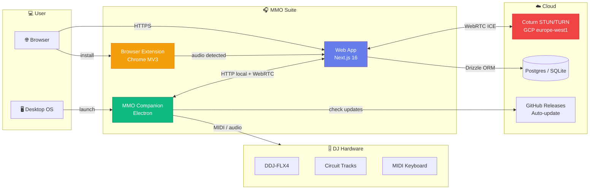

# 🎧 MixAI — Multi Media Organizer

> **Movies, music, DJ, on every screen.**
> Self-hosted **MMO Server** (Raspberry Pi, PC, Docker) + MixAI apps (web, Companion, DJ, TV, mobile).
> Live domain: [mixai.ro](https://mixai.ro) · Source: [github.com/dragoscv/mmo](https://github.com/dragoscv/mmo)
> Media platform plan: [docs/followups/mixai-media-platform-plan.md](docs/followups/mixai-media-platform-plan.md)

[](https://github.com/dragoscv/mmo)
[](LICENSE)
[](https://github.com/dragoscv/mmo/releases)

[🇷🇴 Română](README.md) · 🇬🇧 **English** (this file)

---

## ⚡ What is MixAI?

MixAI is a self-hosted media platform that organizes, analyzes and plays your movies and music — with a DJ mixer/DAW and AI at every step. It started as a personal rekordbox guide and grew into an ecosystem of components that work together:

| Component | Purpose | Path |
|---|---|---|
| 🌐 **MixAI (web)** | Library, movies, mixer, DAW, live, scanner, recordings, visualizations | [`apps/web/`](apps/web/) |
| 🖥️ **MMO Server** (MixAI Companion) | Self-hosted media server — local audio, transcoding, native bridge | [`server/`](server/) |
| 🎛️ **MixAI DJ** | Native DJ app (Tauri 2 + Rust audio) | [`apps/mixai/`](apps/mixai/) |
| 📱 **MixAI Native** | Desktop (Tauri) + mobile/TV (Capacitor) | [`apps/native/`](apps/native/) |
| 🧩 **Browser Extension** | Detects & downloads audio from 15+ streaming platforms | [`apps/extension/`](apps/extension/) |
| ☁️ **Infrastructure** | TURN/STUN server on GCP for WebRTC remote | [`infra/terraform/`](infra/terraform/) |
| 📚 **Docs** | Rekordbox DJ guides, organization, genres, gear | [`docs/`](docs/), [`organizare/`](docs/organizare/), [`genuri/`](docs/genuri/), [`echipament/`](docs/echipament/) |

> **Note**: end-user docs (genres, gear, music theory) are written in **Romanian**. This README and architectural docs have an English mirror. Code, comments, commit messages, and issue tracker are in **English**.

---

## 🗺️ Suite Architecture



---

## 🎯 Who is it for?

### 🎧 End users — DJs & Producers

- **Organize** a large music library (BPM, key, energy, tags, smart folders)
- **Mix** live with DDJ-FLX4 or any MIDI controller
- **Record** mixes and collaborate remotely (peer-to-peer WebRTC)
- **Prepare** USBs for CDJs / XDJs in the club
- **Download** music from YouTube, SoundCloud, Bandcamp, etc. straight into the library
- **Learn** rekordbox, professional organization, harmonic mixing
- **Watch** movies and shows from every MMO Server you own on **Media Home** (`/`): one hero,
  rows merged across servers (TMDB dedupe), "Continue watching" shared between web and TV, and
  provider deep links (Netflix, HBO Max, Disney+ …) for titles you don't have
  ([ADR-0010](docs/adr/0010-media-module-and-media-home.md))

### 👨‍💻 Contributors & Developers

- Contribute to the web app (Next.js 16 / React 19 / Drizzle / Auth.js v5)
- Work on the Electron companion (native audio, IPC, auto-update)
- Add support for a new platform in the browser extension
- Manage infrastructure (Terraform / GCP / coturn)

---

## 🚀 Quick Start

### For users

```bash
# 1. Open web app in browser
open https://mixai.ro              # production
# or run locally:
cd app && pnpm install && pnpm dev # → http://localhost:3000

# 2. Install MMO Companion (optional, for native audio)
# Download from: https://github.com/dragoscv/mmo/releases/latest
#  - MMO-Companion-Setup-X.Y.Z.exe (Windows)
#  - MMO-Companion-X.Y.Z-arm64.dmg (macOS Apple Silicon)
#  - MMO-Companion-X.Y.Z-x64.dmg (macOS Intel)
#  - MMO-Companion-X.Y.Z.AppImage (Linux)

# 3. Install Chrome Extension (optional, for downloads)
# Load `extension/` as an unpacked extension in chrome://extensions
```

### For contributors

```bash
git clone https://github.com/dragoscv/mmo.git
cd mmo

# Web app
cd app
pnpm install
cp .env.example .env.local         # edit secrets
pnpm db:generate && pnpm db:migrate
pnpm dev                            # → http://localhost:3000

# Companion (Electron)
cd ../server
pnpm install
pnpm dev                            # starts Electron in dev mode

# Extension
# Load `extension/` as an unpacked extension in Chrome
```

→ Full details: [docs/arhitectura/02-componente-suite.md](docs/arhitectura/02-componente-suite.md)

---

## 🛠️ Tech Stack

**Web App** ([apps/web/](apps/web/))
- Next.js 16 (App Router, RSC, Server Actions, Turbopack, React Compiler)
- React 19.2 + TypeScript 5.8 strict
- Drizzle ORM + better-sqlite3 (local) / Postgres (prod)
- Auth.js v5 (next-auth beta) + Drizzle adapter
- Tailwind CSS v4 + shadcn/ui + Radix + framer-motion
- Audio: music-metadata, node-id3, Web Audio API, recharts
- Realtime: SSE + WebRTC (ice-servers ↔ coturn)

**Companion** ([server/](server/))
- Electron + TypeScript + electron-builder
- Local Express HTTP + IPC bridge
- Native audio + watch folders (chokidar)
- Auto-update via GitHub Releases

**Extension** ([apps/extension/](apps/extension/))
- Chrome Manifest V3
- Content scripts for 15 platforms
- Background service worker

**Infrastructure** ([infra/terraform/](infra/terraform/))
- Terraform → GCP (e2-micro VM Debian 12 + static IP)
- coturn STUN/TURN (3478 UDP/TCP, 49160-49200 UDP relay)
- Cost: ~$7.5/month

---

## 📂 Repository Layout

```
mmo/
├── apps/
│   ├── web/                🌐 Next.js 16 web app
│   ├── extension/          🧩 Browser extension
│   └── native/             📱 Tauri (desktop) + Capacitor (mobile)
├── packages/               📦 Shared core (@mmo/ai, audio-gen, ai-mcp, sdk)
├── server/                 🖥️ MMO Companion (Electron)
├── infra/terraform/        ☁️ Coturn TURN/STUN on GCP
├── docs/                   📚 Technical & user docs
│   ├── arhitectura/        Umbrella architecture
│   ├── aplicatie/          Per-module web app guides
│   ├── companion/          Companion desktop guide
│   ├── extension/          Browser extension guide
│   ├── incepator/, avansat/, profesional/   Rekordbox guides (RO)
│   ├── concept/            💡 Product concept & decisions
│   ├── organizare/         📁 Music organization system (RO)
│   ├── genuri/             🎵 Per-genre guides (RO)
│   ├── echipament/         🔌 DJ hardware (RO)
│   ├── glosar/             📖 Terminology A-Z (RO)
│   └── versuri/            🎤 Lyrics (RO)
├── artifacts/              📦 Release builds (DMG/EXE/AppImage)
├── README.md               🇷🇴 Romanian (primary)
├── README.en.md            👈 You are here
├── NAVIGARE.md             Full sitemap (RO)
└── CHANGELOG.md            Release notes
```

---

## 🤝 Contributing

Contributions are welcome! See [CONTRIBUTING.md](CONTRIBUTING.md) (TBD) for guidelines.

Before opening a PR:
1. Read [docs/arhitectura/](docs/arhitectura/) for context
2. Run `pnpm typecheck` and `pnpm lint` (CI runs them anyway)
3. Use Conventional Commits for the PR title
4. Update docs if you change user-facing behavior

---

## 🏷️ Naming

- **MixAI** — the brand and the user-facing apps (web, Companion, DJ, TV, mobile), domain `mixai.ro`.
- **MMO Server** — the self-hosted media server (formerly “Companion”), package `mmo-server`.
- **MMO** (Multi Media Organizer) — the repo name and technical identifiers (`@mmo/*`, `mmo-*`).

Rationale: [ADR-0001](docs/adr/0001-naming-mixai-and-mmo-server.md). All architecture decisions: [`docs/adr/`](docs/adr/).

---

## 📄 License

- Core (MMO Server + web app): **AGPL-3.0-only** — see [`LICENSE`](LICENSE).
- `packages/sdk`: **MIT** — see [`packages/sdk/LICENSE`](packages/sdk/LICENSE).
- Commercial licence for MixAI cloud / Pro: [`COMMERCIAL-LICENSE.md`](COMMERCIAL-LICENSE.md).
- MixAI / MMO Server names and logos: [`TRADEMARKS.md`](TRADEMARKS.md).

Decision: [ADR-0007](docs/adr/0007-licensing-agpl-core-mit-sdk.md). © 2024-2026 Dragos Catalin Vladulescu (`mwrty`)

---

## 🔗 Links

- 🌐 **Live**: [mixai.ro](https://mixai.ro)
- 🗺️ **Media platform plan**: [docs/followups/mixai-media-platform-plan.md](docs/followups/mixai-media-platform-plan.md)
- 📦 **Releases**: [github.com/dragoscv/mmo/releases](https://github.com/dragoscv/mmo/releases)
- 🐛 **Issues**: [github.com/dragoscv/mmo/issues](https://github.com/dragoscv/mmo/issues)

---

*Built with ❤️ in Romania — by **mwrty** (DJ + dev)*
