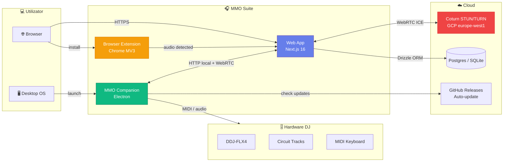

# 🎧 MuzicAI — AI Music Suite

> **Suită open-source AI pentru DJ-i, producători și pasionați de muzică.**
> Web app · desktop companion · extensie browser · infrastructură live.
> Domeniu live: [muzicai.ro](https://muzicai.ro) · Cod sursă: [github.com/dragoscv/mmo](https://github.com/dragoscv/mmo)

[](https://github.com/dragoscv/mmo)
[](LICENSE)
[](https://github.com/dragoscv/mmo/releases)

🇷🇴 **Română** (acest fișier) · [🇬🇧 English](README.en.md)

---

## ⚡ Ce este MuzicAI?

MuzicAI este o suită AI completă pentru organizarea, analiza, mixajul și performance-ul live cu muzică. Pornit ca ghid personal pentru rekordbox, a evoluat într-un ecosistem cu mai multe componente care lucrează împreună:

| Componentă | Ce face | Cale |
|---|---|---|
| 🌐 **Web App** | Bibliotecă, mixer, DAW, live, scanner, recordings, vizualizări | [`apps/web/`](apps/web/) |
| 🖥️ **MMO Companion** | App Electron desktop — server local audio + bridge nativ | [`server/`](server/) |
| 🧩 **Browser Extension** | Detectează & descarcă audio din 15+ platforme streaming | [`apps/extension/`](apps/extension/) |
| ☁️ **Infrastructură** | Server TURN/STUN pe GCP pentru WebRTC remote | [`infra/terraform/`](infra/terraform/) |
| 📚 **Documentație** | Ghiduri DJ rekordbox, organizare, genuri, echipament | [`docs/`](docs/), [`organizare/`](docs/organizare/), [`genuri/`](docs/genuri/), [`echipament/`](docs/echipament/) |

---

## 🗺️ Arhitectura suitei



---

## 🎯 Pentru cine este?

### 🎧 Utilizatori finali — DJ-i & Producători

- **Organizezi** o bibliotecă mare de muzică (BPM, key, energie, taguri, foldere inteligente)
- **Mixezi** live cu DDJ-FLX4 sau alt controller MIDI
- **Înregistrezi** mixuri și colaborezi remote (WebRTC peer-to-peer)
- **Pregătești** USB-uri pentru CDJ-uri / XDJ în club
- **Descarci** muzică din YouTube, SoundCloud, Bandcamp etc. direct în bibliotecă
- **Înveți** rekordbox, organizare profesională, mixaj armonic

→ Începe cu [Ghid Utilizator](#-ghid-utilizator)

### 👨‍💻 Contributors & Dezvoltatori

- Contribuți la web app (Next.js 16 / React 19 / Drizzle / Auth.js v5)
- Lucrezi la companion-ul Electron (audio nativ, IPC, auto-update)
- Adaugi suport pentru o platformă nouă în extensia browser
- Configurezi infrastructura (Terraform / GCP / coturn)

→ Sari la [Ghid Contributor](#-ghid-contributor)

---

## 🚀 Quick Start

### Pentru utilizatori

```bash
# 1. Deschide web app în browser
open https://muzicai.ro            # producție
# sau pornește local:
cd app && pnpm install && pnpm dev # → http://localhost:3000

# 2. Instalează MMO Companion (opțional, pentru audio nativ)
# Descarcă din: https://github.com/dragoscv/mmo/releases/latest
#  - MMO-Companion-Setup-X.Y.Z.exe (Windows)
#  - MMO-Companion-X.Y.Z-arm64.dmg (macOS Apple Silicon)
#  - MMO-Companion-X.Y.Z-x64.dmg (macOS Intel)
#  - MMO-Companion-X.Y.Z.AppImage (Linux)

# 3. Instalează Extensia Chrome (opțional, pentru download)
# Încarcă folderul `extension/` ca extensie nepachetată în chrome://extensions
```

### Pentru contributors

```bash
# Clonează & instalează
git clone https://github.com/dragoscv/mmo.git
cd mmo

# Web app
cd app
pnpm install
cp .env.example .env.local         # editează secretele
pnpm db:generate && pnpm db:migrate
pnpm dev                            # → http://localhost:3000

# Companion (Electron)
cd ../server
pnpm install
pnpm dev                            # pornește Electron în dev mode

# Extension
# Încarcă folderul `extension/` ca extensie nepachetată în Chrome
```

→ Detalii complete: [docs/arhitectura/02-componente-suite.md](docs/arhitectura/02-componente-suite.md)

---

## 📚 Ghid Utilizator

### Aplicație web — pe module

| Modul | Ce face | Doc |
|---|---|---|
| 📚 **Bibliotecă** | Track-uri, filtre (BPM, key, energie, gen, taguri), căutare | [docs/aplicatie/biblioteca.md](docs/aplicatie/biblioteca.md) |
| 🎚️ **Mixer** | Mixer DJ 2-deck cu waveform, EQ, FX, jog, sync | [docs/aplicatie/mixer.md](docs/aplicatie/mixer.md) |
| 🎛️ **DAW / Editor** | Timeline arrangement, clip editing, fade, slice | [docs/aplicatie/daw-editor.md](docs/aplicatie/daw-editor.md) |
| 🎤 **Live** | Mod performance live (controllere + sample triggers) | [docs/aplicatie/live.md](docs/aplicatie/live.md) |
| 📡 **Remote** | Colaborare audio peer-to-peer (WebRTC + TURN) | [docs/aplicatie/remote.md](docs/aplicatie/remote.md) |
| 🌈 **Visualizations** | Vizualizări audio-reactive (waveform, FFT, shaders) | [docs/aplicatie/visualizations.md](docs/aplicatie/visualizations.md) |
| ⬇️ **Download** | Descărcare YouTube/SoundCloud/Bandcamp/etc. | [docs/aplicatie/download.md](docs/aplicatie/download.md) |
| 🔍 **Scanner** | Watch folders, auto-import, analiză BPM/key/gen | [docs/aplicatie/scanner.md](docs/aplicatie/scanner.md) |
| 💿 **Drive Manager** | Detectare drive-uri, format, export USB pentru CDJ | [docs/aplicatie/drive-manager.md](docs/aplicatie/drive-manager.md) |
| 📋 **Playlists** | Playlisturi manuale & smart, recomandări | [docs/aplicatie/playlists.md](docs/aplicatie/playlists.md) |
| 🎙️ **Recordings** | Salvare, redare, arhivare mixuri | [docs/aplicatie/recordings.md](docs/aplicatie/recordings.md) |
| 🔌 **Devices** | Înregistrare & sync cu MMO Companion | [docs/aplicatie/devices.md](docs/aplicatie/devices.md) |
| ⚙️ **Settings** | Watch folders, music root, preferințe | [docs/aplicatie/settings.md](docs/aplicatie/settings.md) |

### Componente externe

- 🖥️ **MMO Companion** — [docs/companion/](docs/companion/) (instalare, IPC, audio pipeline, auto-update)
- 🧩 **Extensia Chrome** — [docs/extension/](docs/extension/) (instalare, platforme suportate, troubleshooting)

### Cunoștințe DJ (rekordbox + organizare + genuri + echipament)

| Categorie | Conținut |
|---|---|
| 🟢 [Începător](docs/incepator/) | Ce e rekordbox, instalare, prima bibliotecă, primul mix, export USB de bază |
| 🟡 [Avansat](docs/avansat/) | Beatgrid, hot cues, smart playlists, mixaj armonic, FX, recording |
| 🔴 [Profesional](docs/profesional/) | Workflow pro, multi-device, live hybrid, backup, streaming, gig prep |
| 📁 [Organizare](docs/organizare/) | Structură foldere, sistem taguri, naming, watch, drive-uri, USB |
| 🎵 [Genuri](docs/genuri/) | Techno, tech-house, acid, psy, bounce, manele, populară, balkanică, latino, fuziune |
| 🔌 [Echipament](docs/echipament/) | DDJ-FLX4, Circuit Tracks, MIDI, cabluri, setup-uri, upgrade path |
| 📖 [Glosar](docs/glosar/glosar.md) | Toți termenii A-Z (BPM, key, cue, FX, stems, etc.) |

---

## 👨‍💻 Ghid Contributor

### Stack tehnologic

**Web App** ([apps/web/](apps/web/))
- Next.js 16 (App Router, RSC, Server Actions, Turbopack, React Compiler)
- React 19.2 + TypeScript 5.8 strict
- Drizzle ORM + better-sqlite3 (local) / Postgres (prod)
- Auth.js v5 (next-auth beta) + Drizzle adapter
- Tailwind CSS v4 + shadcn/ui + Radix + framer-motion
- Audio: music-metadata, node-id3, Web Audio API, recharts
- Realtime: SSE + WebRTC (ice-servers ↔ coturn)

**Companion** ([server/](server/))
- Electron + TypeScript + electron-builder
- Express HTTP local + IPC bridge
- Audio nativ + watch folders (chokidar)
- Auto-update prin GitHub Releases

**Extension** ([apps/extension/](apps/extension/))
- Chrome Manifest V3
- Content scripts pentru 15 platforme
- Service worker background

**Infrastructură** ([infra/terraform/](infra/terraform/))
- Terraform → GCP (e2-micro VM Debian 12 + static IP)
- coturn STUN/TURN (3478 UDP/TCP, 49160-49200 UDP relay)
- Cost: ~$7.5/lună

### Documentație tehnică

| Doc | Subiect |
|---|---|
| [docs/arhitectura/01-prezentare-generala.md](docs/arhitectura/01-prezentare-generala.md) | Privire de ansamblu suite |
| [docs/arhitectura/02-componente-suite.md](docs/arhitectura/02-componente-suite.md) | Cum se conectează componentele |
| [docs/arhitectura/03-stack-tehnologic.md](docs/arhitectura/03-stack-tehnologic.md) | Lista completă tooling + de ce |
| [docs/arhitectura/04-fluxuri-date.md](docs/arhitectura/04-fluxuri-date.md) | Web ↔ Companion ↔ Extension ↔ TURN |
| [docs/arhitectura/05-securitate-auth.md](docs/arhitectura/05-securitate-auth.md) | Auth.js, TURN credentials, CORS, CSP |
| [apps/web/README.md](apps/web/README.md) | Setup web app dev |
| [server/README.md](server/README.md) | Setup companion dev |
| [apps/extension/README.md](apps/extension/README.md) | Setup extensie dev |
| [infra/terraform/README.md](infra/terraform/README.md) | Provisioning infrastructură |

### Convenții repo

- **Limbă**: comentarii cod în EN, docs principale în RO (mirror EN pentru cele importante)
- **Commits**: [Conventional Commits](https://www.conventionalcommits.org/) — `feat:`, `fix:`, `chore:`, `docs:`, etc.
- **Branch**: `main` protejat; PR-uri prin feature branches
- **Versionare**: SemVer; companion auto-tag-uit `v0.x.y` de electron-builder
- **CI/CD**: GitHub Actions — `companion-release.yml` build + publish pe tag

→ Detalii: [docs/arhitectura/](docs/arhitectura/)

---

## 🗺️ Navigare completă

Pentru harta completă a documentației: [**NAVIGARE.md**](NAVIGARE.md)

---

## 📂 Structura repository

```
mmo/
├── apps/
│   ├── web/                🌐 Web app Next.js 16
│   ├── extension/          🧩 Browser extension
│   └── native/             📱 Tauri (desktop) + Capacitor (mobile)
├── packages/               📦 Shared core (@mmo/ai, audio-gen, ai-mcp, sdk)
├── server/                 🖥️ MMO Companion (Electron)
├── infra/terraform/        ☁️ Coturn TURN/STUN pe GCP
├── docs/                   📚 Documentație tehnică & user guides
│   ├── arhitectura/        Arhitectură umbrella
│   ├── aplicatie/          User guides per modul web app
│   ├── companion/          Ghid Companion desktop
│   ├── extension/          Ghid Extensie browser
│   ├── incepator/          🟢 Rekordbox 101
│   ├── avansat/            🟡 Rekordbox tehnici avansate
│   ├── profesional/        🔴 Rekordbox workflow pro
│   ├── concept/            💡 Concept produs & decizii
│   ├── organizare/         📁 Sistem organizare muzică
│   ├── genuri/             🎵 Ghiduri per gen muzical
│   ├── echipament/         🔌 Hardware DJ
│   ├── glosar/             📖 Termeni A-Z
│   └── versuri/            🎤 Versuri (lyrics)
├── artifacts/              📦 Build-uri releases (DMG/EXE/AppImage)
├── README.md               👈 Ești aici
├── README.en.md            English mirror
├── NAVIGARE.md             Sitemap complet
└── CHANGELOG.md            Release notes
```

---

## 🤝 Contribuții

Contribuțiile sunt binevenite! Vezi [CONTRIBUTING.md](CONTRIBUTING.md) (TBD) pentru ghid.

Înainte să deschizi un PR:
1. Citește [docs/arhitectura/](docs/arhitectura/) pentru context
2. Rulează `pnpm typecheck` și `pnpm lint` (CI le rulează oricum)
3. Conventional commit pentru titlul PR-ului
4. Update docs dacă schimbi comportament user-facing

---

## 📄 Licență

MIT © 2024-2026 Dragoș Cătălin Vlăduțescu (`mwrty`)

---

## 🔗 Linkuri utile

- 🌐 **Live**: [muzicai.ro](https://muzicai.ro)
- 📦 **Releases**: [github.com/dragoscv/mmo/releases](https://github.com/dragoscv/mmo/releases)
- 🐛 **Issues**: [github.com/dragoscv/mmo/issues](https://github.com/dragoscv/mmo/issues)
- 📚 **Docs**: această pagină + [NAVIGARE.md](NAVIGARE.md)

---

*Built with ❤️ în România — by **mwrty** (DJ + dev)*
