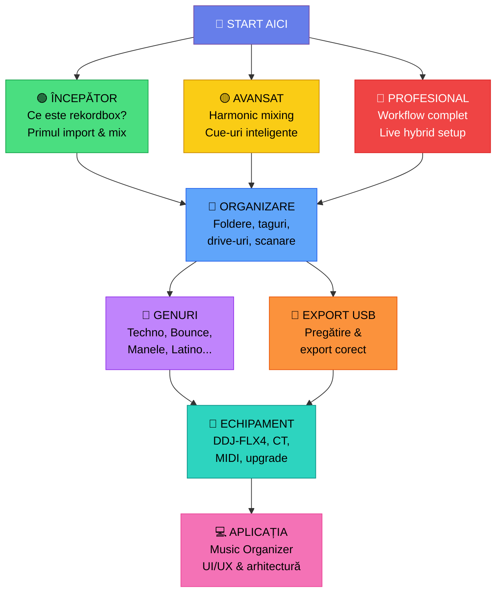

# 🎧 Rekordbox — Ghid Complet pentru DJ & Live Performance

> **mwrty** — De la zero la DJ/Live Performer profesionist.
> Organizare muzică, workflow rekordbox 7, export USB, integrare Circuit Tracks + DDJ-FLX4.

---

## 🗺️ Navigare Principală



---

## 🚀 Setup Rapid — De Unde Începi?

| # | Situație | Link Direct |
|---|----------|-------------|
| 1 | **Complet nou?** Începe aici | [Ce este Rekordbox](docs/incepator/01-ce-este-rekordbox.md) |
| 2 | **Am rekordbox**, vreau să organizez | [Sistem de Organizare](organizare/README.md) |
| 3 | **Am muzică**, vreau să export pe USB | [Export USB Complet](organizare/export-usb.md) |
| 4 | **Vreau să mixez** cu DDJ-FLX4 | [Ghid DDJ-FLX4](echipament/ddj-flx4.md) |
| 5 | **Circuit Tracks** + Rekordbox? | [Integrare CT](echipament/circuit-tracks.md) |
| 6 | **Ce gen** ar trebui să mixez? | [Harta Genurilor](genuri/README.md) |
| 7 | **Nu înțeleg** un termen? | [Glosar Complet](glosar/glosar.md) |
| 8 | **Vreau aplicația** de organizat | [App Music Organizer](app/README.md) |

---

## 📚 Documentație pe Nivel

### 🟢 Începător

| # | Lecție | Descriere |
|---|--------|-----------|
| 1 | [Ce este Rekordbox](docs/incepator/01-ce-este-rekordbox.md) | Software-ul, moduri, licențe, ce face |
| 2 | [Instalare & Configurare](docs/incepator/02-instalare-configurare.md) | Setup pas cu pas pe Windows |
| 3 | [Prima Bibliotecă](docs/incepator/03-prima-biblioteca.md) | Import muzică, foldere, analiza automată |
| 4 | [Analiza Melodiilor](docs/incepator/04-analiza-melodiilor.md) | BPM, beatgrid, key, waveform |
| 5 | [Organizare Bazică](docs/incepator/05-organizare-bazica.md) | Playlisturi, foldere, taguri simple |
| 6 | [Primul Mix](docs/incepator/06-primul-mix.md) | Primul mix cu DDJ-FLX4 |
| 7 | [Export USB — Bazic](docs/incepator/07-export-usb-basic.md) | Primul export pe USB |

### 🟡 Avansat

| # | Lecție | Descriere |
|---|--------|-----------|
| 1 | [Beatgrid Avansat](docs/avansat/01-beatgrid-avansat.md) | Corectare manuală, grile complexe |
| 2 | [Hot Cues & Memory](docs/avansat/02-hot-cues-memory.md) | Cue-uri strategice, Intelligent Cues |
| 3 | [Playlisturi Inteligente](docs/avansat/03-playlisti-inteligente.md) | Smart playlists, filtre avansate |
| 4 | [Mixaj Armonic](docs/avansat/04-mixaj-armonic.md) | Camelot wheel, harmonic mixing |
| 5 | [Efecte Avansate](docs/avansat/05-efecte-avansate.md) | FX chains, performance pads |
| 6 | [Organizare Avansată](docs/avansat/06-organizare-avansata.md) | Tag system complex, My Tag |
| 7 | [Înregistrare Mix](docs/avansat/07-inregistrare-mix.md) | Recording și export |

### 🔴 Profesional

| # | Lecție | Descriere |
|---|--------|-----------|
| 1 | [Workflow Profesional](docs/profesional/01-workflow-pro.md) | De la descoperire la performance |
| 2 | [Pregătire Set](docs/profesional/02-pregatire-set.md) | Set profesional pas cu pas |
| 3 | [Multi-Device Setup](docs/profesional/03-multi-device.md) | CDJ, XDJ, DDJ — toate setup-urile |
| 4 | [Live Hybrid](docs/profesional/04-live-hybrid.md) | Rekordbox + Circuit Tracks live |
| 5 | [Backup & Recovery](docs/profesional/05-backup-disaster.md) | Backup, recovery, migrare |
| 6 | [Streaming & Recording](docs/profesional/06-streaming-live.md) | Streaming live, recording pro |
| 7 | [Pregătire Club/Festival](docs/profesional/07-preparare-club.md) | Checklist pentru gig real |

---

## 📁 Organizare Muzică

| Document | Ce Găsești |
|----------|-----------|
| [📁 Structură Foldere](organizare/structura-foldere.md) | Cum structurezi H:\Music și alte drive-uri |
| [🏷️ Sistem Taguri](organizare/sistem-taguri.md) | Tag system complet pentru rekordbox |
| [📝 Convenții Fișiere](organizare/conventii-fisiere.md) | Naming conventions pentru track-uri |
| [🔍 Workflow Scanare](organizare/workflow-scanare.md) | Scanare automată, watch folders |
| [💿 Gestionare Drive-uri](organizare/gestionare-drive-uri.md) | Multiple drive-uri, surse, export-uri |
| [💾 Export USB Complet](organizare/export-usb.md) | Export USB pas cu pas |
| [📊 BPM / Key / Energy](organizare/bpm-key-energy.md) | Categorizare completă |

---

## 🎵 Genuri Muzicale

| Gen | BPM | Vibe | Link |
|-----|-----|------|------|
| ⚫ Techno | 125–145 | Dark, industrial, repetitiv | [techno.md](genuri/techno.md) |
| 🟤 Tech House | 122–128 | Groovy, funky, dans | [tech-house.md](genuri/tech-house.md) |
| 🟣 Acid | 125–140 | 303, squelchy, hypnotic | [acid.md](genuri/acid.md) |
| 🟠 Psytrance | 138–150 | Psychedelic, intense, trippy | [psytrance.md](genuri/psytrance.md) |
| 🔴 Bounce | 150–165 | High energy, donk, euphoric | [bounce.md](genuri/bounce.md) |
| 🟡 Manele | 85–130 | Românesc, emoțional, dans | [manele.md](genuri/manele.md) |
| 🟢 Populară | 80–140 | Tradițional, hora, sârba | [populara.md](genuri/populara.md) |
| 🔵 Balkanică | 90–160 | Energic, brass, percuție | [balkanica.md](genuri/balkanica.md) |
| 🟠 Latino | 85–130 | Reggaeton, salsa, cumbia | [latino.md](genuri/latino.md) |
| 🌈 Fuziune | variabil | Combinații creative | [fuziune.md](genuri/fuziune.md) |

---

## 🔌 Echipament

| Document | Ce Găsești |
|----------|-----------|
| [🎛️ DDJ-FLX4](echipament/ddj-flx4.md) | Ghid complet controller-ul tău |
| [🎹 Circuit Tracks](echipament/circuit-tracks.md) | Integrare cu rekordbox |
| [🎹 MIDI Keyboard](echipament/midi-keyboard.md) | Claviatură MIDI live |
| [📈 Drumul de Upgrade](echipament/upgrade-path.md) | Ce cumperi și când |
| [🛒 Catalog Echipamente](echipament/echipament-complet.md) | Toate echipamentele pe categorii |
| [🔌 Cabluri & Conexiuni](echipament/cabluri-conexiuni.md) | Signal flow, cabluri |
| [🎚️ Setup-uri Recomandate](echipament/setup-uri.md) | Setup per nivel |

---

## 💻 Aplicația Music Organizer

| Document | Ce Găsești |
|----------|-----------|
| [📋 Overview](app/README.md) | Ce este și de ce |
| [🏗️ Arhitectură](app/arhitectura.md) | Arhitectura tehnică |
| [🎨 UI/UX Design](app/ui-ux.md) | Design complet interfață |
| [📋 Funcționalități](app/functionalitati.md) | Lista completă de features |
| [💿 Drive Manager](app/drive-manager.md) | Modul management drive-uri |
| [🔍 Scanner Muzical](app/scanner.md) | Modul scanner & watch |

---

## 📖 Glosar & Referință

| Document | Ce Găsești |
|----------|-----------|
| [📖 Glosar Complet A-Z](glosar/glosar.md) | Toți termenii explicați |
| [🗺️ Navigare Completă](NAVIGARE.md) | Hartă completă a repo-ului |

---

## 🎯 Setup-ul Meu Actual

```
┌─────────────────────────────────────────────────────┐
│  🎧 mwrty — DJ & Live Performer Setup               │
│                                                      │
│  🎛️ DDJ-FLX4          — Controller DJ (rekordbox)   │
│  🎹 Circuit Tracks     — Groovebox (synths + drums) │
│  🎹 MIDI Keyboard      — Piano live (ocazional)     │
│  💻 Laptop + rekordbox 7                             │
│  📁 H:\Music           — Folder principal muzică    │
│                                                      │
│  🎵 Genuri preferate:                                │
│     Bounce · Techno · Acid · Psy · Tech House       │
│     Manele · Populară · Balkanică · Latino           │
└─────────────────────────────────────────────────────┘
```

---

## 📂 Structura Repository

```
rekordbox-mwrty/
├── README.md                    ← Ești aici
├── NAVIGARE.md                  ← Hartă completă
│
├── docs/
│   ├── incepator/               ← 🟢 7 lecții pentru începători
│   ├── avansat/                 ← 🟡 7 lecții avansate
│   └── profesional/             ← 🔴 7 lecții profesionale
│
├── organizare/                  ← 📁 Sistem de organizare muzică
│   ├── structura-foldere.md
│   ├── sistem-taguri.md
│   ├── conventii-fisiere.md
│   ├── workflow-scanare.md
│   ├── gestionare-drive-uri.md
│   ├── export-usb.md
│   └── bpm-key-energy.md
│
├── genuri/                      ← 🎵 Ghiduri per gen muzical
│   ├── techno.md
│   ├── tech-house.md
│   ├── acid.md
│   ├── psytrance.md
│   ├── bounce.md
│   ├── manele.md
│   ├── populara.md
│   ├── balkanica.md
│   ├── latino.md
│   └── fuziune.md
│
├── echipament/                  ← 🔌 Ghiduri echipament
│   ├── ddj-flx4.md
│   ├── circuit-tracks.md
│   ├── midi-keyboard.md
│   ├── upgrade-path.md
│   ├── echipament-complet.md
│   ├── cabluri-conexiuni.md
│   └── setup-uri.md
│
├── app/                         ← 💻 Aplicația Music Organizer
│   ├── README.md
│   ├── arhitectura.md
│   ├── ui-ux.md
│   ├── functionalitati.md
│   ├── drive-manager.md
│   └── scanner.md
│
└── glosar/                      ← 📖 Glosar A-Z
    └── glosar.md
```

---

> **Repo companion:** [circuit-tracks-mwrty](../circuit-tracks-mwrty/) — Ghid complet Circuit Tracks

---

*Creat de **mwrty** (Dragos) — DJ & Live Performer*
