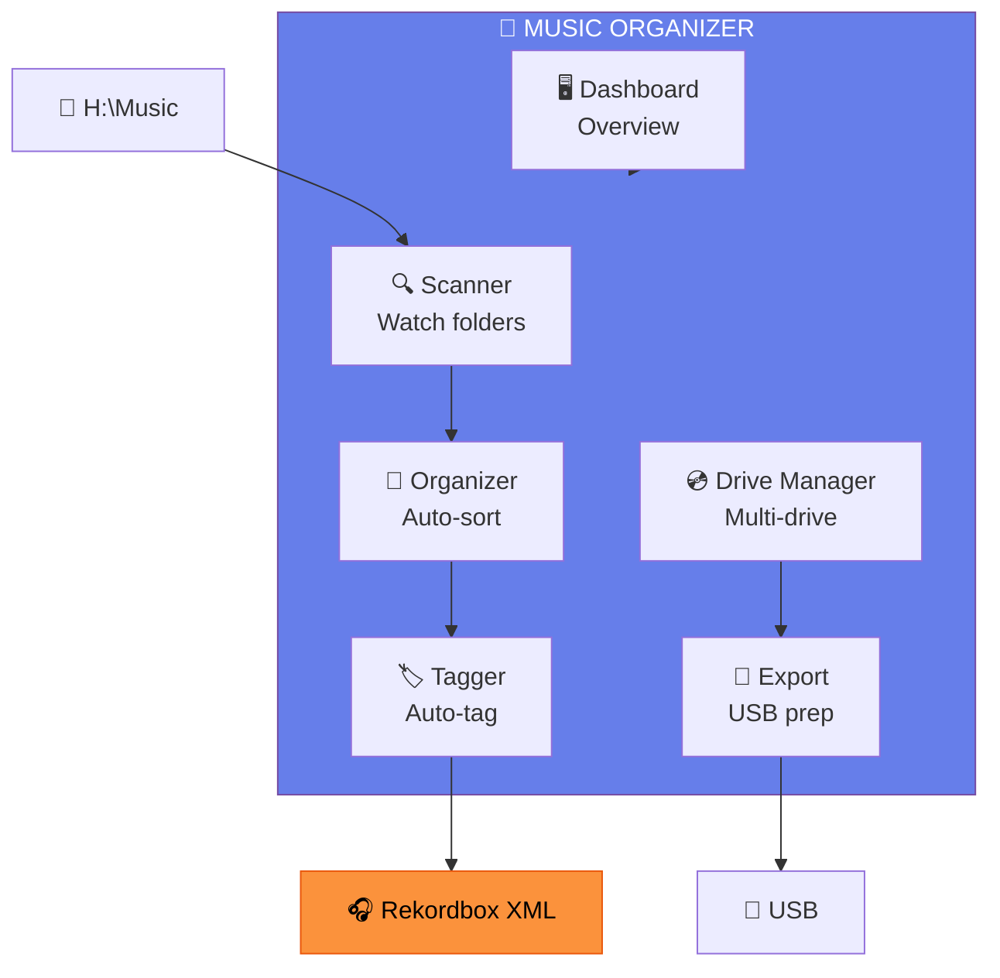

# 📱 Music Organizer App — Concept

[🏠 Home](../README.md)

---

> **Pe scurt:** Conceptul pentru o aplicație Music Organizer care lucrează
> în tandem cu rekordbox — automatizează scanare, organizare, tagging,
> și pregătire USB.

---

## 🎯 Problema

Rekordbox e excelent pentru DJ, dar **organizarea** e manuală:
- Trebuie să muți fișiere manual în foldere
- Trebuie să setezi taguri manual
- Nu monitorizează foldere noi automat
- Nu sugerează gen/energie/mood automat
- Export USB e manual

---

## 💡 Soluția: Music Organizer

---

## 📋 Module

| Modul | Funcție | Documentație |
|-------|---------|-------------|
| **Scanner** | Watch folders, detect new files | [scanner.md](scanner.md) |
| **Drive Manager** | Manage multiple drives & paths | [drive-manager.md](drive-manager.md) |
| **Arhitectură** | Technical architecture | [arhitectura.md](arhitectura.md) |
| **UI/UX** | Interface design | [ui-ux.md](ui-ux.md) |
| **Funcționalități** | Complete feature list | [functionalitati.md](functionalitati.md) |

---

## 🛠️ Tech Stack Propus

| Componentă | Tehnologie |
|-----------|-----------|
| **Framework** | Next.js 16 (App Router) |
| **UI** | shadcn/ui + Tailwind CSS v4 |
| **Database** | SQLite (local) sau PostgreSQL (cloud) |
| **Audio Analysis** | Web Audio API + ffprobe |
| **File System** | Node.js fs/chokidar (watch) |
| **Rekordbox Integration** | XML export/import |
| **Desktop** | Electron sau Tauri (opțional) |

---

## 🗺️ Roadmap

| Fază | Ce | Când |
|------|-----|------|
| **v0.1** | Scanner + folder monitor | MVP |
| **v0.2** | Auto-organize (move to genre folders) | +2 săpt |
| **v0.3** | BPM/Key analysis display | +2 săpt |
| **v0.4** | Rekordbox XML integration | +2 săpt |
| **v0.5** | Drive manager + USB export | +2 săpt |
| **v1.0** | Dashboard complet + auto-tag | Release |

---

[🏠 Home](../README.md)
