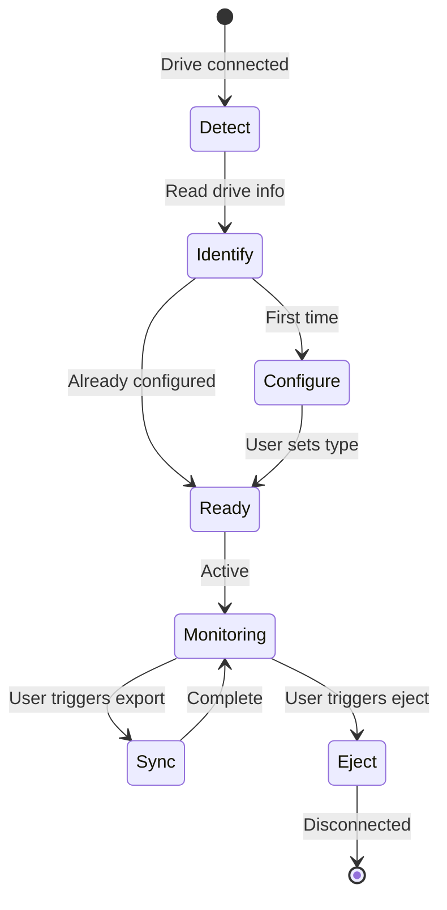

# 💿 Drive Manager — Modul Gestionare Drive-uri

[🏠 Home](../README.md) · [📱 App](README.md)

---

## 🎯 Scop

Gestionează toate drive-urile conectate:
- Detectare automată drive-uri noi
- Informații capacitate/format
- Safe eject
- Configurare tip (sursă/export/backup)

---

## 🔄 Flow



---

## 📊 Drive Info Model

```typescript
interface Drive {
  id: string;
  path: string;           // "H:\", "E:\", "F:\"
  label: string;          // "Music", "mwrty-A", "mwrty-B"
  type: 'source' | 'export' | 'backup';
  format: 'FAT32' | 'NTFS' | 'exFAT';
  capacity: number;       // bytes
  used: number;           // bytes
  isConnected: boolean;
  lastSynced?: Date;
  trackCount?: number;
}
```

---

## 🖥️ UI Components

### Drive Card Component
```
┌──────────────────────────┐
│  💿 mwrty-A              │
│  F:\ · FAT32 · Export    │
│                          │
│  ████████████░░░░  87%   │
│  28.1 GB / 32.0 GB       │
│  342 tracks              │
│                          │
│  Last sync: 2h ago       │
│                          │
│  [🔄 Sync] [⏏️ Eject]    │
└──────────────────────────┘
```

### Reguli de Validare:
- USB Export **TREBUIE** să fie FAT32
- Source drive poate fi orice format
- Warning dacă export drive > 90% full
- Error dacă export drive nu e FAT32

---

## ⚠️ Safety

| Acțiune | Safety Check |
|---------|-------------|
| Eject | Confirm dialog + verificare fișiere deschise |
| Format | NEVER from app (prea periculos) |
| Delete tracks from USB | Confirm + show track list |
| Sync | Show diff (add/remove/update) before execute |

---

[🏠 Home](../README.md) · [📱 App](README.md)
