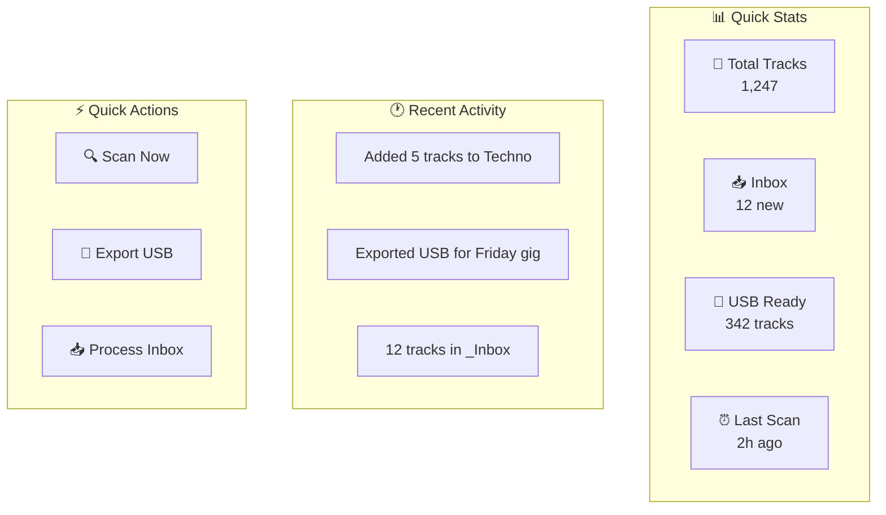

# 🎨 UI/UX Design — Music Organizer

[🏠 Home](../README.md) · [📱 App](README.md)

---

## 🎨 Design System

### Culori (Dark Theme — DJ-friendly)

| Rol | Culoare | Hex | Utilizare |
|-----|---------|-----|-----------|
| **Background** | Negru profund | `#0a0a0a` | Main bg |
| **Surface** | Gri închis | `#171717` | Cards, panels |
| **Border** | Gri mediu | `#262626` | Borders |
| **Text Primary** | Alb | `#fafafa` | Headings, primary |
| **Text Secondary** | Gri deschis | `#a3a3a3` | Secondary info |
| **Accent** | Violet | `#8b5cf6` | CTA, active states |
| **Success** | Verde | `#22c55e` | Succes, completed |
| **Warning** | Galben | `#eab308` | Atenție |
| **Error** | Roșu | `#ef4444` | Erori, delete |
| **Info** | Albastru | `#3b82f6` | Info, links |

### Energia ca Culoare (din sistem taguri):

| Energie | Culoare | CSS |
|---------|---------|-----|
| ⭐ Ambient | 🔵 Albastru | `bg-blue-500` |
| ⭐⭐ Warmup | 🟢 Verde | `bg-green-500` |
| ⭐⭐⭐ Groove | 🟡 Galben | `bg-yellow-500` |
| ⭐⭐⭐⭐ Drive | 🟠 Portocaliu | `bg-orange-500` |
| ⭐⭐⭐⭐⭐ Peak | 🔴 Roșu | `bg-red-500` |

---

## 🖥️ Layout Principal

```
┌──────────────────────────────────────────────────────────┐
│  🎵 Music Organizer          [🔍 Search]    [⚙️] [👤]  │
├──────────┬───────────────────────────────────────────────┤
│          │                                               │
│ 📊 Dash  │   ┌─────────────────────────────────────┐    │
│          │   │         MAIN CONTENT AREA            │    │
│ 📚 Library│   │                                     │    │
│          │   │   Dashboard / Library / Scanner       │    │
│ 🔍 Scanner│  │   Drive Manager / Settings           │    │
│          │   │                                       │    │
│ 💿 Drives│   │                                       │    │
│          │   │                                       │    │
│ ⚙️ Settings│ └─────────────────────────────────────┘    │
│          │                                               │
│          │   ┌─────────────────────────────────────┐    │
│          │   │      STATUS BAR / NOW PLAYING        │    │
│          │   └─────────────────────────────────────┘    │
├──────────┴───────────────────────────────────────────────┤
│  💾 USB: mwrty-A (28/32GB) │ 🔍 Scanning: 3 new │ ✅   │
└──────────────────────────────────────────────────────────┘
```

---

## 📊 Dashboard Page



### Dashboard Wireframe:

```
┌─────────┬─────────┬─────────┬─────────┐
│ 🎵 1,247 │ 📥 12   │ 💾 342  │ ⏰ 2h   │
│ Total    │ Inbox   │ USB     │ Scan    │
└─────────┴─────────┴─────────┴─────────┘

┌───────────────────────┬───────────────────┐
│                       │                   │
│  📊 Genre Distribution│  ⚡ Quick Actions │
│  ┌───┐ Techno 34%    │                   │
│  ┌────┐ Manele 22%   │  [🔍 Scan Now]   │
│  ┌──┐ TH 15%        │  [💾 Export USB]   │
│  ┌─┐ Bounce 10%     │  [📥 Process]     │
│  etc.                 │                   │
│                       │                   │
└───────────────────────┴───────────────────┘

┌─────────────────────────────────────────┐
│  🕐 Recent Activity                     │
│  14:30 — Added 5 tracks to DJ/Techno    │
│  12:00 — Exported USB (mwrty-A)         │
│  Yesterday — 12 new tracks in _Inbox    │
└─────────────────────────────────────────┘
```

---

## 📚 Library Page

```
┌─────────────────────────────────────────────────────────┐
│ 📚 Library    [🔍 filter]  [Gen ▼] [Energy ▼] [BPM ▼]  │
├─────────────────────────────────────────────────────────┤
│ # │ Artist        │ Title          │ BPM│ Key│ Gen │ ⚡│
│───│───────────────│────────────────│────│────│─────│───│
│ 1 │ ANNA          │ Surrender      │ 133│ Am │ Tech│ 4 │
│ 2 │ Charlotte     │ Speed Drive    │ 140│ Em │ Tech│ 5 │
│ 3 │ Fisher        │ Losing It      │ 124│ Gm │ TH  │ 4 │
│ 4 │ Dani Mocanu   │ Fac ce simt    │ 105│ Dm │ Man │ 3 │
│ 5 │ Infected M.   │ Heavyweight    │ 145│ Am │ Psy │ 5 │
└─────────────────────────────────────────────────────────┘
```

### Features Library:
- **Sort** pe orice coloană
- **Filter** per gen, energie, BPM range, key
- **Multi-select** → batch actions (tag, move, export)
- **Preview** cu player inline
- **Color coding** per energie

---

## 🔍 Scanner Page

```
┌─────────────────────────────────────────────────────────┐
│ 🔍 Scanner                                [▶ Scan Now]  │
├─────────────────────────────────────────────────────────┤
│                                                         │
│  Watch Folders:                                         │
│  ✅ H:\Music\_Inbox\     (12 new, 3 processing)        │
│  ✅ H:\Music\DJ\         (458 tracks, up to date)       │
│  ⬜ C:\Downloads\         (not watched)     [+ Add]     │
│                                                         │
│  ┌─────────────────────────────────────────────────┐    │
│  │ 📥 Inbox Queue (12 tracks)                      │    │
│  │──────────────────────────────────────────────────│    │
│  │ newtrack1.mp3   │ 128 BPM │ Am │ → Techno?  [✓]│    │
│  │ manea_noua.mp3  │ 108 BPM │ Dm │ → Manele?  [✓]│    │
│  │ bounce_hit.flac │ 155 BPM │ Cm │ → Bounce?  [✓]│    │
│  │ [Process All] [Process Selected]                │    │
│  └─────────────────────────────────────────────────┘    │
└─────────────────────────────────────────────────────────┘
```

---

## 💿 Drive Manager Page

```
┌─────────────────────────────────────────────────────────┐
│ 💿 Drive Manager                                        │
├─────────────────────────────────────────────────────────┤
│                                                         │
│  ┌──────────────┐  ┌──────────────┐  ┌──────────────┐  │
│  │ H:\Music\    │  │ 💾 mwrty-A   │  │ 💾 mwrty-B   │  │
│  │ ■■■■■■■□□□   │  │ ■■■■■■■■□□   │  │ ■■■■■■■■□□   │  │
│  │ 245GB/500GB  │  │ 28GB/32GB    │  │ 28GB/32GB    │  │
│  │ NTFS │ Source│  │ FAT32│ Export│  │ FAT32│ Backup│  │
│  │ [Scan] [Open]│  │ [Sync][Eject]│  │ [Sync][Eject]│  │
│  └──────────────┘  └──────────────┘  └──────────────┘  │
│                                                         │
│  [+ Add Drive]                                          │
└─────────────────────────────────────────────────────────┘
```

---

## 🧩 Componente UI (shadcn/ui)

| Component | shadcn | Utilizare |
|-----------|--------|-----------|
| **DataTable** | Table + pagination | Library view |
| **Card** | Card | Drive cards, stats |
| **Badge** | Badge | Genre badge, energy level |
| **Button** | Button | Actions (scan, export) |
| **Select** | Select | Filter dropdowns |
| **Progress** | Progress | Drive capacity, scan progress |
| **Dialog** | Dialog | Confirm actions |
| **Toast** | Sonner | Notifications |
| **Command** | cmdk | Quick search/actions |
| **Sidebar** | Sidebar | Navigation |

---

[🏠 Home](../README.md) · [📱 App](README.md)
