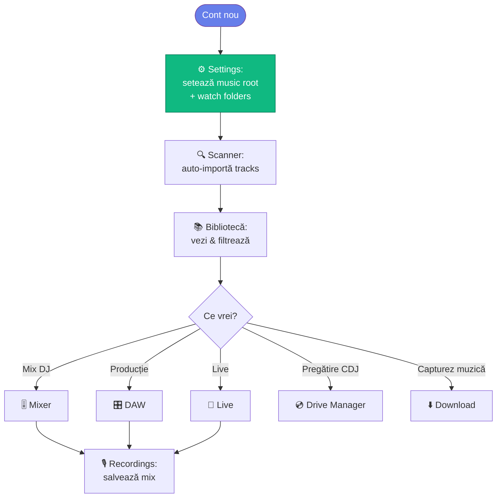

# 🌐 Aplicație Web — Ghiduri pe modul

> Ghiduri **end-user** pentru fiecare modul al web app-ului MMO.
> Pentru setup development → [`app/README.md`](../../app/README.md).
> Pentru arhitectură → [`docs/arhitectura/`](../arhitectura/).

[🏠 Home](../../README.md) · [🗺️ Navigare](../../NAVIGARE.md)

---

## 📚 Module disponibile

| Modul | Rută | Document | Status |
|-------|------|----------|--------|
| 📚 Bibliotecă | `/library` | [biblioteca.md](biblioteca.md) | ✏️ TBD |
| 🎚️ Mixer | `/mixer` | [mixer.md](mixer.md) | ✏️ TBD |
| 🎛️ DAW Editor | `/daw`, `/editor` | [daw-editor.md](daw-editor.md) | ✏️ TBD |
| 🎤 Live | `/live` | [live.md](live.md) | ✏️ TBD |
| 📡 Remote | `/remote` | [remote.md](remote.md) | ✏️ TBD |
| 🌈 Visualizations | `/visualizations` | [visualizations.md](visualizations.md) | ✏️ TBD |
| ⬇️ Download | `/download` | [download.md](download.md) | ✏️ TBD |
| 🔍 Scanner | `/scanner` | [scanner.md](scanner.md) | ✏️ TBD |
| 💿 Drive Manager | `/drives` | [drive-manager.md](drive-manager.md) | ✏️ TBD |
| 📋 Playlists | `/playlists` | [playlists.md](playlists.md) | ✏️ TBD |
| 🎙️ Recordings | `/recordings` | [recordings.md](recordings.md) | ✏️ TBD |
| 🔌 Devices | `/devices` | [devices.md](devices.md) | ✏️ TBD |
| ⚙️ Settings | `/settings` | [settings.md](settings.md) | ✏️ TBD |

> Aceste ghiduri sunt în curs de scriere (Wave 4 al rewrite-ului). Ordinea de prioritate: Bibliotecă → Mixer → Scanner → Download → Drive Manager → restul.

---

## 🧭 De unde să începi (utilizator nou)

---

[🏠 Home](../../README.md)
