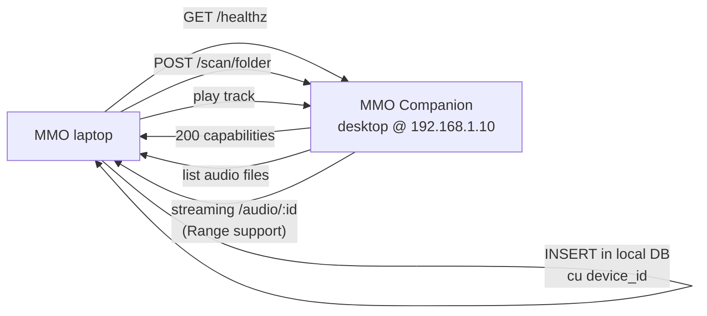

# 🔌 Devices (`/devices`)

> Adaugi și gestionezi dispozitive (Companion-uri sau alte servere MMO) care expun biblioteci muzicale în rețea.

[← docs/aplicatie/](README.md) · [🏠 Home](../../README.md)

---

## 🎯 Ce faci aici

- Înregistrezi alte computere/Companion-uri MMO din rețea
- Vezi statusul (online/offline + latency)
- Adaugi foldere remote pentru a indexa muzică de pe alt PC
- Scan-ezi tracks de pe device-uri remote și le aduci în biblioteca ta

> **Use case**: ai biblioteca principală pe PC desktop, vrei să mixezi de pe laptop fără să copiezi fișierele — adaugi PC-ul ca device și streaming pe loop.

---

## 🖼️ Layout

```
┌──────────────────────────────────────────┐
│  🔌 Devices                  [+ Add]     │
├──────────────────────────────────────────┤
│  ┌────────────────────────────────────┐  │
│  │ 💻 DJ-Desktop  ✓ ONLINE  47ms     │  │
│  │ 192.168.1.10:17899                 │  │
│  │ Tracks: 4,287                      │  │
│  │ ─ Folders ─                        │  │
│  │  📁 H:\Music\DJ           ⟳  🗑   │  │
│  │  📁 H:\Music\Live         ⟳  🗑   │  │
│  │  [+ Add folder]                    │  │
│  │ Actions: Ping  Rename  Remove      │  │
│  └────────────────────────────────────┘  │
│                                          │
│  ┌────────────────────────────────────┐  │
│  │ 💻 Studio-Mac  ✗ OFFLINE          │  │
│  │ 192.168.1.20:17899                 │  │
│  │ Last seen: 2h ago                  │  │
│  └────────────────────────────────────┘  │
└──────────────────────────────────────────┘
```

---

## ⌨️ Acțiuni

| Acțiune | Cum |
|---------|-----|
| Adaugă device | "+ Add" → introdu nume + IP + port (default 17899) |
| Ping device | Click "Ping" — verifică conectivitate |
| Adaugă folder | În card device → "+ Add folder" → path absolut |
| Scan folder remote | Click "⟳" lângă folder — indexează în biblioteca locală |
| Elimină folder | Click "🗑" lângă folder |
| Redenumește device | Click "Rename" |
| Elimină device | Click "Remove" (cu confirmare) |

---

## 🔄 Cum funcționează



În biblioteca ta locală, track-urile remote apar marcate cu icon device + se redă streaming când le pui play.

---

## 🌐 Cerințe

- **Ambele dispozitive** pe **aceeași rețea** (LAN sau VPN)
- **Companion** rulând pe device-ul remote (HTTP server pe `:17899`)
- **Firewall** cu portul 17899 deschis (sau exemption pentru aplicație)

---

## 🔌 Sub capotă

| Aspect | Implementare |
|--------|--------------|
| Server Actions | `getDevices()`, `addDevice()`, `removeDevice()`, `renameDevice()`, `pingDevice()` |
| Folder management | `getDeviceFolders()`, `addDeviceFolder()`, `removeDeviceFolder()` |
| Scan | `scanDeviceFolder()` — call la `/scan/folder` pe device remote |
| Track count | `getDeviceTrackCount()` |
| Auth | Bearer token issued de web app, stored în device |
| Refresh status | Auto la 30s pentru ping |
| API audio remote | `/api/audio/device/[id]` proxy către device |

---

## 🔐 Securitate

- Token Bearer pentru fiecare device — nu sunt accesibile fără auth
- Companion-ul **nu acceptă** request-uri din afara LAN-ului (verificare IP)
- HTTP loopback only by default; expunerea în rețea cere config explicit
- TLS opțional între web app și companion remote (TBD)

---

## ⚠️ Limitări

- **LAN only**: cross-network necesită port forwarding sau VPN
- **No auto-discovery**: trebuie să știi IP-ul (Bonjour/mDNS în roadmap)
- **One-way scan**: device A scan device B, nu invers automat
- **Latency**: streaming peste WiFi 2.4GHz poate avea hiccup-uri pe track-uri lossless

---

## 💡 Tips

- **VPN pentru cross-location**: WireGuard / Tailscale pentru access la device-uri din alt loc
- **NAS ca device**: dacă rulezi MMO Companion pe un NAS (Synology, QNAP), îl adaugi ca device permanent
- **Multi-DJ studio**: 2-3 DJ-i pot share same library pe LAN
- **Backup setup**: device principal + device backup (copy automat al library-ului)

---

[← Recordings](recordings.md) · [⚙️ Settings →](settings.md)
