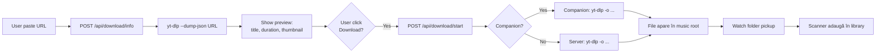

# ⬇️ Download (`/download`)

> Descarcă muzică din YouTube, SoundCloud, Bandcamp și 12 alte platforme; auto-import în bibliotecă.

[← docs/aplicatie/](README.md) · [🏠 Home](../../README.md)

---

## 🎯 Ce faci aici

- Lipești un URL (track sau playlist) și descarci în bibliotecă
- Sau cauți după nume și descarci primul rezultat
- Vezi istoricul download-urilor (status, erori)
- Configurezi formatul (mp3 / flac / opus) și calitatea

> **Pentru auto-capture cu un click** din browser → instalează [Browser Extension](../extension/README.md)

---

## 🖼️ Layout

```
┌────────────────────────────────────────────┐
│  🔗 URL or search...               [GO]    │
│                                            │
│  📺 [Thumbnail]   Track Title              │
│                   Artist · 04:23           │
│                   Format: MP3 320 ▾        │
│                                  [DOWNLOAD]│
├────────────────────────────────────────────┤
│  📥 În progres                             │
│  ▓▓▓▓▓▓▓▓▓▓▓░░░  68%   "Track Name"        │
├────────────────────────────────────────────┤
│  📜 Istoric (sidebar)                      │
│  ✓ Yesterday — 12 tracks                   │
│  ✓ Last week — 47 tracks                   │
└────────────────────────────────────────────┘
```

---

## ⌨️ Acțiuni

| Acțiune | Cum |
|---------|-----|
| Lipește URL | Ctrl+V în input → ENTER |
| Caută după text | Tastează (ex: "Daft Punk - One More Time") → ENTER |
| Schimbă format | Dropdown la dreapta de track preview |
| Descarcă batch (playlist) | Lipește URL playlist → "Download all" |
| Verifică duplicates | Auto la fiecare URL — îți spune dacă există deja |
| Auto-add în bibliotecă | Check "Auto-import" (default ON) |
| Auto-download din URL | `?url=...&auto=1` în URL paginii (folosit de extensie) |

---

## 🌐 Platforme suportate

| Platformă | Download direct | Doar metadate |
|-----------|----------------|---------------|
| YouTube / YouTube Music | ✅ | — |
| SoundCloud | ✅ | — |
| Bandcamp | ✅ (track) / ⚠️ (album doar dacă free) | — |
| Mixcloud | ✅ | — |
| Vimeo | ✅ | — |
| TikTok | ✅ (cu watermark removal) | — |
| Twitter / X | ✅ | — |
| Instagram | ✅ (Reels public) | — |
| Facebook | ✅ (videos public) | — |
| Twitch | ✅ (clips) | — |
| Dailymotion | ✅ | — |
| Spotify | ❌ DRM | ✅ |
| Deezer | ❌ DRM | ✅ |

> Pentru Spotify/Deezer: extragem metadate (titlu, artist, BPM, key) și putem să cerem match pe YouTube/SoundCloud automat.

---

## 🎵 Formate & calitate

| Format | Bitrate | Pentru ce |
|--------|---------|-----------|
| MP3 | 128 / 192 / 256 / 320 kbps | Default; compatibil oriunde |
| OPUS | 128 / 192 kbps | Mai bun la bitrate mic; nesuportat universal |
| FLAC | lossless | Doar dacă sursa e lossless (Bandcamp HD) |
| M4A (AAC) | 128 / 256 kbps | iTunes / Apple ecosystem |

---

## 🔌 Backend

Download-ul efectiv se face prin **yt-dlp** (sau equivalent):

| Mod | Cine rulează yt-dlp |
|-----|---------------------|
| **Cu Companion** | Companion-ul (recommended — fără limite, rulează local) |
| **Fără Companion** | Server-side în Next.js (cu rate limiting) |

> yt-dlp trebuie instalat pe sistem (companion îl bundle-uieză automat în viitor).

---

## 🔄 Flow



---

## 💾 Unde se salvează

- **Default**: `data/downloads/` în folderul aplicației
- Configurabil în [`/settings`](settings.md) → Music Root
- După download → mutat în music root + auto-scan → apare în [`/library`](biblioteca.md)

---

## 💡 Tips

- **Capture rapid din browser**: instalează [extensia Chrome](../extension/README.md) — un click pe orice tab YouTube/SoundCloud
- **Playlist YouTube/SoundCloud**: lipește URL-ul playlist-ului întreg, alege "Download all" — descarcă în paralel (max 3 simultan)
- **Verifică legalitatea**: descarci doar conținut pe care ai dreptul să-l ai (creator-uri free, music tau, sample-uri Bandcamp pe care le-ai cumpărat)
- **Dedup**: înainte de download, MMO verifică dacă track-ul există deja (după title + artist sau hash audio)

---

## ⚠️ Considerații legale

> Tu ești responsabil de respectarea termenilor platformelor și a copyright-ului. MMO doar facilitează download-ul — nu validează drepturile.

---

[← Scanner](scanner.md) · [💿 Drive Manager →](drive-manager.md)
