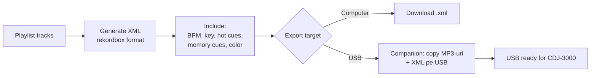

# 📋 Playlists (`/playlists`)

> Creezi, organizezi și exporți playlist-uri (manuale + smart) pentru DJ sets, radio shows sau prep CDJ.

[← docs/aplicatie/](README.md) · [🏠 Home](../../README.md)

---

## 🎯 Ce faci aici

- Creezi **playlist-uri manuale** (selectare track-uri unul câte unul)
- Vezi **playlist-urile recomandate** (smart, auto-generate pe baza istoricului)
- Reordonezi, redenumești, ștergi
- Exporti ca **rekordbox XML** pentru USB CDJ
- Bulk export toate playlist-urile

---

## 🖼️ Layout

```
┌─────────────────┬──────────────────────────┐
│ My Playlists    │  📋 "Friday Night Set"   │
│                 │                          │
│ ▶ Friday Night  │  Track Table:            │
│   (47 tracks)   │  ┌─┬──────────┬───┬───┐  │
│                 │  │1│ Track A  │128│8A │  │
│   Saturday Big  │  │2│ Track B  │128│8B │  │
│   (62)          │  │3│ Track C  │130│9A │  │
│                 │  │ ...                  │
│   Mellow        │                          │
│   Mornings (24) │  [+ Add tracks]          │
│                 │                          │
│  ── Smart ──    │  [Export XML] [Export USB]│
│ ⚡ High Energy  │                          │
│ ⚡ Late Night   │                          │
└─────────────────┴──────────────────────────┘
```

---

## ⌨️ Acțiuni

| Acțiune | Cum |
|---------|-----|
| Creează playlist | Click "+ New playlist" în sidebar |
| Redenumește | Dublu-click pe nume |
| Șterge | Right-click → "Delete" (cu confirmare) |
| Adaugă tracks | "+ Add tracks" → search & select |
| Drag & drop din library | Mai rapid: deschide library în alt tab → drag |
| Reordonează | Drag rânduri în table |
| Elimină track | Right-click → "Remove" |
| Export rekordbox XML | Buton "Export XML" |
| Export pe USB | Buton "Export USB" → selectează drive |
| Bulk export | "Export all" la nivelul rădăcină |

---

## 🤖 Smart playlists (auto-generate)

MMO sugerează playlist-uri pe baza:
- **BPM range** (ex: "Set 124-128 BPM" pentru house)
- **Key compatibility** (Camelot wheel cluster)
- **Energy progression** (low → high → peak → cooldown)
- **Recently added** (last 7/30 zile)
- **Most played** (top 50)
- **Genre + mood** (ex: "Dark Techno", "Sunset Lounge")

→ În viitor: smart filters salvabile (filtrezi în `/library` cu o combinație și salvezi ca smart playlist).

---

## 💾 Export rekordbox XML



Compatibil cu:
- **rekordbox 6/7** (import direct)
- **CDJ-3000 / XDJ-RX3 / XDJ-XZ** (USB import)
- **Pioneer XDJ-1000MK2** (cu rekordbox sync)

---

## 🔌 Sub capotă

| Aspect | Implementare |
|--------|--------------|
| Server Actions | `getPlaylists()`, `getPlaylistTracks()`, `createPlaylist()`, `updatePlaylist()`, `deletePlaylist()`, `removeTrackFromPlaylist()` |
| Export | `exportPlaylistToXml()`, `exportAllPlaylistsToXml()` |
| Recomandări | `getRecommendedPlaylists()` |
| Tabele DB | `playlists`, `playlistTracks` (cu `position` pentru ordine) |
| State | URL params: `?id=N&page=N&pageSize=N` |
| XML generator | `src/lib/rekordbox-xml.ts` |

---

## 💡 Tips

- **Set ordering**: pune track-urile în ordine BPM crescător/descrescător + key compatibil pentru un set fluid
- **Hot cues memorate**: cue-urile setate în [`/mixer`](mixer.md) sunt incluse automat în XML export
- **Backup playlist-uri**: bulk export periodic ca XML — backup în Drive/iCloud
- **Test pe CDJ acasă**: verifică XML-ul pe propriul CDJ înainte de gig
- **Naming**: folosește prefixe `[2026-01-15] Friday Set` pentru istoric/căutare ușoară

---

## 🔮 Roadmap

- Smart playlist editor (UI complet pentru filter rules)
- Playlist sharing între utilizatori
- Sync cu Spotify / SoundCloud playlists (one-way import)
- AI playlist generator pe baza unui prompt ("set 1h tech-house pentru sunset")

---

[← Visualizations](visualizations.md) · [🎙️ Recordings →](recordings.md)
