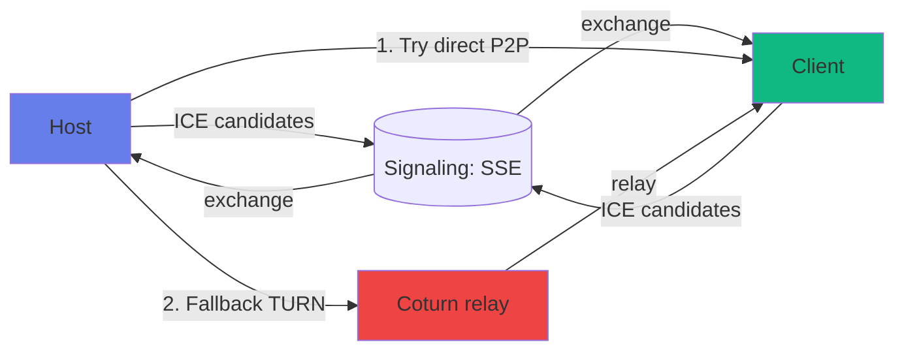

# 📡 Remote (`/remote`)

> Controlează MMO de pe alt device (telefon, tabletă) prin WebRTC peer-to-peer.

[← docs/aplicatie/](README.md) · [🏠 Home](../../README.md)

---

## 🎯 Ce faci aici

- **Controlezi** mixer / DAW / live de pe **telefon sau tabletă** când tu cânți
- Sau **monitorizezi** ce face cineva în alt loc (DJ pe scenă, tu în public)
- Comunică **direct** între dispozitive (P2P), fără ca audio să treacă prin server
- Fallback prin **TURN** când NAT-urile sunt stricte

---

## 🖼️ Layout

```
┌─────────────────────────────────────────┐
│  📡 Connection: ✓ HOST DJ-Laptop        │
│  Latency: 47ms · Signal: ████ HD         │
├─────────────────────────────────────────┤
│  Quality: [HD ▼]  📊 Stats   ⛶ Focus    │
├─────────────────────────────────────────┤
│                                         │
│       (Adaptive widgets per page)       │
│                                         │
│   ┌─────────┐  ┌─────────┐              │
│   │ DECK A  │  │ DECK B  │              │
│   │  ▶ ⏸ ⏹  │  │  ▶ ⏸ ⏹  │              │
│   │  ◀ JOG ▶│  │  ◀ JOG ▶│              │
│   └─────────┘  └─────────┘              │
│   ◄──── CROSSFADER ─────►              │
│                                         │
└─────────────────────────────────────────┘
```

> Widget-urile se schimbă în funcție de pagina **target**:
> - Mixer target → 2 deck-uri + crossfader
> - DAW target → transport + tool selector
> - Live target → mic toggle + loop pads
> - Library target → search + queue

---

## 🚀 Setup (host + client)

### Pe HOST (computer-ul principal)
1. Pornește MMO Web App (cu Companion ideal)
2. Mergi la pagina pe care vrei să o expui (mixer, daw, etc.)
3. Click "Share Remote" în sidebar → primești **invite code** sau **QR**

### Pe CLIENT (telefon / tabletă)
1. Deschide MMO Web App pe telefon
2. Mergi la `/remote`
3. Scanează QR sau introdu invite code
4. ✓ Connected — controlezi acum host-ul

---

## ⌨️ Acțiuni

| Acțiune | Cum |
|---------|-----|
| Conectare | QR scan sau invite code manual |
| Schimbă quality profile | Dropdown HD / SD / Audio-only |
| Vezi stats | Click "📊 Stats" — latency, packet loss, throughput |
| Focus mode | Ascunde UI extra pentru control concentrat |
| Zoom | Pinch (mobile) sau Ctrl + scroll |
| Disconnect | Click "Disconnect" sau închide tab |

---

## 🌐 Quality profiles

| Profile | Bitrate | Use case |
|---------|---------|----------|
| **HD** | 192 kbps Opus | LAN sau WiFi 5GHz puternic |
| **SD** | 96 kbps Opus | WiFi normal sau 4G bun |
| **Audio-only** | 32 kbps Opus mono | 3G / conexiune slabă |
| **No audio** | 0 (doar control) | Latență minimă, zero audio |

---

## 🔌 Sub capotă

| Aspect | Implementare |
|--------|--------------|
| Transport | WebRTC `RTCPeerConnection` cu Opus |
| Signaling | SSE prin web app (`/api/remote/events`) |
| TURN credentials | `/api/turn-credentials` (HMAC-SHA1 ephemeral) |
| Bridge audio | `webrtc-audio-bridge.ts` |
| Sync state | `remote-sync.ts` — JSON-patch snapshots |
| Relay | `remote-relay.ts` — orchestrare ICE |

---

## 🌍 Conectivitate



| Scenariu | Conexiune | Latență |
|----------|-----------|---------|
| Same WiFi | Direct P2P | ~10-20ms |
| Diferite rețele, NAT prietenos | Direct P2P (cu STUN) | ~40-80ms |
| NAT simetric / corporate | Prin TURN relay | ~150-250ms |

---

## ⚠️ Limitări

- **Browser support**: WebRTC e standard, dar pe iOS Safari sub iOS 17 sunt buguri Opus
- **Ad-blockers**: pot bloca WebRTC; whitelist domain-ul tău
- **TURN cost**: dacă self-hosted, ~$7.5/lună; dacă peste capacitate (>150 conexiuni concurente), upgrade VM
- **Audio one-way**: momentan doar host → client; bidirectional în roadmap

---

## 💡 Tips

- **QR cu device propriu**: pentru control rapid de pe telefonul tău, ține telefonul în buzunar și controlează cu touch
- **Battery saver mode**: pe mobile dezactivează vizualizările pentru a economisi baterie
- **Test latency**: în Settings găsești "Latency probe" — măsoară RTT real

---

## 🔮 Roadmap

- Audio bidirectional (vocal feedback între DJ și producător remote)
- Video stream opțional (low-bitrate camera feed)
- Multi-client (3+ conexiuni la același host)
- Recording remote (host înregistrează ce vede client)

---

[← Live](live.md) · [🌈 Visualizations →](visualizations.md)
