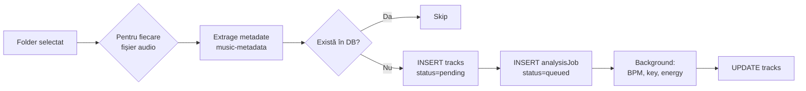

# 🔍 Scanner (`/scanner`)

> Scanează foldere de muzică și importă track-urile noi în bibliotecă.

[← docs/aplicatie/](README.md) · [🏠 Home](../../README.md)

---

## 🎯 Ce faci aici

- Pornești un scan **on-demand** pe un folder watch (configurat în Settings)
- Pornești un scan **one-off** pe un folder ad-hoc
- Vezi rezultate: câte fișiere noi, sărite, erori
- Lansezi scanner-ul după ce ai mutat tracks pe disc

> **Auto-scan continuu** (watch in fundal) → necesită [MMO Companion](../companion/README.md). Pagina `/scanner` declanșează scan-uri **manuale**.

---

## 🖼️ Layout

```
┌────────────────────────────────────────┐
│  📂 Watch Folders                      │
│  ┌──────────────────────────┬───────┐  │
│  │ H:\Music\Inbox           │ SCAN  │  │
│  │ H:\Music\DJ              │ SCAN  │  │
│  │ E:\Downloads\YouTube     │ SCAN  │  │
│  └──────────────────────────┴───────┘  │
├────────────────────────────────────────┤
│  📁 Custom Path Scan                   │
│  [____________________________] [SCAN] │
├────────────────────────────────────────┤
│  📊 Last Scan Result                   │
│  ✓ 47 fișiere audio găsite             │
│  ✓ 32 inserate                          │
│  ↷ 14 sărite (deja în DB)              │
│  ⚠ 1 eroare (ID3 corrupt)              │
└────────────────────────────────────────┘
```

---

## ⌨️ Acțiuni

| Acțiune | Cum |
|---------|-----|
| Scan watch folder | Click butonul "SCAN" lângă folder |
| Scan ad-hoc | Lipește path în input → click "SCAN" |
| Adaugă watch folder | Mergi la [`/settings`](settings.md) → General → Watch Folders |
| Vezi log scan | După scan, modal cu detalii (per fișier) |

---

## 📁 Formate suportate

- **MP3** (ID3v1, ID3v2.3, ID3v2.4)
- **FLAC** (Vorbis comments)
- **WAV** (RIFF metadata)
- **AIFF** (ID3 chunks)
- **M4A / MP4** (iTunes-style atoms)
- **OGG** (Vorbis comments)
- **OPUS**

---

## 🔄 Ce face un scan



După scan:
- Track-urile **noi** apar imediat în [`/library`](biblioteca.md) cu status "pending analysis"
- Analiza (BPM, key, energy) rulează **în background** și se actualizează live
- Poți filtra în library cu "Recently added" pentru a le vedea

---

## ⚠️ Edge cases

| Situație | Comportament |
|----------|--------------|
| Fișier fără metadate | Folosește numele fișierului (parser `Artist - Title`) |
| Fișier corupt | Skip + log eroare; nu blochează restul |
| Duplicat după path | Skip cu mesaj "deja în DB" |
| Duplicat după hash | TBD — momentan nu detectăm; convenții fișiere ajută |
| Permisiuni refuzate | Skip + warning |
| Network drive offline | Eroare; reîncearcă manual |

---

## 🔌 Sub capotă

| Aspect | Implementare |
|--------|--------------|
| Server Action | `scanFolderAction(folderPath)` |
| Settings read | `getSettings()` — întoarce watch folders |
| Metadata | `music-metadata` (Node-side) |
| DB inserts | Drizzle `INSERT INTO tracks ... ON CONFLICT DO NOTHING` |
| Job queue | tabela `analysisJobs` — picked up de worker |

---

## 💡 Tips

- **Convenții fișiere**: folosește `Artist - Title (Remix) [Label].mp3` — vezi [`organizare/conventii-fisiere.md`](../../organizare/conventii-fisiere.md)
- **Inbox workflow**: ține un folder `Inbox` ca watch folder; mută acolo download-uri proaspete; după scan + organizare, mută în foldere genre
- **Re-scan**: re-scanarea aceluiași folder e sigură; nu duplicates, doar adaugă cele noi

---

[← Mixer](mixer.md) · [⬇️ Download →](download.md)
