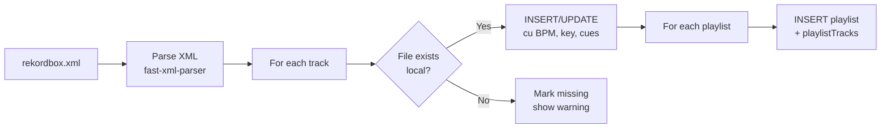

# ⚙️ Settings (`/settings`)

> Configurezi aspectul aplicației, music root, watch folders, import din rekordbox, mod offline,
> device-uri și profile utilizator.

[← docs/aplicatie/](README.md) · [🏠 Home](../../README.md)

---

## 🗺️ Rute (2026-09)

Settings nu mai e o pagină cu tab-uri, ci un **layout cu sub-rute** (`/settings/<domeniu>`),
fiecare cu propriul panou din `src/components/settings/<domeniu>-settings-panel.tsx` și
chei i18n sub `settings.<domeniu>` (RO + EN):

| Rută | Ce conține |
|---|---|
| [`/settings/appearance`](#-appearance) | Temă: mod, accent, suprafață, densitate, rază, mișcare, limbă, feedback |
| `/settings/account` · `/settings/security` | Profil, sesiuni, parolă/passkey |
| `/settings/library` · `/settings/music` | Music root, inbox, recordings, watch folders, genre → folder |
| `/settings/companions` · `/settings/devices` | Companion-uri pereche (tabel), device-uri, Quick Connect |
| `/settings/mixer` · `/settings/daw` · `/settings/live` · `/settings/sound-editor` · `/settings/video` | Preferințe per modul |
| `/settings/notifications` · `/settings/copilot` · `/settings/github` | Notificări, asistentul AI, integrare GitHub |
| `/settings/profiles` · `/settings/advanced` | Profile utilizator, reset, import rekordbox, offline |

### 🎨 Appearance

Randează `<ThemeSettings />` din [`@mmo/ui`](../design-system.md) — aceleași 7 dimensiuni ca pe
MixAI DJ, Companion și TV: **mod** (light/dark/system), **accent** (6 presetări + hue custom +
„din cover art"), **suprafață** (glass/solid/flat), **densitate** (comfortable/compact), **rază**
(sm/md/lg), **mișcare** (full/reduced) și **limbă** (RO/EN). Preferințele se salvează în
`localStorage["mixai:prefs:v1"]`, se sincronizează pe cont (`PreferencesSync`) și se aplică
înainte de primul paint prin `prehydrate.js` — fără flash dark→light. Detalii:
[ADR-0008](../adr/0008-design-system-and-theme-prefs.md).

---

## 🎯 Ce faci aici

- Alegi **tema** (mod, accent, suprafață, densitate, rază, mișcare) și **limba**
- Setezi **folderul root** unde ține MMO muzica
- Configurezi **watch folders** (auto-scan)
- Mapezi genuri → foldere (auto-organize la import)
- Importi din **rekordbox XML** (playlist-uri + metadate existente)
- Configurezi **modul offline** (cache pentru access fără internet)
- Comuți între **profile** utilizator
- Reset la default-uri

---

## 🖼️ Layout (schiță legacy — tab-urile au devenit sub-rute)

```
┌──────────────────────────────────────────┐
│  ⚙️ Settings                             │
│  ┌──────┬───────┬─────────┬─────────┐    │
│  │General│Import│ Offline │ Profiles │    │
│  └──────┴───────┴─────────┴─────────┘    │
├──────────────────────────────────────────┤
│  General Tab                             │
│                                          │
│  📁 Music Root                           │
│  [H:\Music______________________] [Browse]│
│                                          │
│  📥 Inbox Folder                         │
│  [H:\Music\Inbox________________] [Browse]│
│                                          │
│  🎙️ Recordings Folder                    │
│  [H:\Music\Recordings___________] [Browse]│
│                                          │
│  👁️ Watch Folders                        │
│  ┌──────────────────────────────┬───────┐│
│  │ H:\Music\Inbox               │  🗑   ││
│  │ E:\Downloads\YouTube         │  🗑   ││
│  └──────────────────────────────┴───────┘│
│  [+ Add watch folder]                    │
│                                          │
│  🏷️ Genre → Folder Mapping              │
│  ┌──────────┬───────────────────┬───────┐│
│  │ techno   │ H:\Music\DJ\Techno│  🗑   ││
│  │ bounce   │ H:\Music\DJ\Bounce│  🗑   ││
│  └──────────┴───────────────────┴───────┘│
│  [+ Add mapping]                         │
│                                          │
│  ⚠️ [Reset all preferences]              │
└──────────────────────────────────────────┘
```

---

## 📁 General tab

### Music Root
Folderul principal unde MMO indexează muzică. Sub-folderele se scanează recursiv.

### Inbox Folder
Folderul unde muzica nouă e adăugată provizoriu (ex: target download). Recomandat: sub-folder al music root.

### Recordings Folder
Unde se salvează înregistrările din mixer / live / daw / editor.

### Watch Folders
Foldere care sunt **scanate automat** (cu Companion: live cu chokidar; fără Companion: scan on-demand din [`/scanner`](scanner.md)).

### Genre → Folder Mapping
Când organizezi un track (manual sau auto), MMO îl mută în folderul mapat pentru genul detectat.

Exemplu:
- `techno` → `H:\Music\DJ\Techno`
- `bounce` → `H:\Music\DJ\Bounce`

---

## 📥 Import tab

Importă din **rekordbox XML** export:
1. În rekordbox 6/7: File → Export Collection in XML format
2. În MMO: Settings → Import → Browse → selectează `rekordbox.xml`
3. Click "Import" — ia tot: tracks, playlists, hot cues, memory cues, beatgrid



---

## 📡 Offline tab

- **Auto-download top tracks**: cache N tracks (top played) local pentru access offline
- **Cache size limit**: max GB folosit pentru offline cache
- **Clear cache**: șterge tot offline-ul

---

## 👤 Profiles tab

Mai multe profile **per device** (ex: "DJ", "Producer", "Live performer"):
- Fiecare profil are propriile UI presets, FX presets, watch folders
- Comutare rapidă din top bar
- Export profil ca JSON pentru share / backup

---

## 🔌 Sub capotă

| Aspect | Implementare |
|--------|--------------|
| Server Actions | `getSettings()`, `updateSetting()`, `importRekordboxAction()`, `resetUserPreferences()`, `clearSyncableLocalStorage()` |
| File checks | `checkFileExists()`, `getFileSize()` |
| Tabela DB | settings (key-value), userPreferences, userProfiles, profilePreferences |
| Watch folders & genre map | JSON serializat în settings |
| Persistență | DB (server) + localStorage (UI state) |

---

## 💡 Tips

- **Music Root pe drive separat**: pune muzica pe drive dedicat (D:\ sau H:\), nu pe C:\ — mai rapid backup, fără competition cu OS
- **Inbox + watch**: ai un folder `Inbox` ca watch folder; orice download / copy nou intră acolo, scanner-ul îl pickup, după review îl muți în folderul de gen
- **Mapping default**: setează mapping pentru genurile tale principale (techno, bounce, house, etc.) — economisește timp la organizare
- **Backup settings**: exportează profil înainte de upgrade major; import after dacă ceva merge prost
- **Reset**: dacă te-ai blocat în config urât, "Reset all preferences" → reia setup-ul curat

---

## ⚠️ Edge cases

- **Mutare music root**: după ce schimbi music root, run `/scanner` pentru a reindexa
- **Watch folder pe drive removable**: dacă drive-ul nu e prezent la pornire, watch e dezactivat silent
- **Network drive**: poate fi lent la scan; ține-l pe LAN gigabit
- **Genre mapping conflict**: dacă un track are mai multe genuri, primul match câștigă

---

[← Devices](devices.md) · [📚 docs/aplicatie/](README.md)
