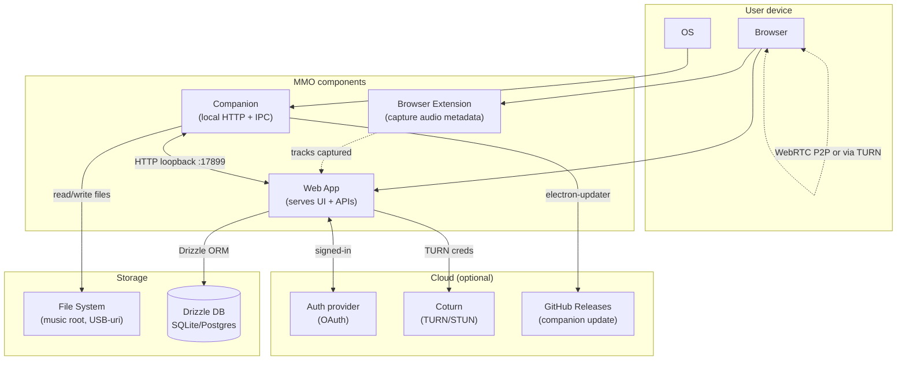

# 01 — Prezentare generală arhitectură

> [← docs/arhitectura/](README.md) · [02 →](02-componente-suite.md)

---

## 🎯 Scop

MMO este o suite de **4 componente** care colaborează pentru a oferi unei singure persoane (sau unui grup mic) o experiență completă de organizare + producție + performance muzicală.

| Strat | Componentă | Tehnologie | Scop |
|-------|-----------|-----------|------|
| Browser | **Web App** | Next.js 16, React 19, TS 5.8 | UI principal, persistență, business logic |
| Browser | **Extension** | Chrome MV3 | Capture audio din platforme streaming |
| Desktop | **Companion** | Electron + Express | Bridge nativ: audio low-latency, MIDI, file system |
| Cloud | **Coturn TURN/STUN** | Debian 12 + coturn pe GCP | Relay WebRTC (fallback NAT) |

---

## 🧭 Principii directoare

1. **Browser-first**. Web app-ul este sursa unică de adevăr și UI. Toate celelalte componente îi servesc lui.
2. **Native când e necesar**. Browser-ul nu poate face anumite lucruri (low-latency MIDI, watch folders OS-level, scriere directă pe USB cu permisiuni native). Companion-ul face acestea.
3. **Server-first în Next.js**. Folosim RSC + Server Actions; `"use client"` doar la componente interactive. Fără API routes pentru mutări (Server Actions au CSRF protection automat).
4. **No vendor lock-in**. SQLite local, Drizzle (SQL standard), Auth.js self-hosted, Coturn self-hosted. Singurele dependențe externe nereversibile: GitHub Releases (auto-update).
5. **Schema deschisă**. DB-ul e accesibil cu unelte standard (sqlite3, psql); orice user avansat poate exporta/migra/back-up-i.
6. **P2P pentru colaborare**. Audio remote nu trece prin server (latență ~50ms vs ~250ms prin relay).

---

## 🎓 Audiență țintă

| Audiență | Ce vrea | Documente recomandate |
|----------|---------|----------------------|
| **Contributor frontend** | Adaug feature UI în web app | [02-componente-suite](02-componente-suite.md) → [03-stack](03-stack-tehnologic.md) → [`app/README.md`](../../app/README.md) |
| **Contributor backend** | Schimb DB schema, server action, API | [04-fluxuri-date](04-fluxuri-date.md) → [03-stack](03-stack-tehnologic.md) → [`app/README.md`](../../app/README.md) |
| **Contributor companion** | Lucrez la Electron, IPC, audio nativ | [02-componente-suite](02-componente-suite.md) → [`docs/companion/`](../companion/) → [`server/README.md`](../../server/README.md) |
| **Contributor extension** | Adaug platformă nouă în extensie | [`docs/extension/`](../extension/) → [`extension/README.md`](../../extension/README.md) |
| **DevOps / SRE** | Provisionez infra, monitorizez TURN | [05-securitate-auth](05-securitate-auth.md) → [`infra/terraform/README.md`](../../infra/terraform/README.md) |
| **Reviewer / arhitect** | Înțeleg deciziile globale | toată secțiunea, în ordine 01→05 |

---

## 📊 Diagramă "vedere de la 30.000 ft"

---

## 🚦 Stări de operare

MMO funcționează în mai multe **moduri**, în funcție de ce componente are utilizatorul instalate:

| Mod | Componente active | Capabilități |
|-----|-------------------|--------------|
| **Solo browser** | Web App | Bibliotecă (upload manual), mixer browser, DAW basic, vizualizări |
| **+ Companion** | Web App + Companion | Watch folders OS, MIDI hardware, audio nativ low-latency, scriere USB pentru CDJ |
| **+ Extension** | Web App + Extension | Capture din 15 platforme streaming |
| **+ Remote** | Web App + (Companion) + TURN | Colaborare audio peer-to-peer cu alți utilizatori |
| **Full self-hosted** | Toate + propriul TURN + Postgres | Multi-user, multi-tenant, control complet |

---

## 🔗 Următorul pas

→ [02 — Componente suite](02-componente-suite.md): cum se conectează concret cele 4 componente.

---

[← docs/arhitectura/](README.md) · [02 →](02-componente-suite.md)
