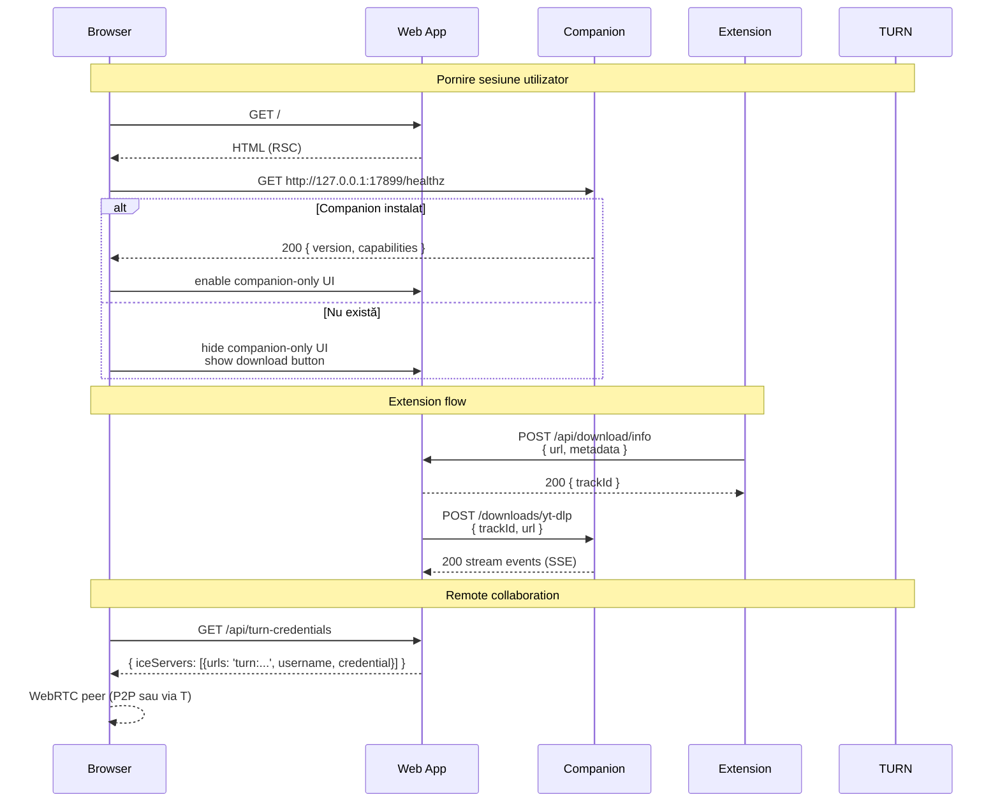

# 02 — Componentele suite

> [← 01](01-prezentare-generala.md) · [03 →](03-stack-tehnologic.md)

---

## 🌐 Web App (`app/`)

### Responsabilități
- Servește UI-ul principal (toate cele ~17 rute)
- Persistă datele (Drizzle ORM peste SQLite/Postgres)
- Expune ~35 endpoints REST/SSE sub `/api/*`
- Rulează 17 Server Actions pentru CRUD (`tracks`, `playlists`, `recordings`, etc.)
- Coordonează fluxurile cu Companion-ul prin HTTP loopback și SSE
- Implementează Auth.js v5 (OAuth multi-provider + sessions)

### Adresă
- Dev: `http://localhost:3000`
- Prod: `https://muzicai.ro`

### Comunicare cu altele
- ↔ **Browser**: HTTPS standard, plus EventSource pentru SSE
- ↔ **Companion**: `fetch` la `http://127.0.0.1:17899/*` din browser sau din server
- ↔ **Extension**: extensia face `fetch` la web app (CORS configurat în extensie)
- ↔ **TURN**: web app emite credențiale ephemeral la `/api/turn-credentials`; browser-ul folosește credențialele direct cu coturn

→ Detalii: [`app/README.md`](../../apps/web/README.md)

---

## 🖥️ MMO Companion (`server/`)

### Responsabilități
- **Bridge nativ** între web app și OS (file system, audio, MIDI)
- Watch folders cu **chokidar** (recursiv, cross-platform)
- Servește audio local (streaming HTTP cu Range requests pentru seek)
- Listează & manipulează drive-uri (USB, externe) cu permisiuni native
- Expune **MIDI input** pentru controllere DDJ-FLX4 / Circuit Tracks
- Auto-update prin **electron-updater** ↔ GitHub Releases
- Window management & system tray

### Adresă
- HTTP local: `http://127.0.0.1:17899` (configurabil)
- Probe endpoint: `GET /healthz` returnează `{ ok: true, version, capabilities }`

### Cum se conectează la web app
- Web app (browser) face `fetch('http://127.0.0.1:17899/healthz')` pe mount
- Dacă probe-ul reușește → web app activează features companion-only
- Dacă nu → web app ascunde aceste features și afișează buton "Download Companion" (vezi `companion-download-button.tsx`)
- Pentru auth, companion-ul cere un token de la web app la pornire (`/api/companion-auth`) și îl include în orice cerere

### Build & distribuție
- `pnpm dist:win` / `dist:mac` / `dist:linux` în `server/`
- Output în `server/release/` și publicat automat pe GitHub Releases prin workflow `.github/workflows/companion-release.yml`
- Auto-update verifică `releases/latest` la pornire + la fiecare 24h

→ Detalii: [`server/README.md`](../../server/README.md), [`docs/companion/`](../companion/)

---

## 🧩 Browser Extension (`extension/`)

### Responsabilități
- Detectează prezența audio/video pe 15 platforme streaming
- Adaugă un buton **"Capture to MMO"** în UI-ul fiecărei platforme (content script)
- La click: extrage metadate (titlu, artist, URL, duration, thumbnail) și le trimite la web app
- Web app-ul decide cum să descarce (prin companion cu yt-dlp, sau prin proxy server)

### Manifest V3
- Service worker (`background.js`) — orchestrează message passing
- Content scripts injectate în domeniile țintă (`youtube.com`, `soundcloud.com`, etc.)
- Permisiuni minime: `storage`, `activeTab`

### Comunicare
- Content script → background SW: `chrome.runtime.sendMessage`
- Background SW → web app: `fetch` la `https://muzicai.ro/api/download/info` (sau `localhost:3000` în dev)
- Storage: `chrome.storage.local` pentru config (URL web app, queue offline)

→ Detalii: [`extension/README.md`](../../apps/extension/README.md), [`docs/extension/`](../extension/)

---

## ☁️ Coturn TURN/STUN (`infra/terraform/`)

### Responsabilități
- **STUN**: ajută peers să-și descopere IP public
- **TURN**: relay de audio când peers nu se pot conecta direct (NAT simetric)

### Provisioning
- Terraform pe GCP, regiune `europe-west1`
- 1× e2-micro VM Debian 12, 10 GB pd-standard
- 1× IP static PREMIUM tier
- Firewall: 3478 UDP+TCP (STUN/TURN), 49160-49200 UDP (relay range)
- Cost: ~$7.5/lună

### Auth
- **REST ephemeral credentials** (RFC 7635) — fără DB pe TURN
- Web app primește `TURN_SHARED_SECRET` din Terraform output
- La cerere `/api/turn-credentials`, web app generează username `<expiry>:<userId>` și parolă `HMAC-SHA1(shared_secret, username)`
- Credențialele sunt valabile 1h

### Capacitate
- ~150 concurrent Opus relays @ 96 kbps pe e2-micro
- Scaling: e2-small (~300), n1-standard-1 (~600)

→ Detalii: [`infra/terraform/README.md`](../../infra/terraform/README.md)

---

## 🔄 Conectări vizuale

---

## 🔗 Următorul pas

→ [03 — Stack tehnologic](03-stack-tehnologic.md): toate librăriile/framework-urile și de ce le-am ales.

---

[← 01](01-prezentare-generala.md) · [03 →](03-stack-tehnologic.md)
