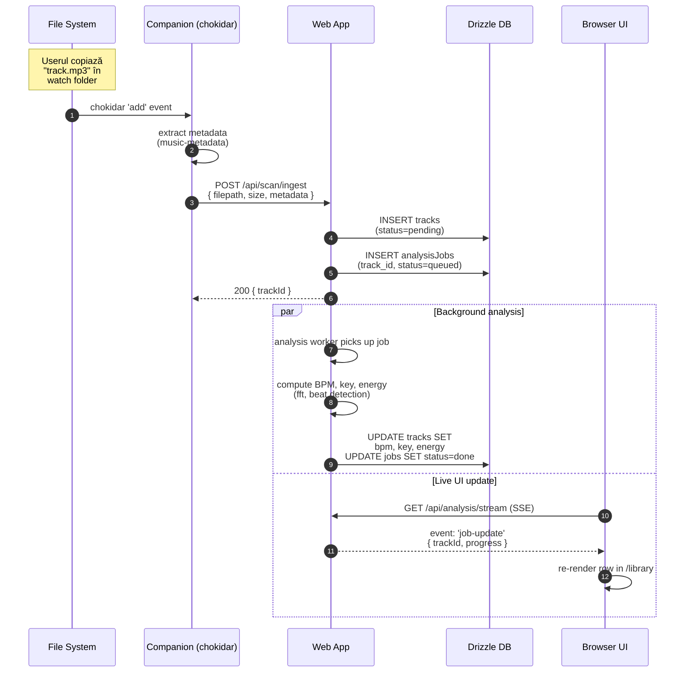
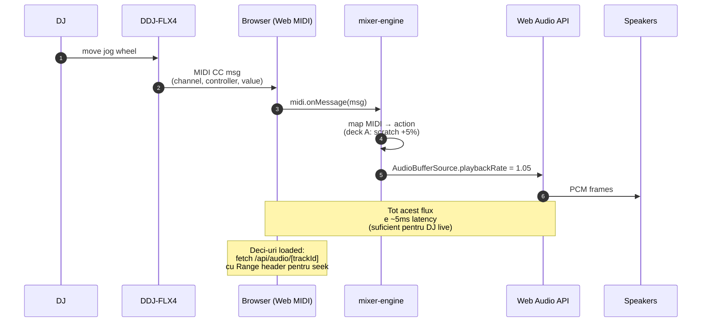
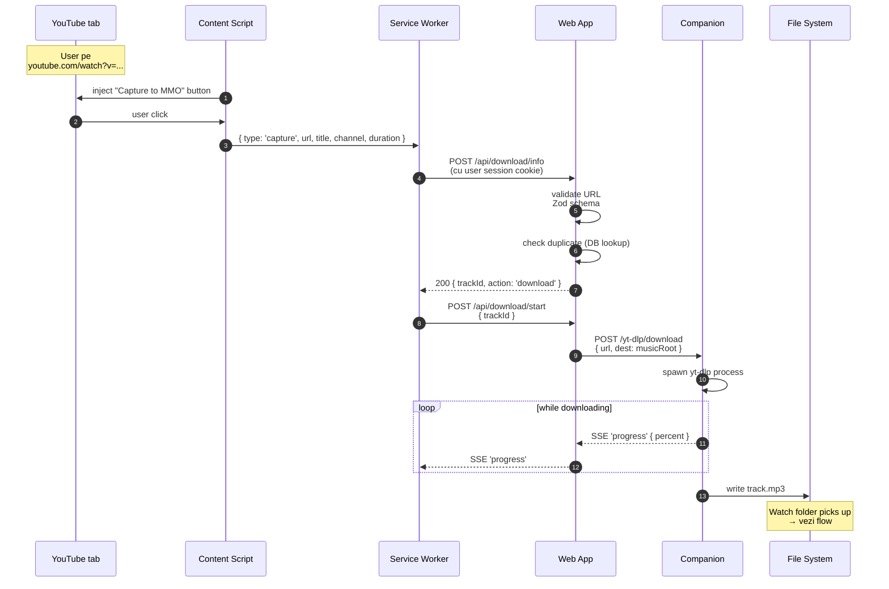
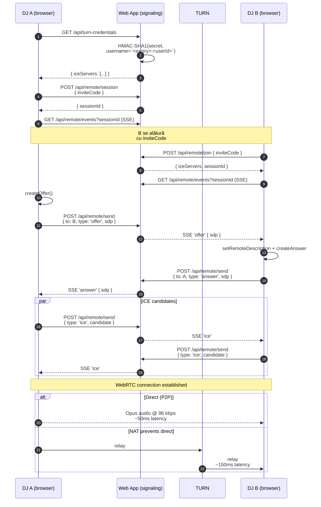
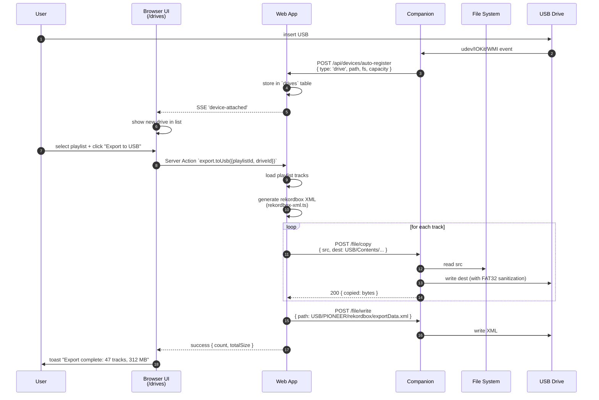
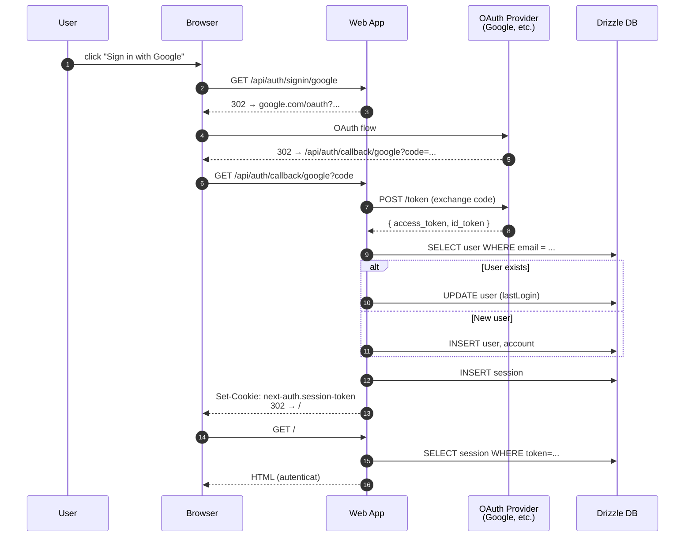
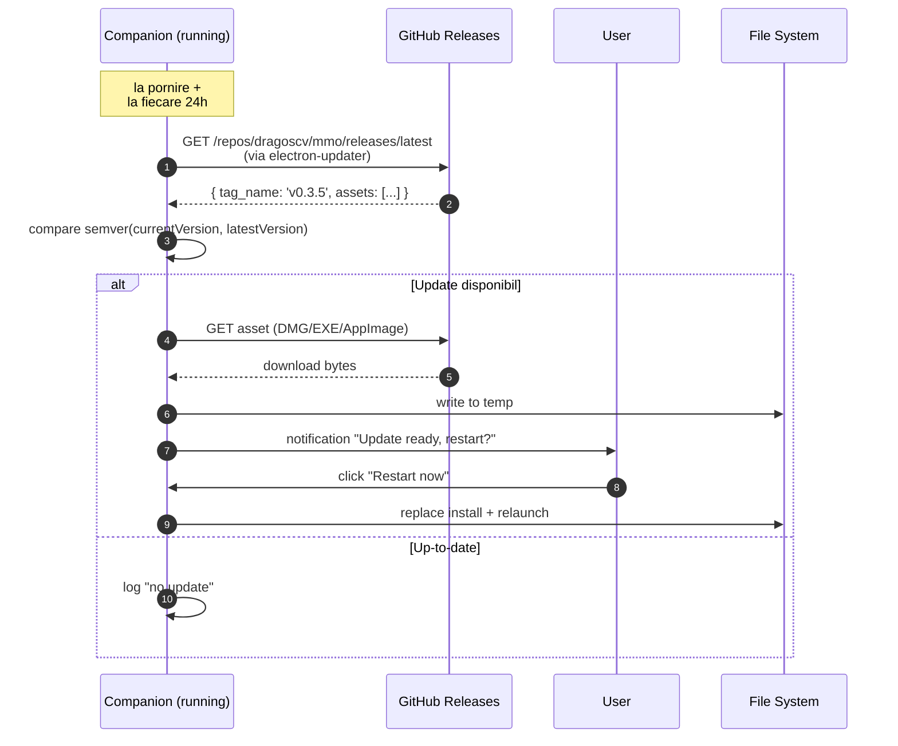

# 04 — Fluxuri de date

> [← 03](03-stack-tehnologic.md) · [05 →](05-securitate-auth.md)

Diagrame sequence pentru cele mai importante fluxuri din MMO.

---

## 1. 📁 Auto-import: track nou apare în watch folder

---

## 2. 🎚️ Mixaj live cu DDJ-FLX4

---

## 3. ⬇️ Download din YouTube prin extensie

> **Notă**: dacă companion-ul nu e instalat, web app-ul poate face fallback la un endpoint server-side care rulează `yt-dlp` (cu rate limiting și verificări legale).

---

## 4. 📡 Sesiune remote (doi DJ-i, audio P2P)

---

## 5. 💿 Export USB pentru CDJ

---

## 6. 🔐 Autentificare (Auth.js v5 + OAuth)

---

## 7. 🔄 Companion auto-update

---

## 🔗 Următorul pas

→ [05 — Securitate & Auth](05-securitate-auth.md): cum protejăm datele și ce limite punem.

---

[← 03](03-stack-tehnologic.md) · [05 →](05-securitate-auth.md)
