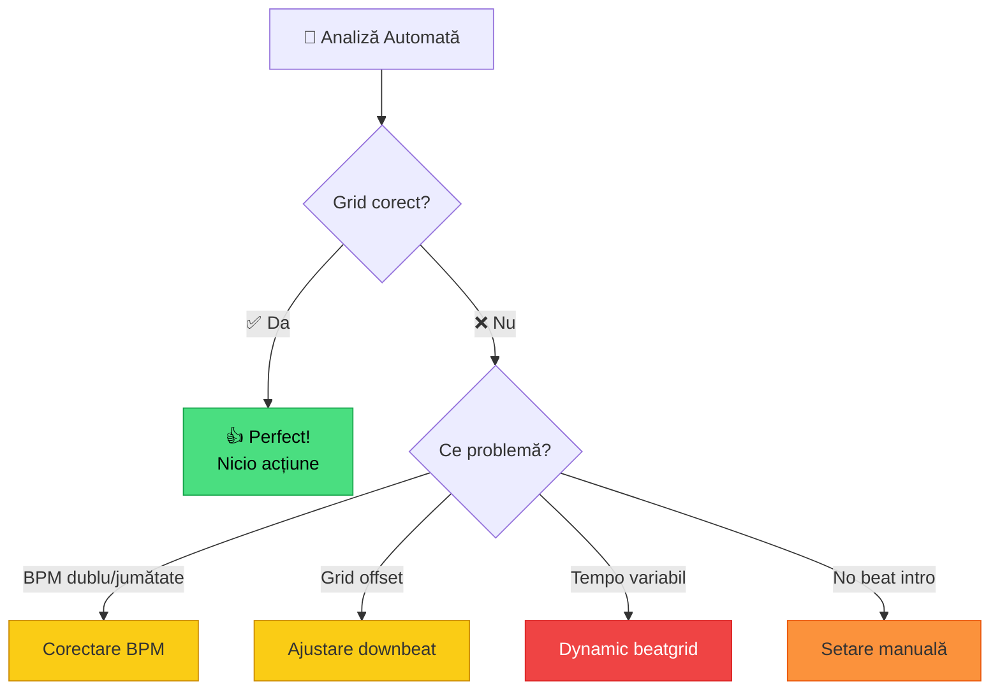

# 🟡 Beatgrid Avansat — Corectare Manuală

[🏠 Home](../../README.md) · [🗺️ Navigare](../../NAVIGARE.md) · [🟡 Avansat](../../README.md#-avansat)

| ← Prev | Next → |
|:---|---:|
| [← Export USB Basic](../incepator/07-export-usb-basic.md) | [Hot Cues & Memory →](02-hot-cues-memory.md) |

---

> **Pe scurt:** Cum corectezi beatgrid-ul când analiza automată greșește.
> Esențial pentru track-uri cu tempo variabil (manele, populară, live recordings).

---

## 🧠 Când Trebuie Corecție Manuală?



### Genuri Problematice (pentru tine):

| Gen | Problemă Frecventă | Dificultate |
|-----|---------------------|-------------|
| **Manele** | Tempo variabil, swing mare | 🔴 Greu |
| **Populară Românească** | Tempo variabil, rubato | 🔴 Greu |
| **Balkanică** | Metru neregulat (7/8, 9/8) | 🟠 Mediu |
| **Latino** (live) | Tempo ușor variabil | 🟡 Ușor-Mediu |
| **Techno/House** | Aproape mereu corect | 🟢 Ușor |
| **Bounce** | Grid corect, dar BPM dublu | 🟡 Ușor |

---

## 🔧 Corectare BPM Dublu/Jumătate

Cel mai frecvent: rekordbox detectează **128 BPM** ca **256** (dublu) sau **64** (jumătate).

### Soluție:

1. Selectează track-ul
2. Click dreapta → **Analyze Track** cu opțiunea BPM range corecta
3. Sau: în track info, modifică **BPM manual** — dublu-click pe valoarea BPM

### Verificare:

- **Techno 128 BPM** → dacă arată 256, împarte la 2
- **Bounce 155 BPM** → dacă arată 77, înmulțește cu 2
- **Manele 100 BPM** → dacă arată 200, împarte la 2

---

## 📐 Ajustare Grid Offset (Downbeat)

Dacă grid-ul e **decalat** (liniile nu cad pe beat):

### În Rekordbox:

1. **Dublu-click** pe track → se deschide în player
2. Zoom pe waveform
3. Găsește **primul beat real** (primul kick vizibil)
4. Click dreapta pe acel punct → **Set as Beat Grid Start**
5. Sau folosește **grid adjust**: `Shift + ← / →` pentru micro-ajustări

### Vizual:

```
  GREȘIT:
  Waveform:   ▄█▄  ▄█▄  ▄█▄  ▄█▄
  Grid:      |    |    |    |
              ^ offset!

  CORECT:
  Waveform:   ▄█▄  ▄█▄  ▄█▄  ▄█▄
  Grid:       |    |    |    |
              ^ perfect!
```

---

## 🎭 Track-uri cu Tempo Variabil

**Manele, populară și muzică live** au adesea tempo **ușor variabil** — muzicienii nu cântă pe un metronom fix.

### Opțiuni:

1. **Ignoră** — dacă mixezi only cu aceste genuri, variația naturală e OK
2. **Setează BPM mediu** — alege un BPM aproximativ care funcționează
3. **Dynamic Beatgrid** — setează mai multe puncte de referință (pro feature)

> **💡 Sfat practic:** Pentru manele și populară, nu te baza pe Sync.
> Învață **beatmatching manual** cu jog wheel — e mai natural.

---

## 🎵 Track-uri Fără Beat la Intro

Unele track-uri încep cu **ambient, vocal, sau efect** fără ritm clar.

### Soluție:

1. Ascultă track-ul și găsește **primul kick real**
2. Setează **Memory Cue** pe acel punt (pentru tine: "First Beat")
3. Ajustează beatgrid-ul pornind de la acel punct
4. Când mixezi, pornește de la Memory Cue, nu de la începutul track-ului

---

## ✅ Checklist

- [ ] Știu să identific BPM dublu/jumătate
- [ ] Știu să ajustez grid offset
- [ ] Înțeleg limitările grid-ului pe manele/populară
- [ ] Știu să setez un punct de referință manual

---

| ← Prev | Next → |
|:---|---:|
| [← Export USB Basic](../incepator/07-export-usb-basic.md) | [Hot Cues & Memory →](02-hot-cues-memory.md) |

[🏠 Home](../../README.md) · [🗺️ Navigare](../../NAVIGARE.md)
