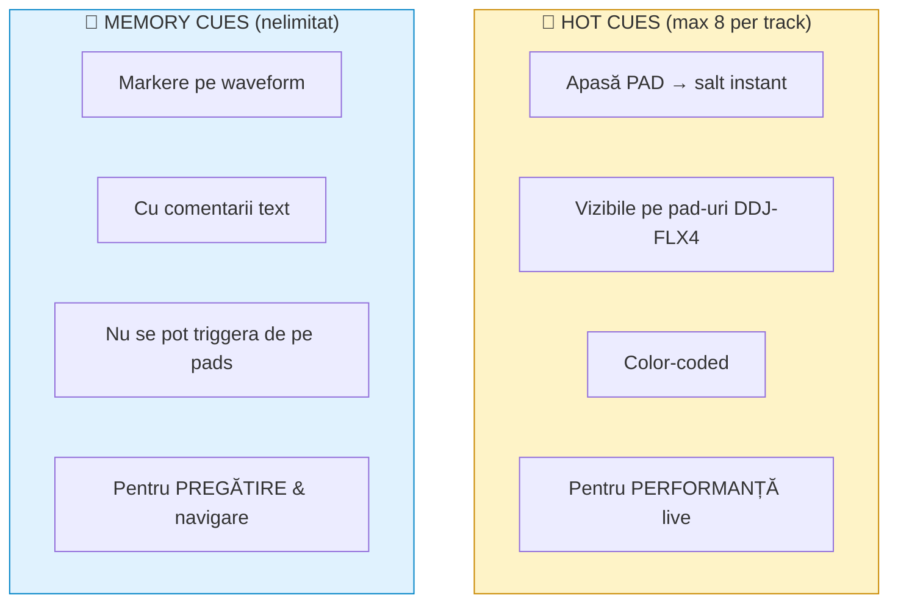
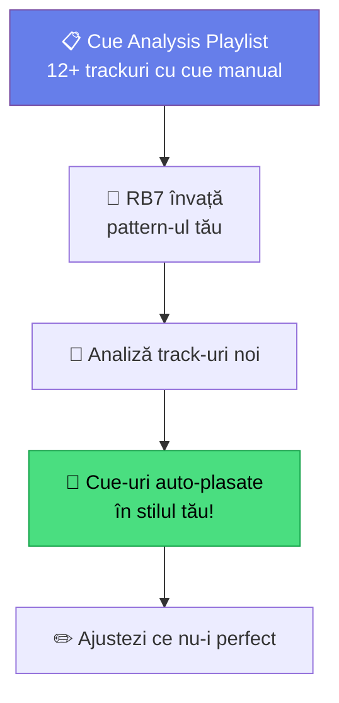

# 🟡 Hot Cues & Memory Cues — Strategie Completă

> ⚠️ **Context**: ghid **rekordbox**. În MMO setezi cues în [`docs/aplicatie/mixer.md`](../aplicatie/mixer.md), sunt incluse în export USB.

[🏠 Home](../../README.md) · [🗺️ Navigare](../../NAVIGARE.md) · [🟡 Avansat](../../README.md#-avansat)

| ← Prev | Next → |
|:---|---:|
| [← Beatgrid Avansat](01-beatgrid-avansat.md) | [Playlisturi Inteligente →](03-playlisti-inteligente.md) |

---

> **Pe scurt:** Cum plasezi Hot Cues și Memory Cues strategic.
> Plus: Intelligent Cues în rekordbox 7.

---

## 🧠 Diferența: Hot Cues vs Memory Cues



| Caracteristică | Hot Cues | Memory Cues |
|----------------|----------|-------------|
| **Număr max** | 8 per track | Nelimitat |
| **Acces** | Pad-uri pe DDJ-FLX4 | Waveform click |
| **Salt instant?** | ✅ Da | Nu |
| **Comentarii** | Nu | ✅ Da |
| **Culori** | ✅ Da | ✅ Da |
| **Folosire** | Live performance | Pregătire & navigare |

---

## 🎯 Strategie Hot Cues — Schema mwrty

### Schema de 8 Hot Cues:

| Pad | Culoare | Ce Marchează | Când Folosești |
|-----|---------|-------------|----------------|
| **1** | 🟢 Verde | **First Beat** — primul kick | Start mix aici |
| **2** | 🔵 Albastru | **Breakdown** — start breakdown | Moment emoțional |
| **3** | 🟡 Galben | **Build-up** — start build | Pregătire drop |
| **4** | 🔴 Roșu | **Drop** — start drop | Momentul de impact |
| **5** | 🟠 Portocaliu | **Vocal** — start vocal memorabil | Moment special |
| **6** | 🟣 Mov | **Mix Out** — punctul ideal de ieșire | Aici începi tranziția |
| **7** | ⚪ Alb | **Loop Point** — secțiune bună de loop | Extend track |
| **8** | 🔵 Cyan | **Outro Safe** — start outro curat | Mix curat garantat |

### Vizualizare pe Track:

```
  │ INTRO │ BUILD │ DROP 1 │ BREAK │ BUILD 2│ DROP 2 │ OUTRO │
  │       │       │        │       │        │        │       │
  🟢1     🟡3     🔴4      🔵2     🟡3      🔴4      ⚪8
  │                🟠5                       🟣6      │
  │                🔵7                                │
```

---

## 📍 Strategie Memory Cues

Memory Cues sunt **note pentru tine** pe track:

| Memory Cue | Comentariu | Scop |
|-----------|------------|------|
| Start | "Mix in point" | Unde porneșit mixul |
| Vocal Start | "Vocal begins" | Știi să eviți overlap vocal |
| Energy Peak | "Maximum energy" | Plus la set-ul tău |
| Mix Out | "Start transition here" | Punct ideal de exit |
| Genre Change | "Becomes more techno" | Track hybride |

---

## 🤖 Intelligent Cues (Rekordbox 7)



### Cum Setezi Intelligent Cues:

1. **Crează playlist "Cue Analysis"** cu 12+ track-uri
2. **Pune cue-urile manual** pe aceste track-uri (consistent cu schema ta)
3. **Preferences → Analysis → Cue Analysis:**
   - ✅ Set Cues During Analysis
   - ✅ Hot Cues (sau Memory Cues)
   - Number of cues: 4-8
   - ✅ Add Auto Cue comment
   - ✅ Don't overwrite existing cues
4. **Analizează track-uri noi** — RB7 pune cue-uri automat în stilul tău!

> **💡 Economie de timp:** Pe 500 track-uri, Intelligent Cues economisesc **ore**.

---

## ✅ Checklist

- [ ] Am o schemă de culori consistentă pentru Hot Cues
- [ ] Pun cel puțin Cue 1 (First Beat) și Cue 6 (Mix Out) pe fiecare track
- [ ] Folosesc Memory Cues pentru note personale
- [ ] Am configurat Intelligent Cues cu playlist-ul de referință

---

| ← Prev | Next → |
|:---|---:|
| [← Beatgrid Avansat](01-beatgrid-avansat.md) | [Playlisturi Inteligente →](03-playlisti-inteligente.md) |

[🏠 Home](../../README.md) · [🗺️ Navigare](../../NAVIGARE.md)
