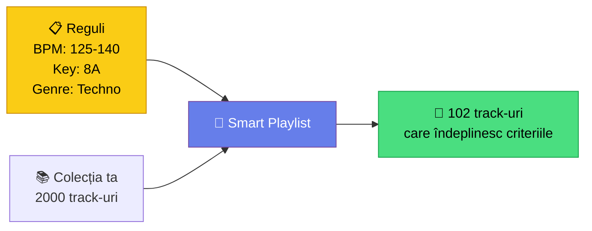

# 🟡 Playlisturi Inteligente & Collection Radar

> ⚠️ **Context**: ghid **rekordbox**. Playlist-uri smart în MMO → [`docs/aplicatie/playlists.md`](../aplicatie/playlists.md).

[🏠 Home](../../README.md) · [🗺️ Navigare](../../NAVIGARE.md) · [🟡 Avansat](../../README.md#-avansat)

| ← Prev | Next → |
|:---|---:|
| [← Hot Cues & Memory](02-hot-cues-memory.md) | [Mixaj Armonic →](04-mixaj-armonic.md) |

---

> **Pe scurt:** Smart playlists, Collection Radar și Streaming Radar —
> lasă rekordbox-ul să lucreze pentru tine.

---

## 🧠 Smart Playlists (Playlisturi Inteligente)

Playlist-urile inteligente se **actualizează automat** pe baza regulilor setate.

### Exemple Smart Playlists:

| Playlist | Reguli | Scop |
|----------|--------|------|
| **Techno Peak** | BPM: 130-145, Genre: Techno, Rating: ≥4 | Track-uri de vârf |
| **Warmup Chill** | BPM: 115-125, Energy: Low | Început de set |
| **Bounce Ready** | BPM: 150-165, Genre: Bounce | Bounce set |
| **Recent Adds** | Date Added: Last 30 days | Ce ai nou |
| **Manele Mix** | Genre: Manele, Rating: ≥3 | Best of manele |
| **5 Star Only** | Rating: 5 | Armele tale secrete |
| **Key 8A Family** | Key: 7A, 8A, 9A, 8B | Harmonic group |

### Cum Creezi:

1. Click dreapta pe Playlists → **Create New Smart Playlist**
2. Setează regulile (add conditions)
3. Combină cu **AND/OR**
4. Playlist-ul se populează automat!

---

## 🔍 Collection Radar (RB7)

Collection Radar scanează biblioteca ta și sugerează track-uri **compatibile** cu ce ai pe deck.

### Ce analizează:

- **BPM** — tempo similar
- **Key** — tonalitate compatibilă  
- **Energy** — nivel energetic potrivit
- **Vocals** — instrumental vs. vocal mix
- **Popularity** — track-uri populare

### Cum Folosești:

1. Încarcă un track pe deck
2. Deschide **Collection Radar** panel
3. Vezi track-uri sugerate din **biblioteca ta**
4. Drag & drop în playlist-ul setului

---

## 📻 Streaming Radar (RB7)

Streaming Radar sugerează track-uri de pe **servicii de streaming** (Beatport, SoundCloud, Tidal).

> **⚠️ Limitare:** Track-urile streamate **NU se pot exporta pe USB**.
> Descarcă/cumpără track-ul dacă vrei pe USB.

---

## ✅ Checklist

- [ ] Am cel puțin 3 smart playlists create
- [ ] Știu să folosesc Collection Radar
- [ ] Înțeleg limitarea streaming-ului (nu USB export)

---

| ← Prev | Next → |
|:---|---:|
| [← Hot Cues & Memory](02-hot-cues-memory.md) | [Mixaj Armonic →](04-mixaj-armonic.md) |

[🏠 Home](../../README.md) · [🗺️ Navigare](../../NAVIGARE.md)
