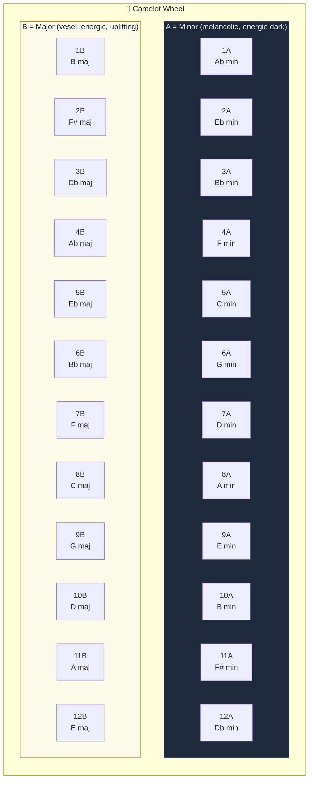
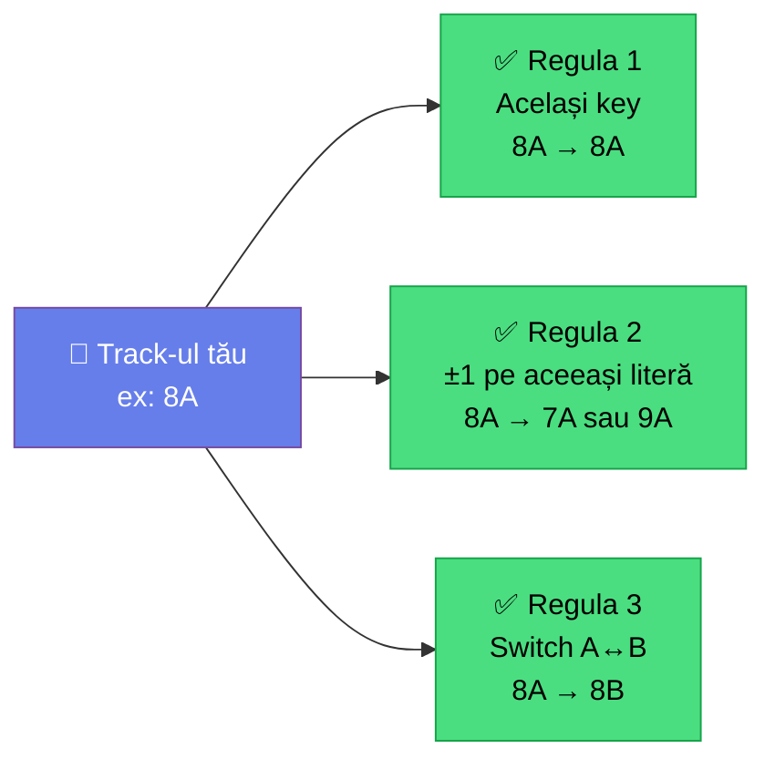
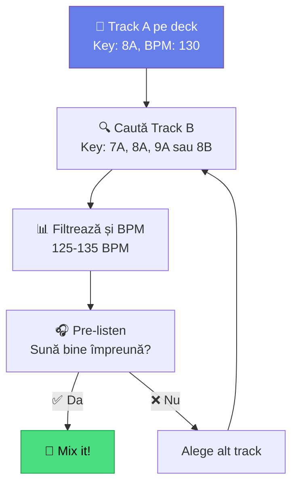

# 🟡 Mixaj Armonic — Camelot Wheel & Key Compatibility

[🏠 Home](../../README.md) · [🗺️ Navigare](../../NAVIGARE.md) · [🟡 Avansat](../../README.md#-avansat)

| ← Prev | Next → |
|:---|---:|
| [← Playlisturi Inteligente](03-playlisti-inteligente.md) | [Efecte Avansate →](05-efecte-avansate.md) |

---

> **Pe scurt:** Cum mixezi track-uri care sună bine împreună folosind
> sistemul Camelot. Diferența dintre un DJ ok și unul profesionist.

---

## 🎯 De Ce Contează Key-ul?

Două track-uri cu key-uri **incompatibile** sună dizarmonic (urât) când se suprapun.
Două track-uri cu key-uri **compatibile** sună natural — ca și cum ar fi fost create împreună.

---

## 🎡 Camelot Wheel — Complet



---

## 📋 Reguli de Compatibilitate

### Cele 3 Reguli de Aur:



| Regulă | Din | Merge Cu | Efect |
|--------|-----|----------|-------|
| **Same Key** | 8A | 8A | Identic — perfect |
| **±1 Same Letter** | 8A | 7A, 9A | Subtil, natural |
| **A↔B Switch** | 8A | 8B | Schimbare mood (minor↔major) |

### Opțiuni totale de la **8A**:

```
  7A ← 8A → 9A     (±1 same letter)
        ↕
       8B           (A↔B switch)
  7B ← 8B → 9B     (±1 pe 8B)

  = 5 opțiuni 100% sigure per track
```

---

## 🔥 Tehnici Avansate

### Energy Boost (+2 sau +7)

- **+2:** 8A → 10A = salt energetic dramatic
- **+7:** 8A → 3A = "perfect fifth" — sună epic

> **⚠️ Risc:** +2 și +7 sunt avansate. Key-urile se suprapun mai puțin.
> Folosește doar pe tranziții scurte sau cu tracks instrumentale.

### Mood Shift (A↔B)

- **8A** (A minor — melancolie) → **8B** (C major — bucurie)
- Efect: ridici mood-ul publicului
- Perfect pentru: build-up → drop

---

## 📊 Key-uri Frecvente per Gen (pentru tine)

| Gen | Key-uri Frecvente | Camelot |
|-----|-------------------|---------|
| **Techno** | Am, Em, Dm, Gm | 8A, 9A, 7A, 6A |
| **Tech House** | Cm, Gm, Dm | 5A, 6A, 7A |
| **Bounce** | Cm, Fm, Gm, Bb | 5A, 4A, 6A, 6B |
| **Acid** | Am, Dm, Em | 8A, 7A, 9A |
| **Psy** | Em, Am, Bm | 9A, 8A, 10A |
| **Manele** | Dm, Am, Gm, Hicaz* | 7A, 8A, 6A |
| **Balkanică** | Dm, Gm, Am | 7A, 6A, 8A |
| **Latino** | Am, Dm, Cm | 8A, 7A, 5A |

> \* Manelele folosesc adesea scale orientale (Hicaz, Nikriz) care nu se mapează perfect pe Camelot. Ascultă cu urechea!

---

## 🎧 Workflow Practic de Harmonic Mixing



### În Rekordbox:

1. Track A pe deck. Notează **Key** (ex: 8A)
2. În Collection, sortează coloana **Key**
3. Caută track-uri 7A, 8A, 9A, 8B
4. Filtrează și după **BPM** (±5 BPM)
5. Ascultă cu **Dual Players** (Export Mode) sau **pre-listen** (Performance Mode)
6. Alege track-ul care sună cel mai bine → mix!

> **💡 Sfat:** Collection Radar face exact asta automat!

---

## 📖 Tabel Complet de Compatibilitate

| Key | ✅ Perfect | ✅ Bun | ⚠️ Risky |
|-----|-----------|--------|----------|
| 1A | 12A, 1A, 2A, 1B | 11A, 3A | Rest |
| 2A | 1A, 2A, 3A, 2B | 12A, 4A | Rest |
| 3A | 2A, 3A, 4A, 3B | 1A, 5A | Rest |
| 4A | 3A, 4A, 5A, 4B | 2A, 6A | Rest |
| 5A | 4A, 5A, 6A, 5B | 3A, 7A | Rest |
| 6A | 5A, 6A, 7A, 6B | 4A, 8A | Rest |
| 7A | 6A, 7A, 8A, 7B | 5A, 9A | Rest |
| **8A** | **7A, 8A, 9A, 8B** | **6A, 10A** | Rest |
| 9A | 8A, 9A, 10A, 9B | 7A, 11A | Rest |
| 10A | 9A, 10A, 11A, 10B | 8A, 12A | Rest |
| 11A | 10A, 11A, 12A, 11B | 9A, 1A | Rest |
| 12A | 11A, 12A, 1A, 12B | 10A, 2A | Rest |

> Același principiu se aplică pentru B-uri (major).

---

## ✅ Checklist

- [ ] Înțeleg sistemul Camelot (A = minor, B = major, numere 1-12)
- [ ] Știu cele 3 reguli de compatibilitate
- [ ] Folosesc coloana Key în rekordbox
- [ ] Sortez/filtrez track-uri după key compatibil
- [ ] Am experimentat cu energy boost (+2, +7)
- [ ] Știu că manelele/populara au limitări cu Camelot

---

| ← Prev | Next → |
|:---|---:|
| [← Playlisturi Inteligente](03-playlisti-inteligente.md) | [Efecte Avansate →](05-efecte-avansate.md) |

[🏠 Home](../../README.md) · [🗺️ Navigare](../../NAVIGARE.md)
