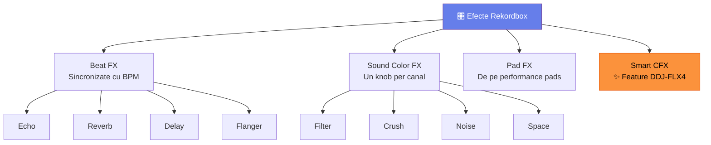

# 🟡 Efecte Avansate — FX, Performance Pads, Sound Color

[🏠 Home](../../README.md) · [🗺️ Navigare](../../NAVIGARE.md) · [🟡 Avansat](../../README.md#-avansat)

| ← Prev | Next → |
|:---|---:|
| [← Mixaj Armonic](04-mixaj-armonic.md) | [Organizare Avansată →](06-organizare-avansata.md) |

---

> **Pe scurt:** FX chains, Beat FX, Sound Color FX pe DDJ-FLX4 și Smart CFX.

---

## 🎛️ Tipuri de Efecte în Rekordbox

---

## 🔊 Beat FX — Efect Principal

| FX | Ce Face | Când Folosești | Gen Potrivit |
|----|---------|----------------|-------------|
| **Echo** | Repetare cu fade | Tranziții, build-uri | Techno, House |
| **Reverb** | Spațiu, cameră | Break-uri, ambient | Melodic, Psy |
| **Delay** | Repetare ritmică | Drop-uri, groove | Tech House |
| **Flanger** | Efect "jet" | Build-uri ascendente | Trance, Psy |
| **Spiral** | Combinație reverb+delay | Tranziții dramatice | Techno |
| **Roll** | Beat repeat | Stutter effects | Bounce, Techno |

### Pe DDJ-FLX4:

1. Selectează FX-ul dorit din rekordbox (sau cu butonul FX)
2. Ajustează **Depth** (intensitate)
3. Selectează **Beat size** (1/4, 1/2, 1, 2 beats)
4. Apasă **FX ON** → efect activ

---

## ✨ Smart CFX (Feature DDJ-FLX4!)

Smart CFX = **un singur knob** care aplică un efect complex pe tot canalul.

| Smart CFX | Ce Face |
|-----------|---------|
| **Smart Fader** | Crossfade cu EQ automat |
| **Smart CFX** | Efect one-knob (filter + echo combo) |

> **💡 Perfect pentru începători** — un singur control, efect profesional.

---

## 🎹 Performance Pads — 4 Moduri

| Mod Pad | Ce Face | Număr Pads |
|---------|---------|------------|
| **Hot Cues** | Salt la cue points | 8 |
| **Pad FX** | Efecte instant | 8 efecte |
| **Beat Jump** | Salt ±2, 4, 8, 16 beats | 8 direcții |
| **Sampler** | Trigger samples | 8 samples |

### Recomandat per Gen:

| Gen | Pad Mode Principal | De Ce |
|-----|-------------------|------|
| Techno | Hot Cues + Beat Jump | Navigare precisă |
| Bounce | Hot Cues + Pad FX | Efecte dramatice |
| Manele | Hot Cues | Salturi la momente cheie |
| Tech House | Sampler + Hot Cues | Layere percuție |

---

## 🎵 FX Chains Recomandate per Gen

| Gen | FX Chain | Moment |
|-----|----------|--------|
| **Techno** | Reverb → Echo (1 beat) | Build → Drop |
| **Bounce** | Roll (1/4) → Flanger | Pre-drop |
| **Psy** | Delay → Spiral | Tranziții |
| **Tech House** | Filter sweep + Echo | Groove sections |
| **Manele** | Reverb (subtil) | Tranziții vocal |

---

## ✅ Checklist

- [ ] Cunosc diferența între Beat FX, Sound Color FX și Pad FX
- [ ] Știu să folosesc Echo și Reverb pe tranziții
- [ ] Am experimentat cu Smart CFX pe DDJ-FLX4
- [ ] Știu ce Pad Mode să folosesc per gen

---

| ← Prev | Next → |
|:---|---:|
| [← Mixaj Armonic](04-mixaj-armonic.md) | [Organizare Avansată →](06-organizare-avansata.md) |

[🏠 Home](../../README.md) · [🗺️ Navigare](../../NAVIGARE.md)
