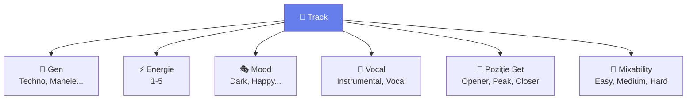

# 🟡 Organizare Avansată — My Tag, Related Tracks, Rating System

> ⚠️ **Context**: organizare în **rekordbox**. Pentru MMO → [`organizare/`](../../organizare/) + [`docs/aplicatie/settings.md`](../aplicatie/settings.md).

[🏠 Home](../../README.md) · [🗺️ Navigare](../../NAVIGARE.md) · [🟡 Avansat](../../README.md#-avansat)

| ← Prev | Next → |
|:---|---:|
| [← Efecte Avansate](05-efecte-avansate.md) | [Înregistrare Mix →](07-inregistrare-mix.md) |

---

> **Pe scurt:** Sistem avansat de taguri, related tracks, și workflow de
> clasificare pentru biblioteci mari (500+ track-uri).

---

## 🏷️ My Tag System — Clasificare Multi-Dimensională



### Taguri Recomandate:

| Tag | Valori | Câmp RB |
|-----|--------|---------|
| **Gen Principal** | Techno, Tech House, Bounce, Acid, Psy, Manele, Populară, Balkanică, Latino | Genre |
| **Sub-gen** | Hard Techno, Minimal, Melbourne Bounce, Dark Psy | Comments |
| **Energie** | 1-Low, 2-Warmup, 3-Mid, 4-High, 5-Peak | Rating (1-5★) |
| **Mood** | Dark, Aggressive, Happy, Emotional, Trippy, Party, Chill | Color Label |
| **Vocal** | Instrumental, Light Vocal, Heavy Vocal, Acapella | My Tag |
| **Poziție Set** | Opener, Journey, Peak, Closer | My Tag |
| **Mixability** | Easy (clean intro/outro), Medium, Hard (tempo variabil) | My Tag |
| **Fuziune** | Techno×Manele, Bounce×Balkan | Comments |

### Color Label → Mood Mapping:

| 🔴 | 🟠 | 🟡 | 🟢 | 🔵 | 🟣 |
|----|-----|-----|-----|-----|-----|
| Agresiv | Energic | Chill | Happy | Emotional | Trippy |
| Peak time | Build | Warmup | Party | Melodic | Experimental |

---

## 🔗 Related Tracks — Grupuri de Compatibilitate

Crează **grupuri** de track-uri care merg bine împreună:

### Metoda Comments:

Scrie în **Comments** track-urile complementare:

```
Comments: "Mix cu: Artist - Track B (8A, 130), Artist - Track C (9A, 128)"
```

### Metoda Related Tracks (RB7):

1. Selectează track-ul
2. Panel Related Tracks → vezi sugestii
3. Confirmă/adaugă relații

---

## 📊 Sistem de Rating Avansat

Folosește **Rating (stele)** = **Nivel de Energie**:

| ⭐ | Energie | Folosire |
|----|---------|----------|
| ⭐ | Very Low | Ambient, intro, warming |
| ⭐⭐ | Low-Med | Warmup set |
| ⭐⭐⭐ | Medium | Mid-set, journey |
| ⭐⭐⭐⭐ | High | Build to peak |
| ⭐⭐⭐⭐⭐ | PEAK | Absolute weapons |

---

## ✅ Checklist

- [ ] Am un sistem consistent de taguri
- [ ] Folosesc Color Labels pentru mood
- [ ] Rating = Energy level
- [ ] Comments conțin info utile (sub-gen, mix notes, fuziune)
- [ ] Am cel puțin 50% din bibliotecă taguită

---

| ← Prev | Next → |
|:---|---:|
| [← Efecte Avansate](05-efecte-avansate.md) | [Înregistrare Mix →](07-inregistrare-mix.md) |

[🏠 Home](../../README.md) · [🗺️ Navigare](../../NAVIGARE.md)
