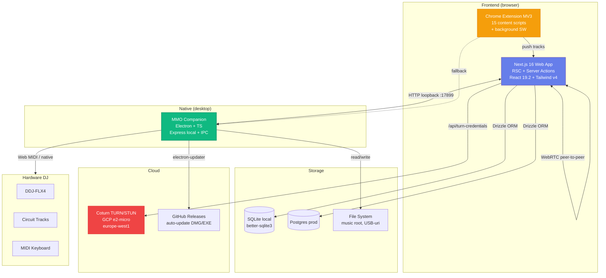

# 🏗️ Arhitectură MMO — Privire de ansamblu

> Acest document descrie arhitectura **suite-ului MMO** (toate componentele).
> Pentru detalii tehnice pe componente → vezi `docs/arhitectura/`.
> Vechea arhitectură monolitică (doar app web) → [legacy-arhitectura.md](legacy-arhitectura.md).

[🏠 Home](../../README.md) · [📋 Concept](README.md)

---

## 🌐 Diagramă suite



---

## 🔑 Principii arhitecturale

1. **Browser-first, native-optional** — web app-ul funcționează singur; companion-ul aduce features extra când e instalat.
2. **Server Actions > REST** — mutările folosesc Server Actions Next.js; REST e doar pentru webhooks, streaming audio/SSE și clienți non-web (companion, extension).
3. **Local data, cloud auth** — fișierele audio și DB rămân local (SQLite + FS); doar autentificarea și TURN-ul sunt cloud.
4. **WebRTC peer-to-peer** — colaborarea remote nu trece prin server (latență minimă); TURN doar fallback când NAT e strict.
5. **Companion = bridge subțire** — companion-ul **nu** dublează logica web app-ului; doar expune file system + MIDI + audio nativ.
6. **Extension = capture-only** — extensia doar detectează & trimite metadate la web app; download-ul efectiv rulează în companion sau în web app.
7. **Schema deschisă** — DB folosește Drizzle (SQL standard); orice utilizator avansat poate citi/migra cu unelte standard.

---

## 🧩 Componente — responsabilități

### 🌐 Web App (`app/`)
- **Routing & UI**: Next.js 16 App Router, ~17 rute (`/library`, `/mixer`, `/daw`, `/live`, `/remote`, `/visualizations`, `/download`, `/scanner`, `/drives`, `/playlists`, `/recordings`, `/devices`, `/settings`, `/profile`, `/login`, `/`)
- **Auth**: Auth.js v5 cu Drizzle adapter
- **DB**: Drizzle ORM peste SQLite (dev) / Postgres (prod) — 13 tabele (users, tracks, drives, playlists, scanLogs, analysisJobs, etc.)
- **Audio engine** (browser): Web Audio API + worklets (`public/worklets/`); engine-uri în `src/lib/`: `audio-fx-engine`, `eq-engine`, `mixer-engine`, `daw-engine`, `live-engine`, `stems-engine`
- **WebRTC**: `webrtc-audio-bridge`, `remote-relay`, `ice-servers`
- **APIs**: ~35 REST/SSE endpoints sub `/api/*`
- **Server Actions**: 17 action files pentru CRUD (`tracks`, `playlists`, `drives`, `recordings`, etc.)

### 🖥️ MMO Companion (`server/`)
- **Electron main**: window management, system tray, menu
- **Express local**: HTTP pe `localhost:17899` — endpoints pentru audio streaming, file ops
- **IPC bridge**: `preload.ts` expune API-uri sigure renderer → main
- **File watch**: chokidar pe folderele configurate
- **Auto-update**: electron-updater → GitHub Releases (`dragoscv/mmo`)
- **Build**: electron-builder → DMG/EXE/AppImage/deb

### 🧩 Browser Extension (`extension/`)
- **Manifest V3** cu service worker (`background.js`)
- **Content scripts** pentru 15 platforme: YouTube, YouTube Music, SoundCloud, Spotify, Bandcamp, Mixcloud, Vimeo, TikTok, Twitter/X, Instagram, Facebook, Twitch, Dailymotion, Deezer
- **Storage**: `chrome.storage.local` pentru config + queue
- **Comunicare cu web app**: `postMessage` / `fetch` la `localhost:3000` sau companion `:17899`

### ☁️ Infrastructură (`infra/terraform/`)
- **Coturn** pe e2-micro Debian 12, static IP eu-west1 (PREMIUM tier)
- **Firewall**: 3478/UDP+TCP (STUN), 49160-49200/UDP (relay)
- **Auth**: ephemeral REST credentials (HMAC-SHA1, fără DB pe server)
- **Capacitate**: ~150 concurrent Opus relays @ 96 kbps
- **Cost**: ~$7.5/lună

---

## 🔄 Fluxuri de date principale

### 1. User adaugă un track local
```
User → Web App /library → Server Action `tracks.add`
                        → Drizzle INSERT tracks
                        → background: analysisJob queued
                        → SSE /api/analysis/stream → UI live update
```

### 2. User mixează cu controller MIDI
```
DDJ-FLX4 → Web MIDI API (browser) → mixer-engine → Web Audio API
                                                  ↘ stream la /api/audio/[id] (companion sau Next.js)
```

### 3. User descarcă din YouTube prin extensie
```
Browser tab YouTube → content script detectează video
                    → background SW notifică user (badge)
                    → user click "Download" → POST la /api/download/start (web app)
                                            → web app cere companion (dacă există) să facă yt-dlp
                                            → file ajunge în music root → scanner îl pickup
```

### 4. Doi DJ-i fac un mix remote
```
DJ A: Web App /remote → init RTCPeerConnection
                      → /api/turn-credentials → primește cred TURN
                      → schimb SDP via SSE relay (`/api/remote/events` + `/api/remote/send`)
DJ B: la fel
DJ A → audio stream (Opus) → P2P → DJ B (sau prin TURN dacă NAT blochează)
```

→ Detalii complete: [docs/arhitectura/04-fluxuri-date.md](../arhitectura/04-fluxuri-date.md)

---

## 📐 Decizii arhitecturale (pe scurt)

| Decizie | Alegere | De ce |
|---|---|---|
| Framework web | Next.js 16 App Router | RSC + Server Actions reduc API surface; Turbopack rapid în dev |
| ORM | Drizzle | SQL-first, type-safe, fără vendor lock-in (vs Prisma) |
| DB local | SQLite (better-sqlite3) | Zero-config pentru utilizatori; portabil |
| DB prod | Postgres | Multi-tenant, concurrent writes, full-text search |
| Auth | Auth.js v5 + Drizzle | Self-hosted, multi-provider, fără vendor |
| Desktop bridge | Electron | Cross-platform, comunitate mare, auto-update solid |
| Audio browser | Web Audio API + worklets | Standard, low-latency, fără pluginuri |
| Realtime | WebRTC + SSE | P2P pentru audio, SSE pentru job updates (mai simplu ca WebSockets) |
| TURN | Coturn self-hosted pe GCP | Cost predictibil, control complet, fără vendor |
| UI | Tailwind v4 + shadcn/ui | Owned components, customizable, fast |
| State | Zustand + TanStack Query | Minimal, type-safe; nu Redux |
| i18n | next-intl (cookie-based, RO/EN) | Cookie `mmo-locale`, fără segment `[locale]` în URL — păstrăm rutele neschimbate |

---

## 🔮 Direcții viitoare (high-level)

- **Mobile app** (React Native sau Capacitor wrap) pentru remote control & browse
- **Cloud sync opțional** — backup bibliotecă encrypted-at-rest
- **AI features** — auto-tagging, recommendations, stem separation server-side
- **Streaming integration** — push live mix la Twitch/YT prin companion (low-latency Opus → RTMP)
- **Marketplace** — utilizatori publică playlisturi, sample packs, FX presets

→ Vezi [functionalitati.md](functionalitati.md) pentru roadmap detaliat.

---

[🏠 Home](../../README.md) · [📋 Concept](README.md) · [📜 Versiune legacy](legacy-arhitectura.md)
