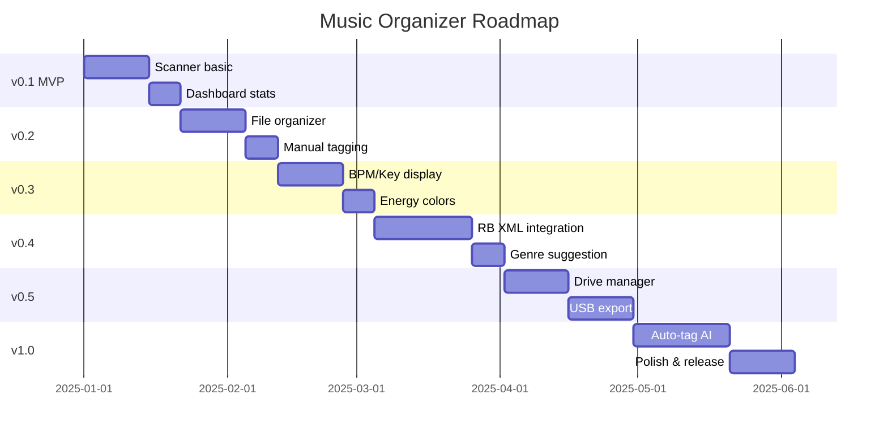

# 📝 Funcționalități — Feature List Complet

[🏠 Home](../../README.md) · [📱 App](README.md)

---

## 📋 Feature Matrix

### 🔍 Scanner Module

| Feature | Prioritate | Complexitate | Versiune |
|---------|-----------|-------------|----------|
| Watch folder monitoring (chokidar) | 🔴 Critical | Medie | v0.1 |
| New file detection + notification | 🔴 Critical | Ușoară | v0.1 |
| Audio file validation (mp3, flac, wav, aiff) | 🔴 Critical | Ușoară | v0.1 |
| Read ID3 metadata | 🔴 Critical | Medie | v0.1 |
| BPM detection display | 🟡 High | Medie | v0.3 |
| Key detection display | 🟡 High | Medie | v0.3 |
| Auto-genre suggestion (BPM-based) | 🟡 High | Medie | v0.4 |
| Duplicate detection | 🟢 Medium | Medie | v0.5 |
| Batch processing | 🟢 Medium | Medie | v0.5 |

### 📁 Organizer Module

| Feature | Prioritate | Complexitate | Versiune |
|---------|-----------|-------------|----------|
| Move file to genre folder | 🔴 Critical | Ușoară | v0.2 |
| Rename file (convention) | 🟡 High | Medie | v0.2 |
| Create folder structure auto | 🟡 High | Ușoară | v0.2 |
| Undo move/rename | 🟡 High | Medie | v0.3 |
| Batch organize | 🟢 Medium | Medie | v0.4 |

### 🏷️ Tagger Module

| Feature | Prioritate | Complexitate | Versiune |
|---------|-----------|-------------|----------|
| Manual tag set (gen, energie, mood) | 🔴 Critical | Ușoară | v0.2 |
| Color assignment (energie→culoare) | 🟡 High | Ușoară | v0.3 |
| Rating/Energy 1-5 | 🔴 Critical | Ușoară | v0.2 |
| Auto-tag suggestion | 🟢 Medium | Grea | v1.0 |
| Batch tagging | 🟢 Medium | Medie | v0.5 |

### 💿 Drive Manager Module

| Feature | Prioritate | Complexitate | Versiune |
|---------|-----------|-------------|----------|
| List connected drives | 🔴 Critical | Ușoară | v0.5 |
| Drive capacity display | 🟡 High | Ușoară | v0.5 |
| Format detection (FAT32/NTFS) | 🟡 High | Medie | v0.5 |
| Safe eject | 🟡 High | Medie | v0.5 |
| Drive health check | 🟢 Medium | Grea | v1.0 |

### 💾 Export Module

| Feature | Prioritate | Complexitate | Versiune |
|---------|-----------|-------------|----------|
| Export playlist to USB | 🔴 Critical | Grea | v0.5 |
| Rekordbox XML generation | 🔴 Critical | Grea | v0.4 |
| PIONEER folder structure creation | 🔴 Critical | Grea | v0.5 |
| Sync (update only changed) | 🟡 High | Grea | v0.6 |
| Verify export integrity | 🟡 High | Medie | v0.5 |
| Backup USB → USB clone | 🟢 Medium | Medie | v0.6 |

### 📊 Dashboard

| Feature | Prioritate | Complexitate | Versiune |
|---------|-----------|-------------|----------|
| Stats overview (totals, inbox count) | 🔴 Critical | Ușoară | v0.1 |
| Genre distribution chart | 🟡 High | Medie | v0.3 |
| Recent activity log | 🟡 High | Ușoară | v0.2 |
| Quick actions | 🟡 High | Ușoară | v0.2 |
| BPM distribution chart | 🟢 Medium | Medie | v0.4 |
| Energy distribution chart | 🟢 Medium | Medie | v0.4 |

### 🎬 Media Home (web 2.2 · MMO Server 3.1 · TV 1.1)

| Feature | Prioritate | Complexitate | Versiune |
|---------|-----------|-------------|----------|
| Media Home la `/` (hero + rânduri Watch/Listen; dashboard-ul vechi la `/dashboard`) | 🔴 Critical | Medie | web 2.2 |
| Multi-server: agregare peste toate MMO Server-ele împerecheate, dedupe TMDB, chip-uri per server | 🔴 Critical | Grea | web 2.2 |
| Deep links furnizori (Movie of the Night → TMDB providers → registry) cu atribuire | 🟡 High | Medie | server 3.1 |
| Pagină titlu unificată `/media/[kind]/[tmdbId]` (Play pe <server> / Unde vezi) | 🔴 Critical | Medie | web 2.2 |
| Progres partajat web ↔ TV prin server (`/media/progress`, `/api/media/sync`) | 🟡 High | Medie | server 3.1 · TV 1.1 |
| Recomandări server-side (TMDB + cache SQLite, rânduri 24 h) | 🟡 High | Grea | server 3.1 |
| Istoric ascultare `track_plays` + rânduri Listen (Continue, Albume noi, Favorite, Playlist-uri) | 🟡 High | Medie | web 2.2 |
| Curator Codai (opțional, titluri de rând + „de ce”) | 🟢 Medium | Medie | web 2.2 |
| TV Android / Tizen: hero + rânduri, lansare aplicație furnizor, Watch Next (Android) | 🟡 High | Medie | TV 1.1 |

---

## 📊 Release Plan

---

[🏠 Home](../../README.md) · [📱 App](README.md)
