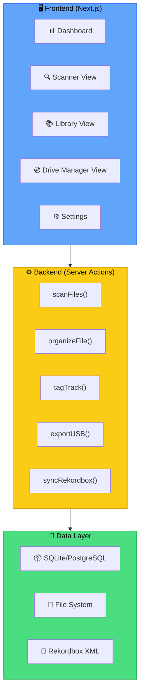
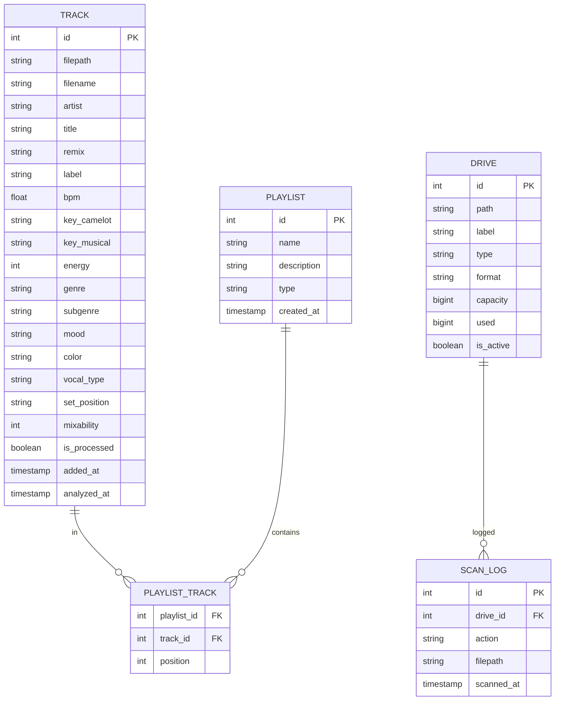

# 🏗️ Arhitectura Tehnică — Music Organizer

[🏠 Home](../../README.md) · [📱 App](README.md)

---

## 🗺️ Arhitectură Overview



---

## 📊 Schema Database



---

## 📂 Structura Proiect

```
music-organizer/
├── apps/
│   └── web/                    # Next.js 16 app
│       ├── app/
│       │   ├── layout.tsx
│       │   ├── page.tsx        # Dashboard
│       │   ├── library/
│       │   │   └── page.tsx    # Library view
│       │   ├── scanner/
│       │   │   └── page.tsx    # Scanner view
│       │   ├── drives/
│       │   │   └── page.tsx    # Drive manager
│       │   └── settings/
│       │       └── page.tsx    # Settings
│       ├── components/
│       │   ├── ui/             # shadcn/ui
│       │   ├── track-table.tsx
│       │   ├── drive-card.tsx
│       │   └── scanner-status.tsx
│       └── actions/
│           ├── scan.ts
│           ├── organize.ts
│           └── export.ts
├── packages/
│   ├── db/                     # Drizzle schema
│   ├── audio/                  # Audio analysis
│   └── fs-watcher/             # File system watcher
├── pnpm-workspace.yaml
└── turbo.json
```

---

## 🔄 Flow-uri Principale

### 1. Scan Flow
```
chokidar watch → new file detected → read metadata (ID3) → 
analyze BPM/Key → suggest genre → insert DB → notify UI
```

### 2. Organize Flow
```
track in _Inbox → auto-detect genre → suggest folder → 
user confirms/changes → move file → update DB → update RB XML
```

### 3. Export Flow
```
select playlist → check USB format → copy files → 
generate PIONEER/ structure → write rekordbox XML → verify → eject
```

---

## 🔌 Rekordbox Integration

### Cum comunicăm cu rekordbox:
rekordbox folosește un **XML database** care poate fi import/export:

1. **Export din RB:** File → Library → Export as XML
2. **Modificare XML:** App-ul nostru citește/scrie XML-ul
3. **Import în RB:** File → Library → Import XML

```xml
<!-- Structura rekordbox XML -->
<DJ_PLAYLISTS Version="1.0.0">
  <PRODUCT Name="rekordbox" />
  <COLLECTION Entries="1234">
    <TRACK TrackID="1" 
           Name="Track Title" 
           Artist="Artist Name"
           Tonality="Am" 
           AverageBpm="128.00"
           Location="file://localhost/H:/Music/DJ/Techno/track.mp3">
      <TEMPO Inizio="0.123" Bpm="128.00" />
      <POSITION_MARK Name="Hot Cue A" Type="0" Start="32.456" Num="0" Red="255" />
    </TRACK>
  </COLLECTION>
  <PLAYLISTS>
    <NODE Type="0" Name="root">
      <NODE Type="1" Name="My Playlist" Entries="10">
        <TRACK Key="1" />
      </NODE>
    </NODE>
  </PLAYLISTS>
</DJ_PLAYLISTS>
```

---

[🏠 Home](../../README.md) · [📱 App](README.md)
