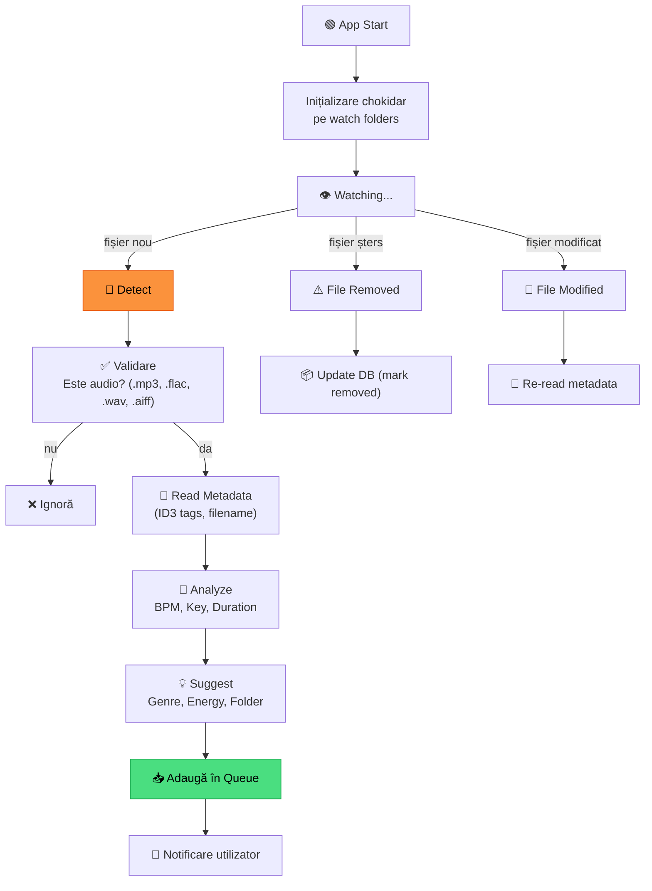

# 🔍 Scanner — Modul Scanare & Monitorizare

[🏠 Home](../../README.md) · [📱 App](README.md)

---

## 🎯 Scop

Monitorizează foldere pentru fișiere audio noi, le analizează automat,
și le pregătește pentru organizare.

---

## 🔄 Scanner Flow



---

## 📋 Supported Formats

| Format | Extension | Metadata | Prioritate |
|--------|----------|----------|-----------|
| MP3 | `.mp3` | ID3v2 | 🔴 Must |
| FLAC | `.flac` | Vorbis Comments | 🔴 Must |
| WAV | `.wav` | BWF/RIFF | 🟡 Nice |
| AIFF | `.aiff`, `.aif` | AIFF chunks | 🟡 Nice |
| AAC | `.m4a`, `.aac` | MP4 atoms | 🟢 Bonus |

---

## 🏷️ Metadata Extraction

Din fiecare fișier extragem:

| Field | Sursa | Fallback |
|-------|-------|----------|
| **Artist** | ID3 `TPE1` | Filename parsing |
| **Title** | ID3 `TIT2` | Filename parsing |
| **BPM** | ID3 `TBPM` | Audio analysis |
| **Key** | ID3 `TKEY` | Audio analysis |
| **Duration** | Audio properties | - |
| **Genre** | ID3 `TCON` | BPM-based suggestion |
| **Album** | ID3 `TALB` | - |
| **Label** | ID3 `TPUB` | Filename parsing |

---

## 🧠 Genre Suggestion Logic

```typescript
function suggestGenre(bpm: number): string {
  if (bpm >= 150) return 'Bounce';
  if (bpm >= 138) return 'Psytrance'; // or Hard Techno
  if (bpm >= 125) return 'Techno';    // or Acid
  if (bpm >= 122) return 'Tech House';
  if (bpm >= 85 && bpm <= 130) return 'Manele/Latino'; // ambiguous
  return 'Unknown';
}
```

> **Limitare:** BPM singur nu e suficient pentru genuri românești vs. latino.
> AI tagging (v1.0) va îmbunătăți acuratețea.

---

## ⚙️ Configurare Watch Folders

```typescript
interface WatchConfig {
  folders: {
    path: string;        // "H:\Music\_Inbox"
    recursive: boolean;  // true
    autoProcess: boolean; // false (manual confirm)
    ignorePatterns: string[]; // ["*.tmp", "*.part"]
  }[];
  scanInterval: number; // ms between checks
  notifyOnNew: boolean;
}
```

---

## 📊 Scanner Status UI

```
┌────────────────────────────────────────────────┐
│ 🔍 Scanner Status                              │
│                                                │
│ ✅ Watching: H:\Music\_Inbox\    (3 new)       │
│ ✅ Watching: H:\Music\DJ\        (up to date)  │
│ ⬜ Paused:   C:\Downloads\                      │
│                                                │
│ Last scan: 5 min ago                           │
│ Total scanned today: 15 files                  │
│ Queue: 3 tracks awaiting processing            │
│                                                │
│ [▶ Scan Now]  [⏸ Pause All]  [⚙️ Configure]   │
└────────────────────────────────────────────────┘
```

---

[🏠 Home](../../README.md) · [📱 App](README.md)
