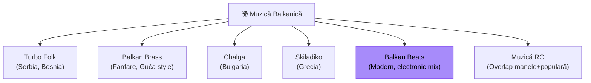

# 🌍 Balkanică — Ghid Complet

[🏠 Home](../../README.md) · [🎵 Genuri](README.md)

---

## 📋 Fișa Genului

| Atribut | Valoare |
|---------|---------|
| **BPM** | 90-160 (variabil) |
| **Key tipic** | Dm, Gm, Am, Cm |
| **Energie** | ⭐⭐⭐ – ⭐⭐⭐⭐⭐ |
| **Structură** | Intro → melodie → dans → bridge → climax → outro |
| **Instrumente** | Brass (trompetă, tuba), acordeon, clarinet, darbuka, bass |
| **Vibe** | Frenetic, festiv, brass-heavy, dans |

---

## 🌍 Ce Include "Balkanică"

---

## 🎛️ Tehnici de Mixaj

| Tehnică | Cum | Când |
|---------|-----|------|
| **Cut mix** | Direct între track-uri | Standard |
| **BPM match** | Grupează pe BPM similar | Smooth flow |
| **Brass build** | Track cu brass intro → drop | Energy peak |
| **Regional flow** | RO → Serbia → Bulgaria → Grecia | Călătorie geo |

---

## 🔗 Tranziții cu Alte Genuri

| Spre | Dificultate | Metoda |
|------|-------------|--------|
| **Manele** | 🟢 Ușor | Crossover natural |
| **Populară RO** | 🟢 Ușor | Similar |
| **Latino** | 🟡 Mediu | BPM overlap 100-120 |
| **Balkan Beats → Techno** | 🟡 Mediu | Electronic balkan ca punte |

---

## 💡 Tip pentru Set

**Balkan Beats** (artiști ca Shantel, Balkan Beat Box, Goran Bregović remixes)
= puntea perfectă între muzica tradițională balkanică și muzica electronică.

---

[🏠 Home](../../README.md) · [🎵 Genuri](README.md)
