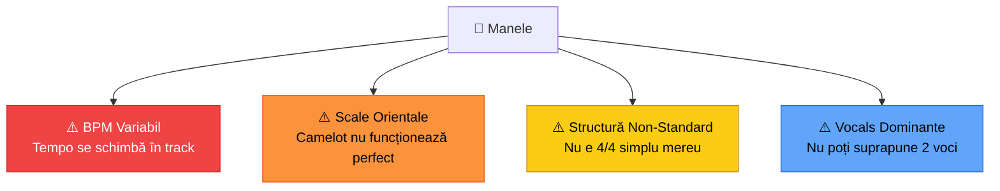

# 🎤 Manele — Ghid Complet

[🏠 Home](../../README.md) · [🎵 Genuri](README.md)

---

## 📋 Fișa Genului

| Atribut | Valoare |
|---------|---------|
| **BPM** | 85-130 (foarte variabil!) |
| **Key tipic** | Dm, Am, Gm (moduri orientale: Hicaz, Nikriz) |
| **Energie** | ⭐⭐ – ⭐⭐⭐⭐⭐ (depinde de track) |
| **Structură** | Intro instrumental → strofa 1 → refren → strofa 2 → refren → bridge → refren final |
| **Instrumente** | Clape orientale, darbuka, bas synth, strings, vocal procesate |
| **Vibe** | Petrecere românească, emoțional, dans |

---

## ⚠️ Provocări Speciale Manele

### BPM Variabil:
- Multe manele **schimbă tempo** în interiorul track-ului
- Beatgrid-ul rekordbox poate fi **greșit**
- Soluție: **manual beatgrid** sau **mixare pe fraz**ă, nu pe grid

### Scale Orientale:
- Manele folosesc scale **Hicaz**, **Nikriz**, **Kurdî**
- Camelot wheel nu le mapează perfect
- Soluție: **mixare pe ureche** — dacă sună bine, e bine

---

## 🎛️ Tehnici de Mixaj

| Tehnică | Cum | Când |
|---------|-----|------|
| **Cut mix** | Fade out → 1 beat silence → fade in | Cel mai sigur |
| **Intro/outro blend** | Dacă are intro instrumental | Când e posibil |
| **Echo out** | Echo lung pe final → track nou | Dramatic |
| **Loop refren** | Loop 4 bars pe refren → blend | Fun effect |
| **Drop instant** | Publicul strigă → drop hit | Party peak |

> **Nu încerca long blend pe manele cu vocale!** Se aud 2 voci = dezastru.

---

## 📂 Sub-categorii în DJ Set

| Tip | BPM | Când | Exemple Stil |
|-----|-----|------|-------------|
| **Manele Lente** | 85-100 | Warmup, dedicații | Baladat, suflet |
| **Manele Mid** | 100-115 | Groove zone | Petrecere normală |
| **Manele Rapide** | 115-130 | Party peak | Hora, dans rapid |
| **Manele Modern** | 100-120 | Tineri | Trap manele, autotune |

---

## 🔗 Tranziții cu Alte Genuri

| Spre | Dificultate | Metoda |
|------|-------------|--------|
| **Balkanică** | 🟢 Ușor | BPM similar, vibe similar |
| **Populară** | 🟢 Ușor | Crossover natural |
| **Latino** | 🟡 Mediu | BPM overlap ~95-110 |
| **Techno** | 🔴 Greu | Break total necesar |
| **Tech House** | 🔴 Greu | Break total necesar |

---

## 🎹 Cu Circuit Tracks

- **NU PREA** — CT nu replică bine sunetul oriental
- **Posibil:** Darbuka/percussion patterns pe drum tracks
- **Posibil:** Bass synth layer simplu
- **Recomandare:** CT oprit pe secțiunea de manele, folosit doar pe techno/acid

---

[🏠 Home](../../README.md) · [🎵 Genuri](README.md)
