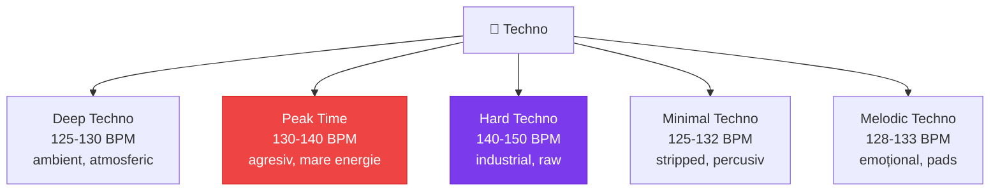

# 🖤 Techno — Ghid Complet

[🏠 Home](../../README.md) · [🎵 Genuri](README.md)

---

## 📋 Fișa Genului

| Atribut | Valoare |
|---------|---------|
| **BPM** | 125-145 (tipic: 130-138) |
| **Key tipic** | Am, Em, Dm, Fm |
| **Energie** | ⭐⭐⭐ – ⭐⭐⭐⭐⭐ |
| **Structură** | 16/32 bars intro → build → drop → breakdown → drop → outro |
| **Instrumente** | Kick 4/4, hi-hats, claps, synth pads, bass |
| **Vibe** | Dark, industrial, repetitiv, hipnotic |

---

## 🔊 Sub-genuri

---

## 🎛️ Tehnici de Mixaj

| Tehnică | Cum | Când |
|---------|-----|------|
| **Long blend** | 32-64 bars overlap, EQ swap | Track-uri similare |
| **EQ swap** | Bass out track A, Bass in track B | Standard techno transition |
| **Filter build** | Hi-pass filter crescendo | Build tension |
| **Echo out** | Echo FX → fade out | Tranziție dramatică |
| **Drop swap** | Sync drop de la ambele tracks | Peak time impact |

---

## 🎯 Hot Cue Schema Techno

| Cue | Culoare | Poziție |
|-----|---------|---------|
| 1 🔴 | Roșu | First kick |
| 2 🟠 | Portocaliu | Breakdown start |
| 3 🟡 | Galben | Drop/Climax |
| 4 🟢 | Verde | Second drop |
| 5 🔵 | Albastru | Outro start |

---

## 🔗 Tranziții cu Alte Genuri

| Spre | Dificultate | Metoda |
|------|-------------|--------|
| **Tech House** | 🟢 Ușor | Scade BPM -5, track melodic |
| **Acid** | 🟢 Ușor | Adaugă 303 tracks, BPM similar |
| **Hard Techno** | 🟢 Ușor | Crește BPM +5-10 |
| **Psytrance** | 🟡 Mediu | Track de tranziție 138-140 BPM |
| **Manele** | 🔴 Greu | Break total, nu recomand blend |

---

## 🎹 Cu Circuit Tracks

- **Synth 1:** Bass drone sau stab industrial
- **Synth 2:** Pad atmosferic sau lead metalic
- **Drums:** 909 kick pattern, metallic hi-hats
- **Genial pentru:** Layer-uri pe track-uri minimale

---

[🏠 Home](../../README.md) · [🎵 Genuri](README.md)
