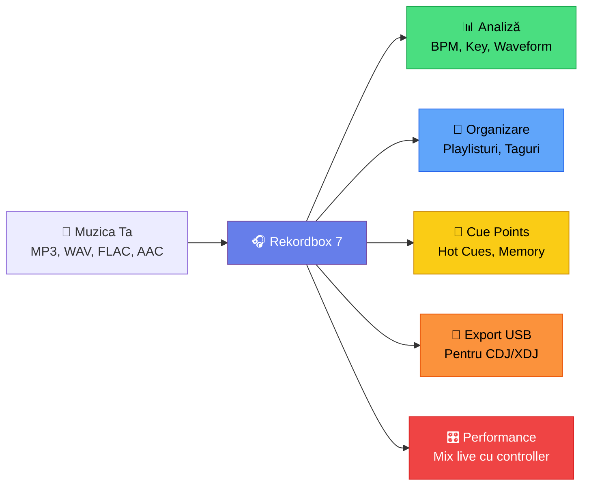
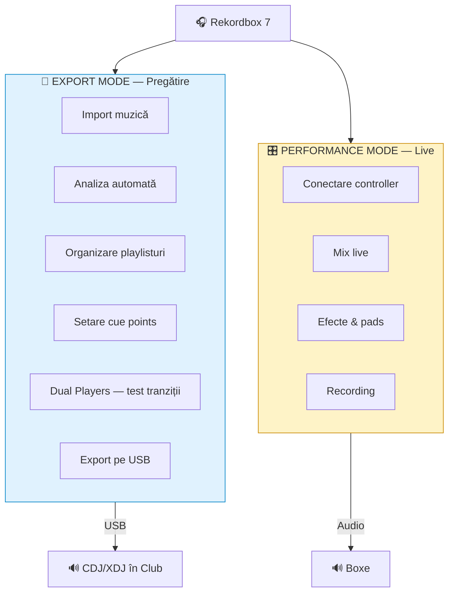
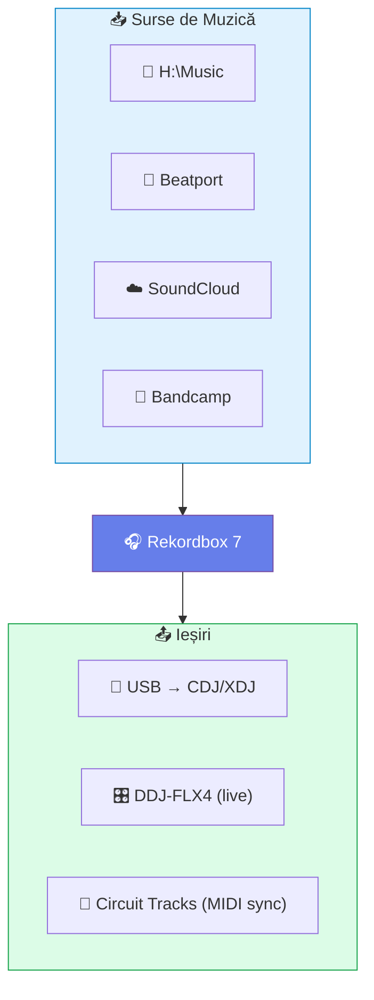

# 🟢 Ce este Rekordbox?

[🏠 Home](../../README.md) · [🗺️ Navigare](../../NAVIGARE.md) · [🟢 Începător](../../README.md#-începător)

| ← Prev | Next → |
|:---|---:|
| — | [Instalare & Configurare →](02-instalare-configurare.md) |

---

> **Pe scurt:** Rekordbox este software-ul oficial Pioneer DJ pentru gestionarea muzicii,
> pregătirea seturilor și performanță live. Este nucleul ecosistemului Pioneer.

---

## 🎯 Ce Face Rekordbox?

Rekordbox face 5 lucruri esențiale:

1. **Analizează** muzica — detectează BPM, tonalitate (key), formă de undă
2. **Organizează** — playlisturi, foldere, taguri, rating
3. **Pregătește** — cue points, loop-uri, beatgrid
4. **Exportă** — pe USB pentru CDJ/XDJ în cluburi
5. **Performează** — mix live cu controller conectat la laptop

---

## 🔄 Cele Două Moduri Principale

### 💾 Export Mode (modul principal pentru tine)

- **Fără controller conectat** — lucrezi doar pe laptop
- Importi, analizezi, organizezi muzica
- Setezi cue-uri și loop-uri
- **Dual Players** (nou în RB7!) — testezi tranziții fără hardware
- Exporti pe USB → mergi la gig cu USB-ul pregătit
- **Collection Radar** — îți sugerează track-uri compatibile din bibliotecă
- **Streaming Radar** — sugestii de la Beatport, SoundCloud etc.

### 🎛️ Performance Mode (când mixezi live)

- **Controller conectat** (DDJ-FLX4)
- Mix live prin laptop
- Efecte, sampler, pads
- Recording direct din software

> **💡 Sfat:** Începe cu Export Mode. Acolo pregătești totul. Performance Mode
> vine natural când conectezi DDJ-FLX4.

---

## 💰 Planuri & Licențe

| Plan | Preț | Ce Primești |
|------|------|-------------|
| **Free** | €0 | Export mode complet, import, analiză, playlisturi, export USB |
| **Core** | ~€10/lună | + Performance mode, Intelligent Cues, Collection Radar |
| **Creative** | ~€15/lună | + Vocal detection, edit tools, cloud sync |
| **Professional** | ~€30/lună | + Streaming offline locker, toate features |

> **💡 Sfat pentru tine:** Planul **Free** este suficient pentru export pe USB.
> Dacă vrei să mixezi live cu DDJ-FLX4 prin laptop, ai nevoie de **Core**.
> DDJ-FLX4 vine cu licență Core inclusă!

---

## 🆕 Ce e Nou în Rekordbox 7?

| Feature | Ce Face | De Ce Contează |
|---------|---------|----------------|
| **Dual Players** | Preview 2 track-uri simultan în Export Mode | Testezi tranziții fără hardware |
| **Intelligent Cues** | RB învață cum pui cue-uri și le pune automat | Economisești ore de pregătire |
| **Collection Radar** | Sugerează track-uri compatibile din biblioteca ta | Găsești combinații noi |
| **Streaming Radar** | Sugestii de la servicii de streaming | Descoperi muzică nouă |
| **Cloud Analysis** | Analiza BPM/key de pe server AlphaTheta | Analiză mai rapidă |
| **Vocal Detection** | Waveform arată unde sunt vocile | Știi unde să mixezi |

---

## 🔗 Rekordbox în Ecosistemul Tău

### Cum se leagă totul:

1. **Muzica ta** (H:\Music) → importi în Rekordbox
2. **Rekordbox** → analizează, organizează, pregătește
3. **Export USB** → mergi la club cu track-urile pregătite
4. **DDJ-FLX4** → mix live acasă sau la events mici
5. **Circuit Tracks** → sincronizare MIDI pentru live performance hibrid

---

## 📋 Formate Audio Suportate

| Format | Extensie | Calitate | Recomandat? |
|--------|----------|----------|-------------|
| WAV | .wav | Lossless (cel mai bun) | ✅ Da — pentru producții |
| AIFF | .aiff | Lossless | ✅ Da |
| FLAC | .flac | Lossless comprimat | ✅ Da — cel mai bun raport calitate/spațiu |
| AAC | .m4a | Lossy (bun) | ⚠️ OK la 256+ kbps |
| MP3 | .mp3 | Lossy | ⚠️ OK la 320 kbps |

> **💡 Regulă simplă:** FLAC pentru calitate maximă cu spațiu rezonabil.
> MP3 320kbps dacă spațiul e limitat. Niciodată sub 256kbps.

---

## 🧠 Concepte Cheie de Reținut

| Concept | Ce Înseamnă |
|---------|-------------|
| **BPM** | Beats Per Minute — viteza track-ului |
| **Key** | Tonalitatea — nota muzicală principală |
| **Beatgrid** | Grila de beat-uri suprapusă pe waveform |
| **Hot Cue** | Punct marcat pe track pentru salt rapid |
| **Memory Cue** | Punct de referință cu comentariu |
| **Playlist** | Listă ordonată de track-uri |
| **Waveform** | Reprezentarea vizuală a sunetului |
| **Crate** | Termen alternativ pentru playlist/folder |

> **📖 Nu înțelegi un termen?** → [Glosar Complet](../../glosar/glosar.md)

---

## ✅ Checklist — Ești Pregătit?

- [ ] Înțeleg ce face rekordbox (analiză, organizare, export, performance)
- [ ] Știu diferența între Export Mode și Performance Mode
- [ ] Știu ce plan am nevoie (Free sau Core cu DDJ-FLX4)
- [ ] Știu unde îmi țin muzica (H:\Music)
- [ ] Sunt gata să instalez!

---

| ← Prev | Next → |
|:---|---:|
| — | [Instalare & Configurare →](02-instalare-configurare.md) |

[🏠 Home](../../README.md) · [🗺️ Navigare](../../NAVIGARE.md)
