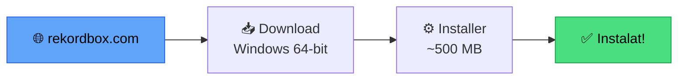
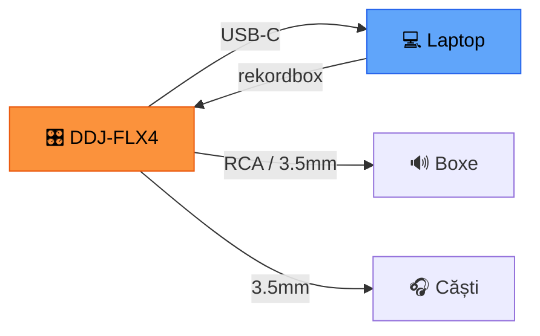

# 🟢 Instalare & Configurare Rekordbox 7

> ⚠️ **Context**: ghid pentru **rekordbox** (software Pioneer DJ extern). Pentru MMO → [`docs/aplicatie/`](../aplicatie/README.md).

[🏠 Home](../../README.md) · [🗺️ Navigare](../../NAVIGARE.md) · [🟢 Începător](../../README.md#-începător)

| ← Prev | Next → |
|:---|---:|
| [← Ce este Rekordbox](01-ce-este-rekordbox.md) | [Prima Bibliotecă →](03-prima-biblioteca.md) |

---

> **Pe scurt:** Instalare rekordbox 7 pe Windows, configurare inițială,
> setări recomandate pentru DDJ-FLX4.

---

## 📥 Pasul 1 — Download



1. Mergi la **rekordbox.com** → Download
2. Alege **Windows (64-bit)**
3. Trebuie cont Pioneer DJ — creează-ți unul gratuit
4. Dimensiune: ~500 MB download

---

## ⚙️ Pasul 2 — Instalare

1. Rulează installer-ul descărcat
2. Accept Terms & Conditions
3. Alege folderul de instalare (default e OK)
4. Așteaptă instalarea (~5 minute)
5. La final: **Nu conecta DDJ-FLX4 încă!**

---

## 🔧 Pasul 3 — Prima Configurare

### La prima deschidere:

1. **Login** cu contul Pioneer DJ
2. **Alege planul** — Free sau activează licența Core (vine cu DDJ-FLX4)
3. Rekordbox va cere să alegi **Export Mode** sau **Performance Mode**
   - Alege **Export Mode** (poți schimba oricând)

### Setări Recomandate (Preferences):

Mergi la **Preferences** (⚙️ icon sau `Ctrl + ,`)

#### 🔊 Audio

| Setare | Valoare Recomandată |
|--------|-------------------|
| Audio Output | System (fără controller) |
| Buffer Size | 512 samples |
| Sample Rate | 44100 Hz |

#### 📊 Analysis

| Setare | Valoare Recomandată |
|--------|-------------------|
| BPM Range | Normal (70-180) |
| Key Detection | ✅ Activat |
| Track Analysis | ✅ Auto-analyze on import |
| Beatgrid | ✅ Set beatgrid automatically |
| Key Notation | Camelot (1A, 2B...) |

> **💡 Important:** Setează **Key Notation = Camelot** — e cel mai ușor sistem
> pentru harmonic mixing. Vezi [Mixaj Armonic](../avansat/04-mixaj-armonic.md).

#### 📁 Library

| Setare | Valoare Recomandată |
|--------|-------------------|
| iTunes/Music.app | Dezactivat (nu folosim iTunes) |
| Collection Folder | Default |
| File Management | Always copy to collection: **NU** |

> **⚠️ Important:** Lasă "Always copy to collection" pe **NU**.
> Vrem ca rekordbox să referențieze fișierele din H:\Music, nu să le copieze.

---

## 💻 Cerințe Sistem

| Componentă | Minim | Recomandat |
|-----------|-------|-----------|
| **OS** | Windows 10 64-bit | Windows 11 |
| **CPU** | Intel i5 / Ryzen 5 | Intel i7 / Ryzen 7 |
| **RAM** | 8 GB | 16 GB |
| **Disk** | SSD, 1 GB spațiu | SSD, 2+ GB |
| **USB** | USB 2.0 | USB 3.0+ |
| **Display** | 1280×768 | 1920×1080+ |

---

## 🎛️ Pasul 4 — Configurare DDJ-FLX4

### Instalare Driver

1. **Descarcă driver-ul** de pe pioneerdj.com → Support → DDJ-FLX4
2. Instalează driver-ul **înainte** de a conecta controller-ul
3. Repornește PC-ul

### Conectare



1. Deschide rekordbox
2. Conectează DDJ-FLX4 prin USB-C
3. Rekordbox detectează automat → trece în Performance Mode
4. Audio output se schimbă automat pe DDJ-FLX4

### Setări DDJ-FLX4 în Rekordbox

| Setare | Valoare |
|--------|---------|
| Audio Output | DDJ-FLX4 |
| MIDI | DDJ-FLX4 (auto-mapped) |
| Jog Wheel Mode | Vinyl |
| Pad Mode | Hot Cues |

---

## 📁 Pasul 5 — Pregătire Folder Muzică

Creează structura de bază pe disk:

```
H:\Music\
├── _Inbox\          ← Muzică nouă, neorganizată
├── _Processing\     ← În curs de pregătire
├── DJ\              ← Muzică gata de mix
│   ├── Techno\
│   ├── Tech-House\
│   ├── Bounce\
│   ├── Acid\
│   ├── Psy\
│   ├── Manele\
│   ├── Populara\
│   ├── Balkanica\
│   └── Latino\
└── Live\            ← Samples pentru Circuit Tracks
    ├── Drums\
    ├── Synths\
    └── FX\
```

> **Detalii complete:** [Structură Foldere](../../organizare/structura-foldere.md)

---

## 🗂️ Pasul 6 — Locația Bazei de Date

Rekordbox își ține baza de date în:

```
C:\Users\[USERNAME]\AppData\Roaming\Pioneer\rekordbox\
```

Conține:
- **master.db** — baza de date principală (SQLite)
- **Artwork/** — cover art cache
- **Settings/** — setările tale

> **⚠️ Backup regulat!** Vezi [Backup & Recovery](../profesional/05-backup-disaster.md)

---

## ✅ Checklist — Configurare Completă

- [ ] Rekordbox 7 instalat și actualizat
- [ ] Cont Pioneer DJ creat
- [ ] Key Notation = Camelot
- [ ] Auto-analyze on import = ✅
- [ ] "Copy to collection" = NU
- [ ] Driver DDJ-FLX4 instalat
- [ ] Folder H:\Music structurat
- [ ] Știu unde e baza de date rekordbox

---

| ← Prev | Next → |
|:---|---:|
| [← Ce este Rekordbox](01-ce-este-rekordbox.md) | [Prima Bibliotecă →](03-prima-biblioteca.md) |

[🏠 Home](../../README.md) · [🗺️ Navigare](../../NAVIGARE.md)
