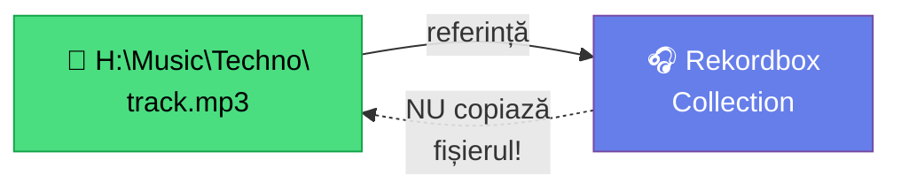
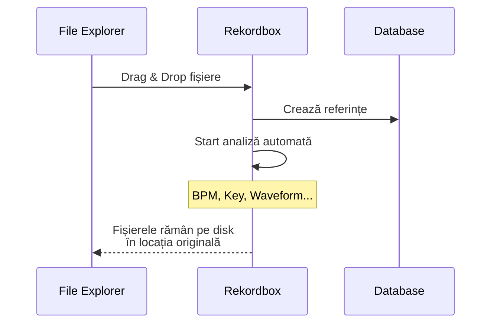
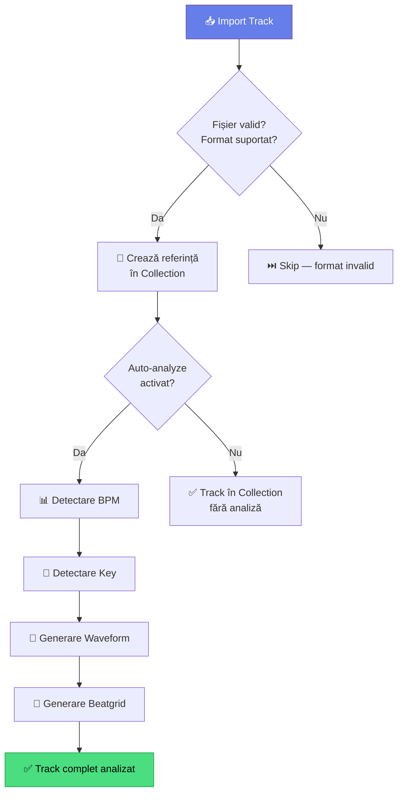

# 🟢 Prima Bibliotecă — Import Muzică

> ⚠️ **Context**: ghid pentru **rekordbox**. Pentru biblioteca în MMO → [`docs/aplicatie/biblioteca.md`](../aplicatie/biblioteca.md).

[🏠 Home](../../README.md) · [🗺️ Navigare](../../NAVIGARE.md) · [🟢 Începător](../../README.md#-începător)

| ← Prev | Next → |
|:---|---:|
| [← Instalare & Configurare](02-instalare-configurare.md) | [Analiza Melodiilor →](04-analiza-melodiilor.md) |

---

> **Pe scurt:** Cum importi prima muzică în rekordbox, cum funcționează referințele,
> și regula de aur: **o singură sursă de adevăr** pe disk.

---

## 🧠 Conceptul Cheie — Referințe, Nu Copii



**Regulă de aur:** Rekordbox **NU copiază** fișierele. Crează doar **referințe** (link-uri) către locația reală pe disk.

| ✅ Corect | ❌ Greșit |
|-----------|-----------|
| Pui muzica în H:\Music → importi în RB | Importi direct din Downloads |
| Muți fișierul în folderul final ÎNAINTE de import | Muți fișierul DUPĂ import |
| O singură locație pentru fiecare fișier | Copii în mai multe locuri |

> **Ce se întâmplă dacă muți un fișier după import?**
> Rekordbox afișează ⚠️ "File not found". Trebuie să-l relocalizezi manual.

---

## 📥 Metoda 1 — Drag & Drop (Recomandată)

1. Deschide **File Explorer** → navighează la `H:\Music\DJ\`
2. Deschide **Rekordbox** → asigură-te că ești în **Collection**
3. **Selectează fișierele** (Ctrl+A pentru toate, sau Ctrl+Click pentru selecție)
4. **Drag** din Explorer **→ Drop** în fereastra rekordbox



---

## 📥 Metoda 2 — Import Folder

1. În rekordbox: **File → Import → Import Folder**
2. Navighează la `H:\Music\DJ\`
3. Click **Select Folder**
4. Rekordbox importă **tot** conținutul (inclusiv subfoldere)

> **💡 Sfat:** Această metodă e perfectă pentru importul inițial al întregii biblioteci.

---

## 📥 Metoda 3 — File Import Dialog

1. **File → Import → Import Track**
2. Navighează și selectează fișiere individuale
3. Click **Open**

---

## 🔍 Ce Se Întâmplă La Import?



La fiecare import, rekordbox:

1. **Verifică** formatul fișierului (MP3, FLAC, WAV, etc.)
2. **Crează referința** în baza de date (Collection)
3. **Analizează automat** (dacă e activat):
   - BPM (tempo)
   - Key (tonalitate)
   - Waveform (forma de undă)
   - Beatgrid (grila ritmică)
4. **Citește metadata** existentă (artist, titlu, gen, an)

---

## 📂 Organizarea Inițială în Rekordbox

### Structura Recomandată de Playlisturi

Crează aceste foldere de playlist-uri în rekordbox:

```
📁 Collection (tot)
│
├── 📁 _Inbox
│   └── 🎵 Muzică Nouă           ← Track-uri noi de sortat
│
├── 📁 Per Gen
│   ├── 🎵 Techno
│   ├── 🎵 Tech House
│   ├── 🎵 Bounce
│   ├── 🎵 Acid
│   ├── 🎵 Psy
│   ├── 🎵 Manele
│   ├── 🎵 Populară
│   ├── 🎵 Balkanică
│   └── 🎵 Latino
│
├── 📁 Per Energie
│   ├── 🎵 Warmup (low energy)
│   ├── 🎵 Build (medium)
│   ├── 🎵 Peak (high energy)
│   └── 🎵 Cooldown
│
├── 📁 Seturi
│   ├── 🎵 Set Practice 001
│   └── 🎵 Set Live 001
│
└── 📁 Speciale
    ├── 🎵 Favourites ⭐
    ├── 🎵 Fuziune (manele + techno etc.)
    └── 🎵 Clasice / Evergreen
```

### Cum creezi un folder de playlisturi:

1. Click dreapta pe **Playlists** în sidebar
2. **Create New Playlist Folder**
3. Numește-l (ex: "Per Gen")
4. Click dreapta pe folder → **Create New Playlist**
5. Numește playlist-ul (ex: "Techno")

### Cum adaugi track-uri la playlist:

1. Selectează track-uri din **Collection**
2. **Drag & Drop** pe playlist-ul dorit din sidebar
3. Sau: Click dreapta → **Add to Playlist** → alege playlist-ul

> **💡 Același track poate fi în mai multe playlist-uri** fără duplicare pe disk!

---

## 📊 Verificare Import

După import, verifică în Collection:

| Coloană | Ce Verifici |
|---------|-------------|
| **Title** | Numele corect al track-ului |
| **Artist** | Artistul corect |
| **BPM** | Valoare rezonabilă (ex: 128, nu 64 sau 256) |
| **Key** | Afișat în format Camelot (ex: 8A) |
| **Duration** | Durată normală (3-8 minute) |
| **Location** | Path-ul corect (H:\Music\...) |

### Probleme Frecvente:

| Problemă | Cauză | Soluție |
|----------|-------|---------|
| BPM dublu (256 în loc de 128) | Analiză greșită | Click dreapta → Analyze Track |
| BPM jumătate (64 în loc de 128) | Analiză greșită | Click dreapta → Analyze Track |
| Key lipsă | Fișier prea scurt/corrupt | Re-analizează sau verifică fișierul |
| Track lipsă ⚠️ | Fișier mutat/șters | Relocalizează: click dreapta → Relocate |

---

## 🔢 Câte Track-uri Să Ai?

| Nivel | Număr Track-uri | Note |
|-------|-----------------|------|
| **Început** | 50–100 | Suficiente pentru primele mixuri |
| **Confortabil** | 200–500 | Poți face seturi variate |
| **Avansat** | 500–2000 | Bibliotecă serioasă |
| **Pro** | 2000+ | Pregătit pentru orice gig |

> **💡 Calitate > Cantitate.** 50 track-uri bine pregătite bat 500 track-uri random.

---

## ✅ Checklist — Prima Bibliotecă

- [ ] Am muzică în H:\Music organizată pe gen
- [ ] Am importat folderul principal în rekordbox
- [ ] Analiza automată a rulat pe toate track-urile
- [ ] Am creat folder-ele de playlisturi (Per Gen, Per Energie, Seturi)
- [ ] Am sortat cel puțin 20 track-uri în playlisturi
- [ ] BPM și Key arată corect pentru track-urile mele
- [ ] Niciun track nu arată ⚠️ (file not found)

---

| ← Prev | Next → |
|:---|---:|
| [← Instalare & Configurare](02-instalare-configurare.md) | [Analiza Melodiilor →](04-analiza-melodiilor.md) |

[🏠 Home](../../README.md) · [🗺️ Navigare](../../NAVIGARE.md)
