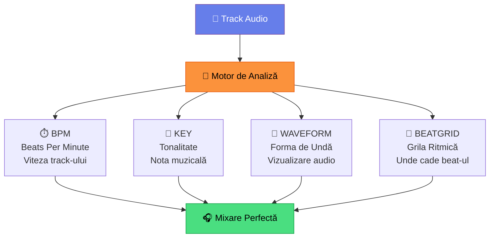
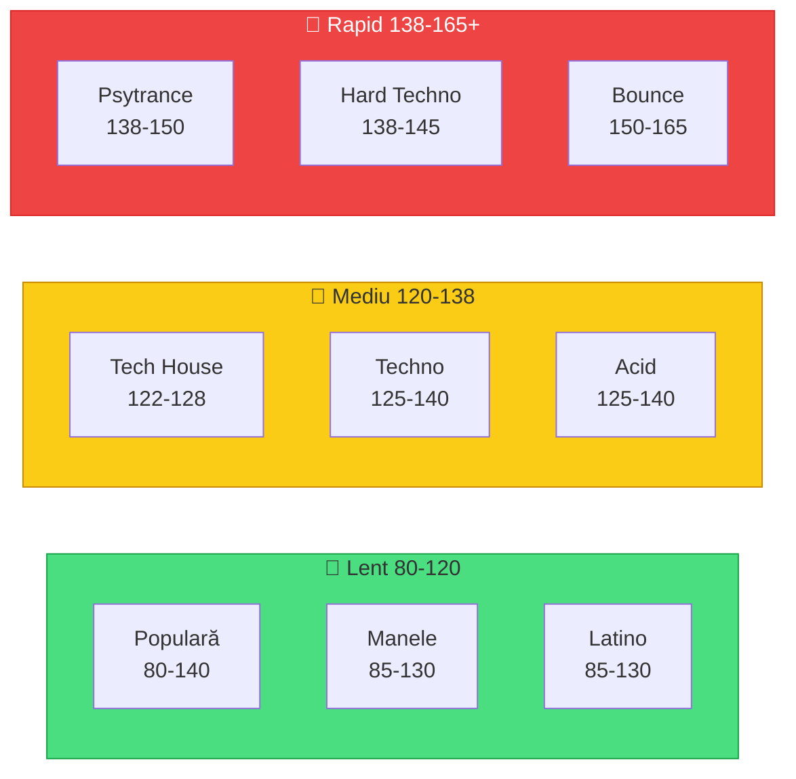
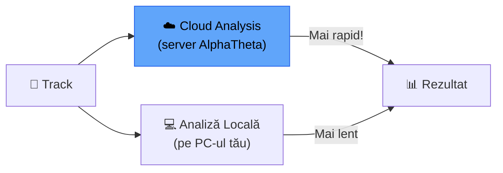

# 🟢 Analiza Melodiilor — BPM, Key, Waveform, Beatgrid

> ⚠️ **Context**: ghid pentru **rekordbox**. MMO are analiză automată (BPM/key/energy) → [`docs/aplicatie/scanner.md`](../aplicatie/scanner.md).

[🏠 Home](../../README.md) · [🗺️ Navigare](../../NAVIGARE.md) · [🟢 Începător](../../README.md#-începător)

| ← Prev | Next → |
|:---|---:|
| [← Prima Bibliotecă](03-prima-biblioteca.md) | [Organizare Bazică →](05-organizare-bazica.md) |

---

> **Pe scurt:** Rekordbox analizează fiecare track și extrage 4 informații esențiale:
> BPM, Key (tonalitate), Waveform (forma de undă) și Beatgrid (grila ritmică).

---

## 📊 Ce Analizează Rekordbox?



---

## ⏱️ BPM — Beats Per Minute

**Ce e:** Câte beat-uri (bătăi) sunt într-un minut. Definește **viteza** track-ului.

### BPM-uri Tipice per Gen (pentru genurile tale):



| Gen | BPM Minim | BPM Tipic | BPM Maxim |
|-----|-----------|-----------|-----------|
| **Populară Românească** | 80 | 100–120 | 140 |
| **Manele** | 85 | 95–115 | 130 |
| **Latino** (Reggaeton) | 85 | 92–100 | 130 |
| **Balkanică** | 90 | 100–130 | 160 |
| **Tech House** | 122 | 124–126 | 128 |
| **Techno** | 125 | 130–138 | 145 |
| **Acid** | 125 | 130–136 | 140 |
| **Psytrance** | 138 | 142–148 | 150+ |
| **Hard Techno** | 138 | 140–145 | 150 |
| **Bounce** | 150 | 155–160 | 165+ |

### De Ce Contează BPM?

- Pentru a **mixui** două track-uri, trebuie să aibă **BPM similar** (±3-5%)
- DDJ-FLX4 are **Sync** — sincronizează automat BPM-ul
- Dar trebuie să **știi** BPM-ul ca să alegi track-uri compatibile

---

## 🎵 KEY — Tonalitatea

**Ce e:** Nota muzicală principală a track-ului. Determină **cum sună** melodia.

### Sistem Camelot (Recomandat)

Rekordbox poate afișa key-ul în **format Camelot** — un sistem simplu cu numere și litere:

```
  Camelot Wheel (simplificat)

       12B        1B
    11B    \    /    2B
           \  /
   10B ---- ★ ---- 3B      ← B = Major (vesel)
           /  \
    9B    /    \    4B
       8B        5B
       
       12A        1A
    11A    \    /    2A
           \  /
   10A ---- ★ ---- 3A      ← A = Minor (trist)
           /  \
    9A    /    \    4A
       8A        5A
```

### Reguli Simple de Compatibilitate:

| Ai pe deck | Compatibil cu | Exemplu |
|-----------|---------------|---------|
| **8A** | 7A, 8A, 9A | Același registru minor |
| **8A** | **8B** | Switch minor ↔ major |
| **8B** | 7B, 8B, 9B | Același registru major |

> **Regulă simplă:** ±1 pe același rând (A sau B) + switch A↔B = **5 opțiuni sigure**.

---

## 🌊 WAVEFORM — Forma de Undă

**Ce e:** Reprezentarea vizuală a sunetului. Arată **structura** track-ului.

### Cum Citești Waveform-ul:

```
  Intro    Build    Drop     Break    Drop 2   Outro
  ░░░░░░  ▒▒▒▒▒▒  ████████  ▒▒▒▒▒▒  ████████  ░░░░░░
  |quiet  |louder  |LOUD!    |softer  |LOUD!    |quiet
  |                                              |
  └── Aici pornești mixul ──────────────── Aici ieși ──┘
```

### Culorile Waveform (Multicolor Mode):

| Culoare | Ce Reprezintă | Frecvențe |
|---------|---------------|-----------|
| 🔵 **Albastru** | Bass (bas) | Low (~20-250 Hz) |
| 🟢 **Verde** | Mid (medii) | Mid (~250-4000 Hz) |
| 🔴 **Roșu** | Treble (înalte) | High (~4000-20000 Hz) |

> **💡 Sfat:** Activează **Multicolor Waveform** din Preferences → View.
> Te ajută să vezi unde sunt bass-urile (kick = albastru) și vocile (verde/roșu).

---

## 📐 BEATGRID — Grila Ritmică

**Ce e:** Linii verticale suprapuse pe waveform care marchează **unde cade fiecare beat**.

```
  Waveform:     ▄█▄  ▄█▄  ▄█▄  ▄█▄  ▄█▄  ▄█▄  ▄█▄  ▄█▄
  Beatgrid:     |    |    |    |    |    |    |    |    
  Beat:         1    2    3    4    1    2    3    4    
  Bară:         ├───── Bară 1 ─────┤├───── Bară 2 ─────┤
```

### De Ce Contează?

- **Sync** funcționează pe baza beatgrid-ului
- **Cue points** se aliniază la grid
- **Loops** se creează pe baza grid-ului
- Grid greșit = sync greșit = mix dezastru

### Când Beatgrid-ul E Greșit?

| Simptom | Cauză | Soluție |
|---------|-------|---------|
| Beat-urile nu se aliniază | Grid offset greșit | Ajustează manual (avansat) |
| Track-urile se desincronizează | BPM variabil (live recording) | Beatgrid avansat |
| Sync sare ciudat | Track cu intro fără beat | Setează prima bătaie manual |

> **📚 Pentru corecții:** [Beatgrid Avansat](../avansat/01-beatgrid-avansat.md)

---

## 🔬 Cum Rulezi Analiza

### Analiză Automată (la import)

Dacă ai activat **"Track Analysis: Auto"** în Preferences, analiza rulează automat la import.

### Analiză Manuală

1. Selectează track-uri în Collection (Ctrl+A pentru toate)
2. Click dreapta → **Analyze Track**
3. Sau: din meniu **Track → Analyze Track**

### Re-analiză (dacă ceva e greșit)

1. Selectează track-ul
2. Click dreapta → **Analyze Track**
3. ✅ Bifează **"Overwrite previous analysis"**

---

## 📊 Cloud Analysis (Nou în RB7)



Dacă ești conectat la internet, rekordbox 7 poate descărca analiza de pe server-ul AlphaTheta (dacă altcineva a analizat deja track-ul). **Mai rapid**, mai precis.

---

## ✅ Checklist — Analiza Completă

- [ ] Toate track-urile au BPM detectat
- [ ] BPM-urile arată corect (nu dublu/jumătate)
- [ ] Key-ul e afișat în format Camelot (8A, 5B etc.)
- [ ] Waveform-ul e generat și vizibil
- [ ] Știu să citesc waveform-ul (intro, build, drop, outro)
- [ ] Înțeleg beatgrid-ul și de ce contează

---

| ← Prev | Next → |
|:---|---:|
| [← Prima Bibliotecă](03-prima-biblioteca.md) | [Organizare Bazică →](05-organizare-bazica.md) |

[🏠 Home](../../README.md) · [🗺️ Navigare](../../NAVIGARE.md)
