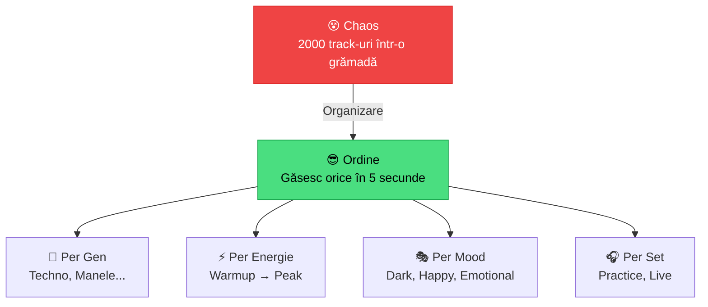
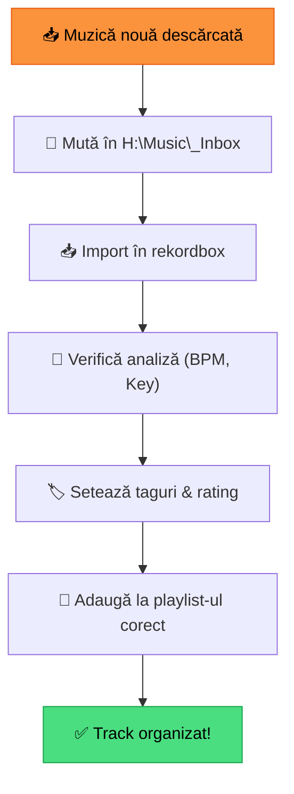

# 🟢 Organizare Bazică — Playlisturi, Foldere, Taguri

[🏠 Home](../../README.md) · [🗺️ Navigare](../../NAVIGARE.md) · [🟢 Începător](../../README.md#-începător)

| ← Prev | Next → |
|:---|---:|
| [← Analiza Melodiilor](04-analiza-melodiilor.md) | [Primul Mix →](06-primul-mix.md) |

---

> **Pe scurt:** Cum organizezi muzica în rekordbox folosind playlisturi, foldere și taguri.
> O organizare bună = seturi mai bune = evoluție mai rapidă.

---

## 🧠 Filozofia Organizării



**Regula #1:** Un track bine organizat valorează cât 10 neorganizate.

---

## 📁 Tip 1 — Playlist Folders (Foldere de Playlisturi)

Folder-ele sunt **containere** care grupează playlist-uri. Nu conțin track-uri direct.

### Structura Recomandată:

```
📁 Playlists
├── 📁 🎵 Per Gen
│   ├── 🎧 Techno
│   ├── 🎧 Tech House  
│   ├── 🎧 Acid
│   ├── 🎧 Psytrance
│   ├── 🎧 Bounce
│   ├── 🎧 Manele
│   ├── 🎧 Populară
│   ├── 🎧 Balkanică
│   └── 🎧 Latino
│
├── 📁 ⚡ Per Energie
│   ├── 🎧 1-Warmup (chill, intro)
│   ├── 🎧 2-Build (crescendo)
│   ├── 🎧 3-Peak (maximum energy)
│   └── 🎧 4-Cooldown (ending)
│
├── 📁 🔥 Fuziuni
│   ├── 🎧 Techno × Manele
│   ├── 🎧 Bounce × Balkan
│   └── 🎧 Tech House × Latino
│
├── 📁 📅 Seturi
│   ├── 🎧 Practice 001
│   ├── 🎧 Practice 002
│   └── 🎧 Live Event 001
│
└── 📁 ⭐ Speciale
    ├── 🎧 Top Favourites
    ├── 🎧 Recent Adds
    └── 🎧 Clasice / Evergreen
```

### Cum Creezi:

1. **Folder:** Click dreapta pe "Playlists" → Create New Playlist Folder
2. **Playlist:** Click dreapta pe folder → Create New Playlist
3. **Adaugă track-uri:** Drag from Collection → Drop pe playlist

---

## 🏷️ Tip 2 — Taguri (My Tag)

Rekordbox are un sistem de **taguri** care permit clasificare multiplă:

| Tag | Exemplu de Valori |
|-----|-------------------|
| **Genre** | Techno, Manele, Bounce, etc. |
| **Energy** | 1-Low, 2-Warmup, 3-Mid, 4-High, 5-Peak |
| **Mood** | Dark, Happy, Emotional, Aggressive, Chill |
| **Vocals** | Instrumental, Light Vocals, Heavy Vocals |
| **Mixability** | Easy Mix, Needs Skill, Standalone |
| **Set Position** | Opener, Journey, Peak Time, Closer |

### Cum Setezi Taguri:

1. Selectează track-ul
2. În **Track Info** panel (jos), găsește câmpurile de tag
3. Completează: **Genre, Rating, Color, Comments**

> **💡 Comments** = cel mai flexibil câmp. Poți scrie orice: "bun pentru peak", "mix cu XYZ", etc.

---

## ⭐ Tip 3 — Rating (1-5 Stele)

Folosește rating-ul pentru **calitatea** track-ului în contextu tău:

| Stele | Înseamnă |
|-------|----------|
| ⭐ | Decent, dar rar folosit |
| ⭐⭐ | OK, funcționează în anumite situații |
| ⭐⭐⭐ | Bun, pentru seturi practice |
| ⭐⭐⭐⭐ | Foarte bun, merită la orice gig |
| ⭐⭐⭐⭐⭐ | Weapon! Track pe care te bazezi mereu |

### Cum Setezi:

- Click pe colana **Rating** din Collection
- Sau: click dreapta → **Rate** → alege stelele

---

## 🎨 Tip 4 — Color Labels

Rekordbox permite **culori** pe track-uri. Folosește-le consistent:

| Culoare | Sugestie Utilizare |
|---------|-------------------|
| 🔴 Roșu | Peak time / High energy |
| 🟠 Portocaliu | Build-up tracks |
| 🟡 Galben | Warmup / Chill |
| 🟢 Verde | Ready to play (pregătit 100%) |
| 🔵 Albastru | Needs work (trebuie ajustat) |
| 🟣 Mov | Special / Experimental |

---

## 🔍 Tip 5 — Coloane Vizibile

Setează coloanele vizibile în Collection pentru eficiență:

| Coloană | De Ce |
|---------|-------|
| **#** | Ordinea |
| **Title** | Numele track-ului |
| **Artist** | Cine a produs |
| **BPM** | Viteza — esențial! |
| **Key** | Tonalitatea — pentru harmonic mixing |
| **Rating** | Calitatea ta |
| **Color** | Clasificare vizuală |
| **Genre** | Genul |
| **Duration** | Cât durează |
| **Date Added** | Când l-ai adăugat |

### Cum Setezi Coloanele:

Click dreapta pe **header-ul coloanelor** → selectează/deselectează coloane.

---

## 🔎 Cum Găsești Track-uri Rapid

### 1. Search (Ctrl+F)

Caută după titlu, artist, gen — instant.

### 2. Sort by Column

Click pe header de coloană pentru sortare:
- **BPM** — găsește track-uri la același tempo
- **Key** — grupează track-uri compatibile
- **Date Added** — vezi ce ai adăugat recent
- **Rating** — cele mai bune primele

### 3. Filter

Folosește **Filter** din sidebar:
- Genre = Techno
- BPM Range = 125-140
- Key = 8A

---

## 📋 Workflow Zilnic de Organizare



1. **Descarci** muzică nouă
2. **Muți** fișierele în `H:\Music\_Inbox\`
3. **Importi** în rekordbox (drag & drop)
4. **Verifici** analizia (BPM corect? Key detectat?)
5. **Taguri**: gen, energie, rating, culoare
6. **Adaugi** la playlist-ul corect
7. **Muți** fișierul din `_Inbox` în folderul final (`H:\Music\DJ\Techno\`)
8. **Relocalizezi** în rekordbox dacă ai mutat (click dreapta → Relocate)

> **💡 Sfat:** Mută fișierul în folderul final **ÎNAINTE** de import pentru a evita relocalizări.

---

## ✅ Checklist — Organizare Completă

- [ ] Am folder-e de playlist-uri create (Per Gen, Per Energie, Fuziuni, Seturi)
- [ ] Am playlist-uri pentru fiecare gen pe care-l mixez
- [ ] Știu să setez taguri (genre, rating, color, comments)
- [ ] Am coloanele importante vizibile (BPM, Key, Rating)
- [ ] Știu să sortez și filtrez track-uri
- [ ] Am un workflow zilnic de organizare

---

| ← Prev | Next → |
|:---|---:|
| [← Analiza Melodiilor](04-analiza-melodiilor.md) | [Primul Mix →](06-primul-mix.md) |

[🏠 Home](../../README.md) · [🗺️ Navigare](../../NAVIGARE.md)
