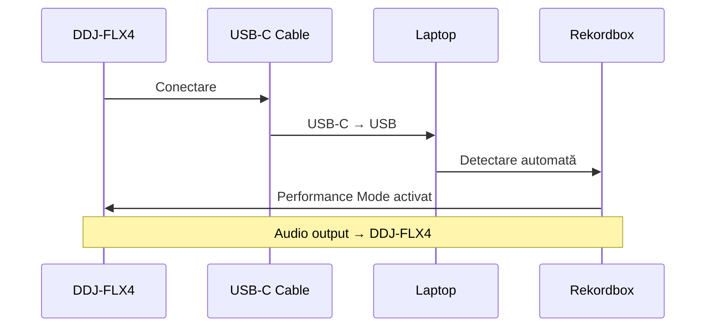
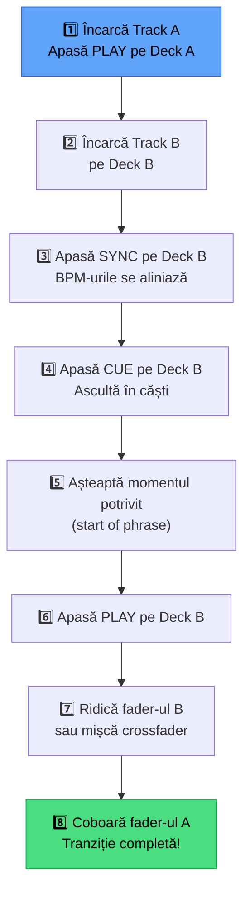

# 🟢 Primul Mix — DDJ-FLX4 + Rekordbox

> ⚠️ **Context**: mix în **rekordbox**. MMO are mixer integrat (browser, suport DDJ-FLX4) → [`docs/aplicatie/mixer.md`](../aplicatie/mixer.md).

[🏠 Home](../../README.md) · [🗺️ Navigare](../../NAVIGARE.md) · [🟢 Începător](../../README.md#-începător)

| ← Prev | Next → |
|:---|---:|
| [← Organizare Bazică](05-organizare-bazica.md) | [Export USB Basic →](07-export-usb-basic.md) |

---

> **Pe scurt:** Cum faci primul mix cu DDJ-FLX4 conectat la rekordbox.
> De la conectare la prima tranziție reușită.

---

## 🎛️ DDJ-FLX4 — Layout Rapid

```
┌─────────────────────────────────────────────────────────────┐
│                       DDJ-FLX4                              │
│                                                             │
│  ┌──────────┐    ┌────────────┐    ┌──────────┐            │
│  │ JOG      │    │   MIXER    │    │ JOG      │            │
│  │ WHEEL    │    │            │    │ WHEEL    │            │
│  │          │    │ ┌──┐ ┌──┐ │    │          │            │
│  │  DECK A  │    │ │CH│ │CH│ │    │  DECK B  │            │
│  │  (stânga)│    │ │ A│ │ B│ │    │ (dreapta)│            │
│  │          │    │ └──┘ └──┘ │    │          │            │
│  └──────────┘    │            │    └──────────┘            │
│                  │ CROSSFADER │                             │
│  [PAD][PAD]      │ ◄════════► │     [PAD][PAD]             │
│  [PAD][PAD]      └────────────┘     [PAD][PAD]             │
│  [PAD][PAD]                         [PAD][PAD]             │
│  [PAD][PAD]    DECK A    DECK B     [PAD][PAD]             │
│                                                             │
│  PLAY  CUE       BROWSE       PLAY  CUE                   │
│  SYNC  TEMPO     LOAD A/B     SYNC  TEMPO                 │
└─────────────────────────────────────────────────────────────┘
```

### Controale Principale:

| Control | Ce Face |
|---------|---------|
| **Jog Wheel** | Scratch / pitch bend / browse waveform |
| **Play/Pause** | Pornește/oprește track-ul |
| **Cue** | Salt la cue point / setează cue temporar |
| **Sync** | Sincronizează BPM cu celălalt deck |
| **Tempo Slider** | Ajustare manuală BPM (±8%) |
| **Channel Fader** | Volum per canal |
| **Crossfader** | Tranziție stânga ↔ dreapta |
| **EQ (Hi/Mid/Lo)** | Egalizare per canal |
| **Browse** | Navighează prin playlisturi |
| **Load** | Încarcă track pe deck |
| **Pads** | Hot Cues, Pad FX, Beat Jump, Sampler |
| **Smart Fader** | ✨ Tranziții automate (feature FLX4!) |
| **Smart CFX** | ✨ Efect one-knob per canal |

---

## 🚀 Pasul 1 — Conectare



1. Deschide rekordbox
2. Conectează DDJ-FLX4 prin **USB-C**
3. Rekordbox detectează automat → Performance Mode
4. Conectează **căștile** la DDJ (jack 3.5mm)
5. Conectează **boxele** la DDJ (RCA sau 3.5mm Master Out)

---

## 🎵 Pasul 2 — Încarcă Track-uri

1. **Browse** prin playlisturi cu rotița Browse de pe DDJ
2. Găsește track-ul dorit
3. Apasă **LOAD A** (deck stânga) sau **LOAD B** (deck dreapta)

> **Regulă:** Încarcă track-uri cu **BPM similar** (±5 BPM).

---

## 🎧 Pasul 3 — Primul Mix



### Pas cu Pas Detaliat:

1. **Track A pornit** — se aude prin boxe
2. **Încarcă Track B** pe celălalt deck
3. **Apasă SYNC** pe Deck B — BPM se potrivește automat
4. **Pre-listen** (monitoring):
   - Pe DDJ-FLX4: rotite **CUE/MASTER** mix pe căști
   - CUE = auzi ce vine (Track B)
   - MASTER = auzi ce se aude pe boxe (Track A)
5. **Așteaptă un moment bun** (start de frază — de obicei la 8 sau 16 bătăi)
6. **Apasă PLAY** pe Deck B
7. **Ridică Channel Fader B** — publicul începe să audă Track B
8. **Coboară EQ Low pe Track A** — scoate bass-ul ca să nu se ciocnească
9. **Coboară Channel Fader A** — Track A dispare
10. **Track B** rulează solo — **tranziție completă!**

---

## 🔄 Tehnici de Tranziție (Începător)

### 1. Crossfade Simplu

```
Track A:  ████████████████░░░░░░░░░░░░░░░░
Track B:  ░░░░░░░░░░░░░░░░████████████████
Crossfader: ◄═══════════╪═══════════►
                   mișcă lent
```

Mișcă crossfader-ul **lent** de la stânga la dreapta.

### 2. EQ Mixing (Recomandat!)

```
Track A Bass:  ████████████████▓▓▒▒░░░░░░░░
Track B Bass:  ░░░░░░░░░░░░░░░░▒▒▓▓████████
Track A Vol:   ████████████████████▓▓▒▒░░░░
Track B Vol:   ░░░░░░░░░░░░▒▒▓▓████████████
```

1. Ridică Vol Track B cu bass-ul **jos**
2. Schimbă bass-urile: track A bass **jos**, Track B bass **sus**
3. Coboară vol Track A

> **💡 De ce EQ mixing?** Două bass-uri simultan sună murdar. Schimbând bass-ul,
> tranziția e curată.

### 3. Smart Fader (Feature DDJ-FLX4!)

DDJ-FLX4 are **Smart Fader** — un fader care face crossfade + EQ automat:

1. Track A pe stânga, Track B pe dreapta
2. Mișcă Smart Fader **lent** spre dreapta
3. DDJ face automat: EQ switch + volume transition
4. Rezultat: tranziție curată fără effort

---

## 📐 Structura unui Track (Phrasing)

```
│ INTRO │ BUILD │ DROP 1 │ BREAK │ DROP 2 │ OUTRO │
│ 16bar │ 16bar │ 32bar  │ 16bar │ 32bar  │ 16bar │
│       │       │        │       │        │       │
│quiet  │rising │ENERGY! │breath │ENERGY! │fading │
```

**Regula de Aur:** Mixează **Outro Track A** cu **Intro Track B**.

```
Track A: ... │ DROP 2 │ OUTRO  │
Track B:              │ INTRO  │ BUILD │ DROP 1 │ ...
                      └── overlap ──┘
```

---

## 🎯 Exerciții Pentru Începători

### Exercițiu 1: Sync + Crossfade
1. Alege 2 track-uri techno (~130 BPM)
2. Load pe decks, Sync, Play
3. Crossfade lent (30 secunde)

### Exercițiu 2: EQ Mixing
1. Aceleași track-uri
2. Ridică Vol B cu bass jos
3. Switch bass-uri
4. Coboară Vol A

### Exercițiu 3: Smart Fader
1. Alege 2 track-uri orice gen
2. Folosește Smart Fader
3. Observă ce face automat

### Exercițiu 4: Phrasing
1. Numără 8/16/32 bătăi
2. Pornește Track B exact pe "1" al unei fraze noi
3. Mixează pe durata intro-ului

---

## ⚠️ Greșeli Frecvente

| Greșeală | Soluție |
|----------|---------|
| Două bass-uri simultan | Scoate bass-ul unuia cu EQ Low |
| Start off-beat | Folosește Sync + Quantize |
| Tranziție prea rapidă | Ia-o ușor, 16-32 bătăi minim |
| Track-uri incompatibile BPM | Alege track-uri cu ±5 BPM |
| Volum diferit între track-uri | Ajustează **Trim/Gain** per canal |

---

## ✅ Checklist — Primul Mix

- [ ] DDJ-FLX4 conectat, rekordbox îl detectează
- [ ] Știu să încarc track pe deck A și deck B
- [ ] Știu să folosesc Sync
- [ ] Am fait un crossfade simplu
- [ ] Am fait un EQ mix (switch bass)
- [ ] Am folosit Smart Fader
- [ ] Știu să ascult în căști (pre-listen)
- [ ] Înțeleg phrasing-ul (intro, build, drop, outro)

---

| ← Prev | Next → |
|:---|---:|
| [← Organizare Bazică](05-organizare-bazica.md) | [Export USB Basic →](07-export-usb-basic.md) |

[🏠 Home](../../README.md) · [🗺️ Navigare](../../NAVIGARE.md)
