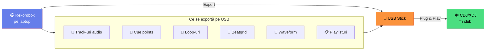
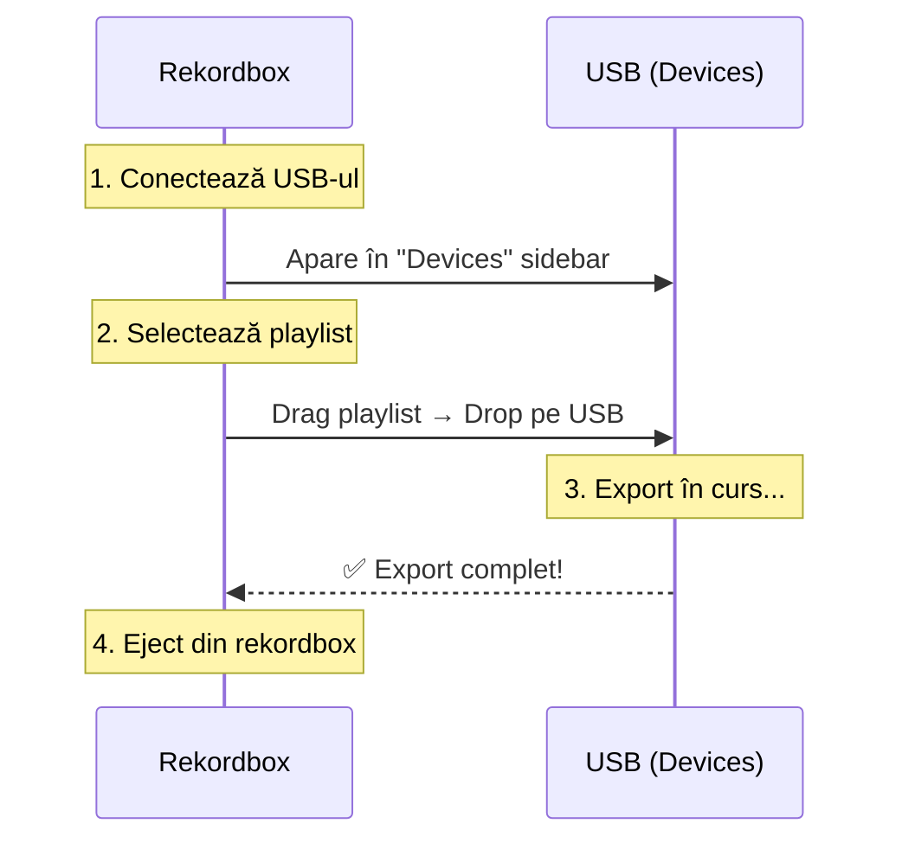
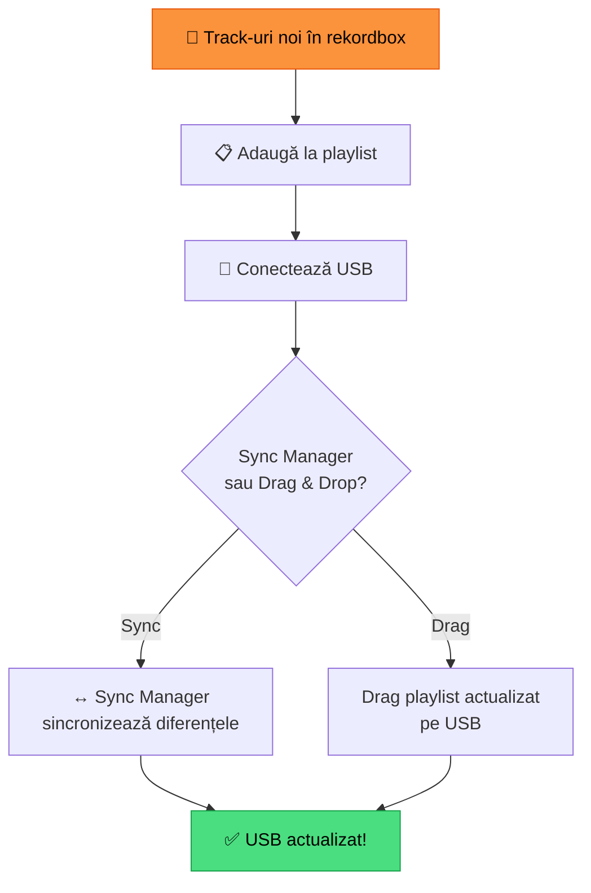
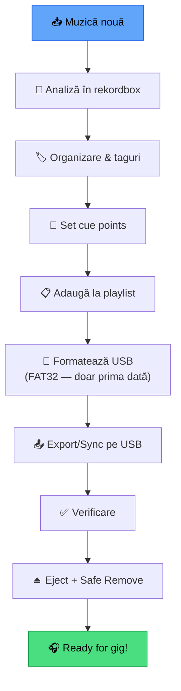

# 🟢 Export USB — Ghid Basic

[🏠 Home](../../README.md) · [🗺️ Navigare](../../NAVIGARE.md) · [🟢 Începător](../../README.md#-începător)

| ← Prev | Next → |
|:---|---:|
| [← Primul Mix](06-primul-mix.md) | [🟡 Beatgrid Avansat →](../avansat/01-beatgrid-avansat.md) |

---

> **Pe scurt:** Cum exporti muzică pe USB pentru a o folosi pe CDJ/XDJ în club
> sau pe orice player Pioneer compatibil.

---

## 🎯 De Ce Export USB?



Export USB = **mutarea** playlisturilor pregătite pe un stick USB, cu toate informațiile (cue-uri, waveform, beatgrid). Mergi la club, bagi USB-ul → totul e gata.

---

## 💾 Pasul 1 — Pregătire USB

### Format Recomandat

| Format | Compatibilitate | Max Dimensiune | Recomandat? |
|--------|----------------|----------------|-------------|
| **FAT32** | ✅ Toate CDJ/XDJ | 32 GB max partitie* | ✅ **DA — cel mai sigur** |
| **exFAT** | ⚠️ CDJ noi (2018+) | Nelimitat | ⚠️ OK pe echipament nou |
| **NTFS** | ❌ Incompatibil | — | ❌ NU folosi |

> \* FAT32 suportă partitii mai mari, dar unele CDJ-uri mai vechi au limită de 32 GB.

### Cum Formatezi USB-ul (Windows):

1. Conectează USB-ul
2. **File Explorer** → click dreapta pe USB → **Format**
3. File System: **FAT32**
4. Allocation Unit Size: **Default**
5. ✅ Quick Format
6. Click **Start**

> **⚠️ ATENȚIE:** Formatarea **șterge tot** de pe USB!

### USB-uri Recomandate:

| USB | Capacitate | Interfață | Preț | Note |
|-----|-----------|-----------|------|------|
| SanDisk Ultra Fit | 32 GB | USB 3.1 | ~€10 | Mic, rapid |
| SanDisk Extreme Go | 64 GB | USB 3.2 | ~€15 | Robust |
| Samsung BAR Plus | 64 GB | USB 3.1 | ~€12 | Durabil |
| Kingston DataTraveler | 32 GB | USB 3.0 | ~€8 | Buget |

> **💡 Sfat:** Cumpără **2 USB-uri identice** — unul principal, unul backup.

---

## 📤 Pasul 2 — Export din Rekordbox

### Metoda 1 — Drag & Drop (Simplă)



1. **Conectează USB-ul** la laptop
2. În rekordbox, USB-ul apare în **Devices** (sidebar stânga, jos)
3. **Drag** playlist-ul din Playlists → **Drop** pe USB device
4. Rekordbox copiază track-urile + metadata
5. **Eject** din rekordbox (click dreapta → Eject) → apoi safe remove din Windows

### Metoda 2 — Sync Manager (Avansat)

1. **Conectează USB-ul**
2. Mergi la **Sync Manager** (icon ↔️ în toolbar)
3. Selectează ce playlisturi vrei pe USB
4. Click **Sync** — rekordbox sincronizează automat

> Sync Manager e util când actualizezi regulat USB-ul.

---

## 📂 Ce Se Crează pe USB?

```
USB:\
├── PIONEER\
│   ├── rekordbox\
│   │   ├── export.pdb         ← Baza de date rekordbox
│   │   └── ...
│   └── USBANLZ\
│       └── ...                ← Waveform data
│
└── [Foldere cu muzică]        ← Track-urile audio (MP3, WAV, etc.)
```

> **IMPORTANT:** Nu modifica niciodată folderul **PIONEER/** manual!
> Rekordbox gestionează totul automat.

---

## ✅ Pasul 3 — Verificare

După export, verifică:

1. **În rekordbox:** expandează USB-ul în Devices → verifică playlist-urile
2. **Track-uri prezente:** toate track-urile apar?
3. **Play test:** dă play pe un track de pe USB — funcționează?
4. **Informații:** BPM, Key, Waveform prezente?

---

## 🔄 Actualizare USB

Când adaugi muzică nouă:



> **💡 Sfat:** Sync Manager actualizează doar ce s-a schimbat = mai rapid.

---

## ⚠️ Reguli Importante

| Regulă | De Ce |
|--------|-------|
| **Mereu Eject din rekordbox** | Previne coruperea bazei de date |
| **Apoi Safe Remove din Windows** | Previne pierderea datelor |
| **Nu scoate USB-ul în timpul exportului** | Risc de corupere |
| **Backup USB** | Ai mereu un al doilea USB identic |
| **FAT32 pe echipament vechi** | Compatibilitate maximă |
| **Nu modifica PIONEER/ manual** | Rekordbox gestionează automat |

---

## 🏁 Workflow Complet Export



---

## ✅ Checklist — Export USB

- [ ] Am un USB formatat FAT32
- [ ] Știu să export un playlist pe USB
- [ ] Am verificat track-urile pe USB
- [ ] Știu diferența între Export și Sync Manager
- [ ] Fac Eject din rekordbox + Safe Remove din Windows
- [ ] Am un USB de backup

---

| ← Prev | Next → |
|:---|---:|
| [← Primul Mix](06-primul-mix.md) | [🟡 Beatgrid Avansat →](../avansat/01-beatgrid-avansat.md) |

[🏠 Home](../../README.md) · [🗺️ Navigare](../../NAVIGARE.md)
