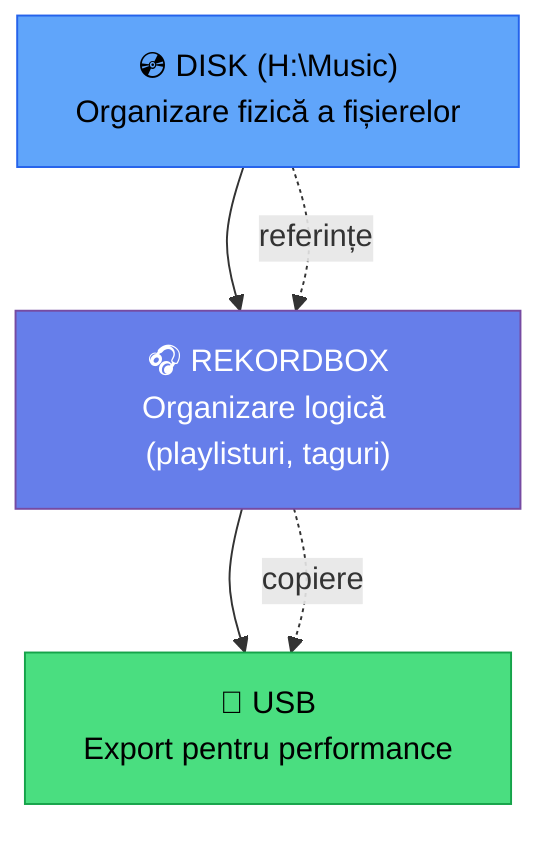

# 📁 Sistem de Organizare Muzică — Overview

[🏠 Home](../../README.md) · [🗺️ Navigare](../../NAVIGARE.md)

---

> **Pe scurt:** Sistemul complet de organizare a muzicii tale.
> De la structura pe disk, la taguri în rekordbox, la export USB.

---

## 🧠 Filozofia

**3 niveluri de organizare:**

1. **Disk** — Fișierele pe H:\Music (structura de foldere)
2. **Rekordbox** — Playlisturi, taguri, cue-uri (organizare logică)
3. **USB** — Export selectiv pentru gig-uri

---

## 📋 Ghiduri

| Document | Ce Rezolvă |
|----------|-----------|
| [📂 Structură Foldere](structura-foldere.md) | Cum organizezi fișierele pe disk |
| [🏷️ Sistem Taguri](sistem-taguri.md) | Clasificare multi-dimensională în rekordbox |
| [📝 Convenții Fișiere](conventii-fisiere.md) | Cum denumești fișierele |
| [🔍 Workflow Scanare](workflow-scanare.md) | Scanare automată, watch folders |
| [💿 Gestionare Drive-uri](gestionare-drive-uri.md) | Multiple drive-uri & surse |
| [💾 Export USB](export-usb.md) | Export complet pe USB |
| [📊 BPM / Key / Energy](bpm-key-energy.md) | Categorizare completă |

---

[🏠 Home](../../README.md)
