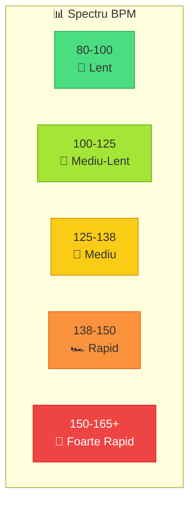
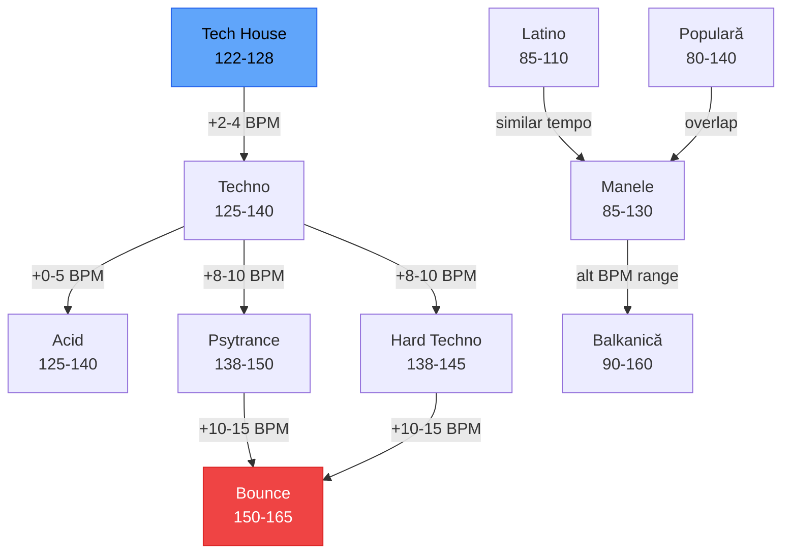

# 📊 BPM / Key / Energy — Categorizare Completă

[🏠 Home](../../README.md) · [📁 Organizare](README.md)

---

> **Pe scurt:** Tabel complet de categorizare per gen, BPM, Key și energie.

---

## 📊 Tabel Master — Toate Genurile

| Gen | BPM Min | BPM Tipic | BPM Max | Key Frecvent | Energie | Camelot Zone |
|-----|---------|-----------|---------|-------------|---------|-------------|
| **Populară Românească** | 80 | 100-120 | 140 | Dm, Am, Gm | 2-4 | 6A-8A |
| **Latino (Reggaeton)** | 85 | 92-100 | 110 | Am, Dm, Cm | 3-4 | 5A-8A |
| **Manele** | 85 | 95-115 | 130 | Dm, Am, Gm | 2-5 | 6A-8A |
| **Balkanică** | 90 | 100-130 | 160 | Dm, Gm, Am | 3-5 | 6A-8A |
| **Tech House** | 122 | 124-126 | 128 | Cm, Gm, Dm | 3-4 | 5A-7A |
| **Techno** | 125 | 130-138 | 145 | Am, Em, Dm | 3-5 | 7A-9A |
| **Acid** | 125 | 130-136 | 140 | Am, Dm, Em | 4-5 | 7A-9A |
| **Psytrance** | 138 | 142-148 | 150+ | Em, Am, Bm | 4-5 | 8A-10A |
| **Hard Techno** | 138 | 140-145 | 150 | Am, Dm, Fm | 5 | 4A-8A |
| **Bounce** | 150 | 155-160 | 165+ | Cm, Fm, Gm | 5 | 4A-6A |

---

## 🔄 Compatibilitate BPM între Genuri

### Tranziții Naturale între Genuri:

| De la | La | Ușurință | Tehnica |
|-------|-----|---------|---------|
| Tech House → Techno | 🟢 Ușor | Crește BPM gradual +2-3 |
| Techno → Acid | 🟢 Ușor | Același BPM range |
| Techno → Hard Techno | 🟢 Ușor | +5-10 BPM |
| Techno → Psy | 🟡 Mediu | +10 BPM, track de tranziție |
| Hard Techno → Bounce | 🟡 Mediu | +15 BPM, track de tranziție |
| Manele → Techno | 🔴 Greu | BPM complet diferit — nevoie de break |
| Manele → Balkanică | 🟢 Ușor | BPM similar |
| Latino → Manele | 🟢 Ușor | BPM similar |
| **Orice → Orice** | 🟡 | Folosește un **track de fuziune** ca punte |

---

## ⚡ Sistem de Energie

| Nivel | Rating | Denumire | Descriere | Genuri Tipice |
|-------|--------|----------|-----------|---------------|
| 1 | ⭐ | **Ambient** | Background, zero energie | Deep, Ambient |
| 2 | ⭐⭐ | **Warmup** | Chill, intro | Tech House chill, Populară |
| 3 | ⭐⭐⭐ | **Groove** | Curgător, pleasant | Tech House, Manele mid |
| 4 | ⭐⭐⭐⭐ | **Drive** | Energic, dans | Techno, Acid, Manele party |
| 5 | ⭐⭐⭐⭐⭐ | **Peak** | Maximum! | Bounce, Hard Techno, Psy |

---

[🏠 Home](../../README.md) · [📁 Organizare](README.md)
