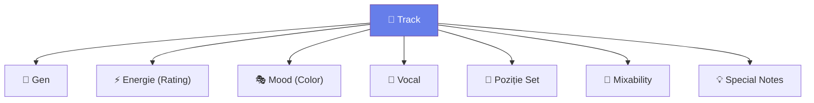

# 🏷️ Sistem Taguri — Clasificare Multi-Dimensională

[🏠 Home](../../README.md) · [📁 Organizare](README.md)

---

> **Pe scurt:** Sistem complet de taguri pentru rekordbox.

---

## 🧠 Cele 7 Dimensiuni

| Dimensiune | Câmp Rekordbox | Valori |
|-----------|---------------|--------|
| **Gen** | Genre | Techno, Tech House, Bounce, Acid, Psy, Manele, Populară, Balkanică, Latino |
| **Energie** | Rating ⭐ | 1★=Low, 2★=Warmup, 3★=Mid, 4★=High, 5★=Peak |
| **Mood** | Color Label | 🔴Agresiv, 🟠Energic, 🟡Chill, 🟢Happy, 🔵Emoțional, 🟣Trippy |
| **Vocal** | My Tag / Comments | Instrumental, Light Vocal, Heavy Vocal, Acapella |
| **Poziție Set** | My Tag | Opener, Journey, Peak Time, Closer |
| **Mixability** | My Tag | Easy, Medium, Hard |
| **Special** | Comments | Fuziune notes, mix-uri recomandate |

---

## 📊 Exemplu Complet de Tagging

| Track | Gen | ⭐ | Color | Vocal | Poziție | Mix | Comments |
|-------|-----|-----|-------|-------|---------|-----|----------|
| Dark Acid 303 | Acid | ⭐⭐⭐⭐ | 🔴 | Instrumental | Peak | Easy | "Merge cu balkan perc" |
| Manea Club 2025 | Manele | ⭐⭐⭐ | 🟠 | Heavy Vocal | Journey | Hard | "BPM variabil, beat match manual" |
| Bounce Euphoria | Bounce | ⭐⭐⭐⭐⭐ | 🟠 | Light Vocal | Peak | Easy | "Weapon! Mereu funcționează" |
| Tech Groove | Tech House | ⭐⭐ | 🟡 | Instrumental | Warmup | Easy | "Opener perfect" |

---

[🏠 Home](../../README.md) · [📁 Organizare](README.md)
