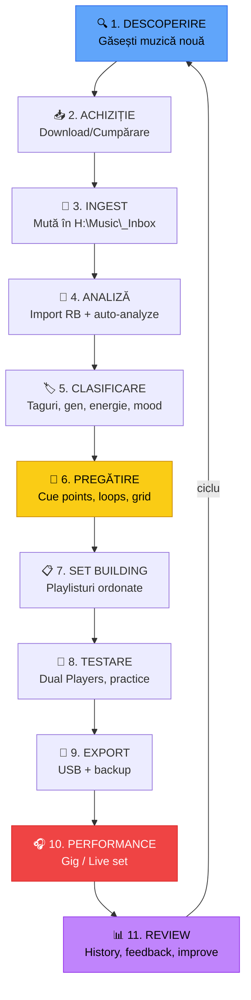

# 🔴 Workflow Profesional — De la Descoperire la Performance

> ⚠️ **Context**: workflow cu **rekordbox + CDJ**. Suplimentar/alternativ în MMO → [`docs/aplicatie/`](../aplicatie/README.md).

[🏠 Home](../../README.md) · [🗺️ Navigare](../../NAVIGARE.md) · [🔴 Profesional](../../README.md#-profesional)

| ← Prev | Next → |
|:---|---:|
| [← Înregistrare Mix](../avansat/07-inregistrare-mix.md) | [Pregătire Set →](02-pregatire-set.md) |

---

> **Pe scurt:** Pipeline-ul complet de la descoperirea muzicii noi
> până la performanța live. Workflow-ul care te separă de amatori.

---

## 🔄 Pipeline-ul Complet



---

## 📋 Fiecare Pas în Detaliu

### 1. 🔍 Descoperire

| Sursă | Tip | Cost | Ce găsești |
|-------|-----|------|-----------|
| **Beatport** | Store + Streaming | €€ | Techno, house, bounce, trance |
| **Bandcamp** | Store | €-€€ | Underground, indie, experimental |
| **SoundCloud** | Free + Streaming | €0-€ | Remixuri, bootleguri, nișe |
| **YouTube** | Free | €0 | Orice, dar calitate variabilă |
| **Spotify playlists** | Discover | €0-€ | Descoperire → apoi cumperi |
| **DJ pools** | Subscription | €€ | Track-uri DJ-ready |
| **Collection Radar** | RB7 | Inclus | Sugestii din biblioteca ta |
| **Streaming Radar** | RB7 | Plan plătit | Sugestii de pe streaming |

### 2-3. 📥 Achiziție & Ingest

```
Download → H:\Music\_Inbox\ → Verifică calitate → Mută în gen
```

### 4-5. 🔬 Analiză & Clasificare

- Import → Auto-analyze → Verifică BPM/Key → Taguri → Sort

### 6. 🎯 Pregătire (cel mai important!)

- Hot Cues (schema de 8)  
- Memory Cues pe puncte structurale
- Beatgrid verificat
- Loops pe secțiuni bune

### 7-8. 📋 Set Building & Testing

- Ordonează track-uri într-un flow narativ
- Testează tranziții cu **Dual Players** (Export Mode)
- Ajustează ordinea

### 9. 💾 Export

- Sync pe USB principal + backup

### 10-11. 🎧 Performance & Review

- Gig → Save History → Analiză → Improve

---

## ⏰ Timp Alocat per Pas

| Pas | Timp/Săptămână | Prioritate |
|-----|---------------|-----------|
| Descoperire | 2-3 ore | 🟡 |
| Achiziție & Ingest | 30 min | 🟢 |
| Analiză & Clasificare | 1-2 ore | 🔴 |
| Pregătire (cue points) | 2-3 ore | 🔴 |
| Set Building | 1-2 ore | 🔴 |
| Practice | 2-4 ore | 🔴 |
| Export | 15 min | 🟢 |
| **Total** | **~10-15 ore** | |

---

## ✅ Checklist

- [ ] Am un workflow clar de la descoperire la performance
- [ ] Fac descoperire regulat (săptămânal)
- [ ] Fiecare track importat trece prin pipeline-ul complet
- [ ] Testez tranzițiile înainte de gig
- [ ] Salvez și revizuiesc Play History

---

| ← Prev | Next → |
|:---|---:|
| [← Înregistrare Mix](../avansat/07-inregistrare-mix.md) | [Pregătire Set →](02-pregatire-set.md) |

[🏠 Home](../../README.md) · [🗺️ Navigare](../../NAVIGARE.md)
