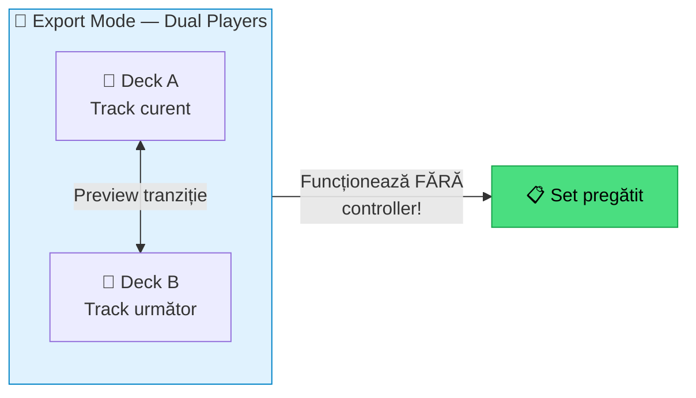
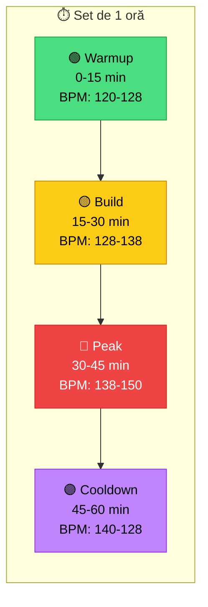

# 🔴 Pregătire Set — Dual Players, Flow & Ordering

[🏠 Home](../../README.md) · [🗺️ Navigare](../../NAVIGARE.md) · [🔴 Profesional](../../README.md#-profesional)

| ← Prev | Next → |
|:---|---:|
| [← Workflow Pro](01-workflow-pro.md) | [Multi-Device →](03-multi-device.md) |

---

> **Pe scurt:** Cum construiești un set profesional folosind Dual Players,
> energy flow și tehnici de ordering.

---

## 🎯 Dual Players — Feature Killer din RB7



### Ce Poți Face:

1. **Lock** 2 track-uri — sincronizate BPM
2. **Jump forward** — sari cu 8/16 bare pentru a auzi tranziția
3. **Crossfade** — preview cum sună împreună
4. **Ajustează cue-uri** pe loc
5. **Reorder** playlist-ul pe baza testelor

---

## 📈 Energy Flow — Arcul Narativ al Setului



### Exemplu Set mwrty — 1 Oră Techno × Manele:

| Segment | Minute | BPM | Key Flow | Gen | Track-uri |
|---------|--------|-----|----------|-----|-----------|
| **Warmup** | 0-15 | 122-128 | 8A→9A | Tech House | 3-4 |
| **Build** | 15-25 | 128-136 | 9A→7A | Techno | 3 |
| **Fuziune** | 25-35 | 136 | 7A→6A | Techno × Manele | 2-3 |
| **Peak** | 35-45 | 136-142 | 6A→8A | Hard Techno/Bounce | 3 |
| **Emotional** | 45-52 | 142-130 | 8A→8B | Melodic/Manele | 2 |
| **Closer** | 52-60 | 130-125 | 8B→7A | Tech House ambient | 2 |

---

## 📋 Tehnici de Ordering

### 1. Journey Ordering (Recomandată)

```
Low → Medium → High → Peak → Medium → End
```
Construiești o **poveste** cu energie crescătoare și un moment de vârf.

### 2. Genre Block Ordering

```
[Techno Block] → [Transition Track] → [Manele Block] → [Transition] → [Bounce Block]
```
Groupuri de 3-5 track-uri per gen cu track-uri de tranziție între ele.

### 3. Key Walk Ordering

```
8A → 9A → 10A → 11A → 12A → 1A → ...
```
Mergi pe Camelot wheel în ordine — maxim armonic.

---

## ✅ Checklist

- [ ] Știu să folosesc Dual Players pentru preview tranziții
- [ ] Am un energy flow planificat pentru set
- [ ] Testez cel puțin 50% din tranzițiile înainte de gig
- [ ] Am track-uri de tranziție între genuri

---

| ← Prev | Next → |
|:---|---:|
| [← Workflow Pro](01-workflow-pro.md) | [Multi-Device →](03-multi-device.md) |

[🏠 Home](../../README.md) · [🗺️ Navigare](../../NAVIGARE.md)
