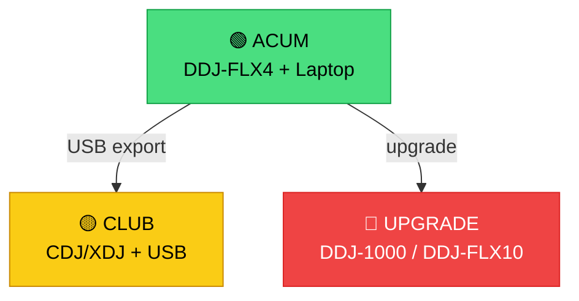

# 🔴 Multi-Device Setup — CDJ, XDJ, DDJ

[🏠 Home](../../README.md) · [🗺️ Navigare](../../NAVIGARE.md) · [🔴 Profesional](../../README.md#-profesional)

| ← Prev | Next → |
|:---|---:|
| [← Pregătire Set](02-pregatire-set.md) | [Live Hybrid →](04-live-hybrid.md) |

---

> **Pe scurt:** Compatibilitate cu echipamentul din cluburi și cum să fii pregătit.

---

## 🏢 Ce Găsești în Cluburi

| Echipament | Tip | USB? | Rekordbox? | Frecvență |
|-----------|-----|------|------------|-----------|
| **CDJ-3000** | Player standalone | ✅ | ✅ | Club-uri mari |
| **CDJ-2000NXS2** | Player standalone | ✅ | ✅ | Standard club |
| **XDJ-RX3** | All-in-one | ✅ | ✅ | Bar-uri, events |
| **XDJ-XZ** | Controller+Standalone | ✅ | ✅ | Versatil |
| **DDJ-1000** | Controller (laptop) | ❌ | ✅ | Events |
| **DJM-900NXS2** | Mixer | — | — | Standard club |

### Ce E Relevant pentru Tine:

**USB-ul tău exportat din rekordbox** funcționează pe **ORICE** CDJ/XDJ Pioneer.
Pregătești acasă → bagi USB → mixi pe echipamentul clubului.

---

## 💾 Compatibilitate USB

| Format USB | CDJ-3000 | CDJ-2000NXS2 | CDJ-900 | XDJ-RX3 |
|-----------|----------|--------------|---------|---------|
| **FAT32** | ✅ | ✅ | ✅ | ✅ |
| **exFAT** | ✅ | ✅ | ❌ | ✅ |
| **NTFS** | ❌ | ❌ | ❌ | ❌ |
| **HFS+** | ✅ | ✅ | ✅ | ✅ |

> **Regulă:** Folosește **FAT32** mereu = funcționează pe tot.

---

## 🔑 Sfaturi pentru Cluburi

1. **Mereu 2 USB-uri** identice (principal + backup)
2. **Testează USB-ul** pe echipamentul tău înainte de gig
3. **Formatează FAT32** — nu exFAT
4. **Nu mai mult de 1000 track-uri** pe un USB pentru CDJ-uri mai vechi
5. **Eject corect** din rekordbox + safe remove Windows

---

## ✅ Checklist

- [ ] USB formatat FAT32
- [ ] 2 USB-uri identice (backup)
- [ ] Track-uri analizate complet (BPM, Key, Waveform, Cues)
- [ ] Playlisturi ordonate
- [ ] Testat pe echipamentul meu

---

| ← Prev | Next → |
|:---|---:|
| [← Pregătire Set](02-pregatire-set.md) | [Live Hybrid →](04-live-hybrid.md) |

[🏠 Home](../../README.md) · [🗺️ Navigare](../../NAVIGARE.md)
