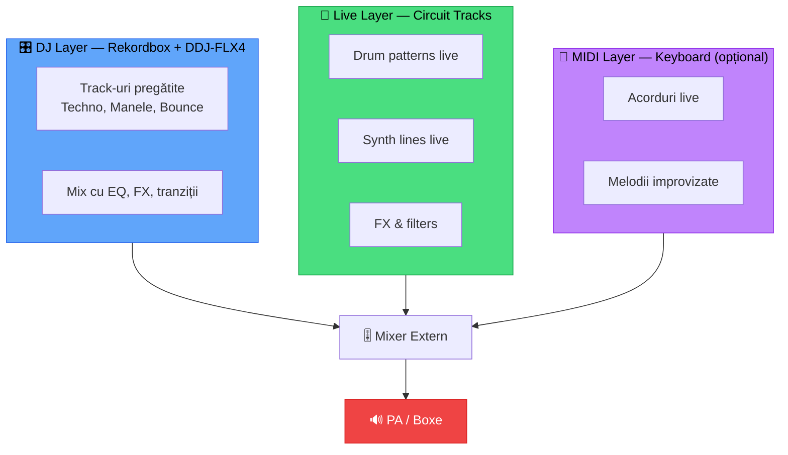
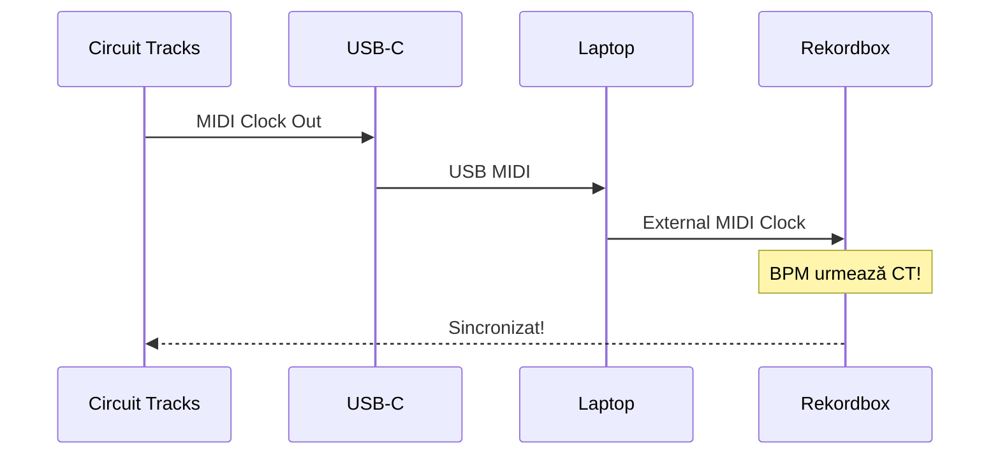
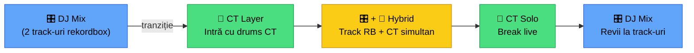

# 🔴 Live Hybrid — Rekordbox + Circuit Tracks + MIDI

[🏠 Home](../../README.md) · [🗺️ Navigare](../../NAVIGARE.md) · [🔴 Profesional](../../README.md#-profesional)

| ← Prev | Next → |
|:---|---:|
| [← Multi-Device](03-multi-device.md) | [Backup & Recovery →](05-backup-disaster.md) |

---

> **Pe scurt:** Cum combini rekordbox (DJ) cu Circuit Tracks (live synth/drums)
> și opțional un MIDI keyboard. Setup-ul hibrid definitiv al lui mwrty.

---

## 🎯 Conceptul Hybrid



---

## 🔌 Setup-uri de Conexiune

### Setup A — Minimal (Fără Mixer Extern)

```
CT Audio Out ──→ Laptop Audio In ──→ rekordbox (ca sample)
DDJ-FLX4 ──→ Laptop USB ──→ rekordbox
Laptop ──→ DDJ Audio Out ──→ 🔊 Boxe
```

> **Limitare:** CT trece prin laptop = latency posibilă.

### Setup B — Cu Mixer Extern (RECOMANDAT)

```
CT Main Out ────→ Mixer Canal 1/2
DDJ-FLX4 Out ──→ Mixer Canal 3/4
MIDI Keys ──────→ CT MIDI In (sau Mixer canal separat)
Mixer Main ────→ 🔊 PA / Boxe
```

### Setup C — Cu Audio Interface

```
CT ─────────→ Audio Interface Input 1/2
DDJ-FLX4 ──→ Audio Interface Input 3/4
Audio IF ──→ Laptop (DAW monitor / recording)
Audio IF ──→ 🔊 Monitors
```

---

## 🔄 MIDI Sync — CT și Rekordbox pe Același Tempo



### Configurare:

1. **CT** → Settings → MIDI Clock → **Send** = ON
2. **CT** → USB → Laptop
3. **Rekordbox** → Preferences → MIDI → External Clock = Circuit Tracks
4. Setezi BPM pe CT → rekordbox urmează automat

### Alternativ: Rekordbox ca Master

1. **Rekordbox** → MIDI Clock → **Send** = ON
2. **CT** → Settings → MIDI Clock → **Receive** = ON
3. CT urmează BPM-ul din rekordbox

---

## 🎹 Performance Flow: DJ + Live

### Scenariul Tipic:



### Workflow Detaliat:

1. **Mixezi normal** cu rekordbox (Track A → Track B)
2. În timp ce Track B merge, **pornești CT** cu un pattern complementar
3. **Ridici volumul CT** pe mixer — publicul aude drums/synths live
4. **Oprești/coborzi Track B** — rămâi pe CT (solo live)
5. **Improvizezi** pe CT (schimbi patterns, filtre, FX)
6. **Încarcă Track C** în rekordbox, sincronizat cu CT
7. **Ridici Track C** + coborzi CT → întorci la DJ mode
8. **Repeti** ciclul

---

## 🎹 MIDI Keyboard Integration

Dacă ai acces la o claviatură MIDI (de la vărul tău):

### Conexiune:

```
MIDI Keyboard ──→ CT MIDI In (5-pin DIN)
                   sau
MIDI Keyboard ──→ Laptop USB ──→ Software Synth
```

### Ce Poți Face:

- **Acorduri live** peste un track de rekordbox
- **Melodii** improvizate în Key-ul track-ului curent
- **Pads** — trigger samples sau one-shots

> **💡 Sfat:** Verifică Key-ul track-ului curent în rekordbox (ex: 8A = A minor)
> și cântă în A minor pe keyboard!

---

## 📋 Checklist Setup Hybrid

- [ ] CT sincronizat cu rekordbox (MIDI Clock)
- [ ] Mixer extern (sau routing prin laptop)
- [ ] Știu să intru/ies din CT layer în timpul mixului
- [ ] Am patterns pe CT care merg cu genurile mele
- [ ] (Opțional) MIDI keyboard conectat la CT sau laptop

> **📋 Referință CT:** [circuit-tracks-mwrty](../../../circuit-tracks-mwrty/) — Ghidul complet CT

---

| ← Prev | Next → |
|:---|---:|
| [← Multi-Device](03-multi-device.md) | [Backup & Recovery →](05-backup-disaster.md) |

[🏠 Home](../../README.md) · [🗺️ Navigare](../../NAVIGARE.md)
