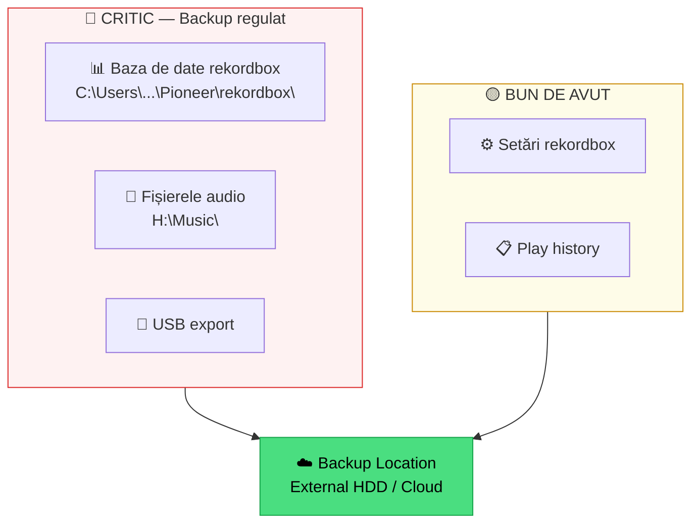

# 🔴 Backup & Disaster Recovery

> ⚠️ **Context**: strategie pentru **rekordbox library**. Aplicabil și pentru MMO music root + DB SQLite.

[🏠 Home](../../README.md) · [🗺️ Navigare](../../NAVIGARE.md) · [🔴 Profesional](../../README.md#-profesional)

| ← Prev | Next → |
|:---|---:|
| [← Live Hybrid](04-live-hybrid.md) | [Streaming & Recording →](06-streaming-live.md) |

---

> **Pe scurt:** Backup regulat = nu pierzi niciodată ani de muncă.

---

## 💾 Ce Trebuie Backup

---

## 📋 Strategia 3-2-1

| Regulă | Ce Înseamnă |
|--------|-------------|
| **3** copii | Original + 2 backup-uri |
| **2** medii | HDD extern + Cloud |
| **1** offsite | Cel puțin un backup în altă locație |

### Plan Practic:

| Ce | Unde e originalul | Backup 1 | Backup 2 |
|----|-------------------|----------|----------|
| **Fișiere audio** | H:\Music | HDD Extern | Google Drive/OneDrive |
| **DB Rekordbox** | C:\Users\...\Pioneer\rekordbox | HDD Extern | Cloud |
| **USB Gig** | USB A | USB B (identic) | — |

---

## 🔄 Backup Rekordbox Database

### Manual:

1. Închide rekordbox
2. Copiază folderul: `C:\Users\[USER]\AppData\Roaming\Pioneer\rekordbox\`
3. Pastează pe HDD extern / cloud

### Automat (rekordbox):

1. **File → Library → Backup Library**
2. Alege locația
3. Salvează

### Restore:

1. **File → Library → Restore Library**
2. Selectează backup-ul
3. Confirm → restaurare completă

---

## ⏰ Program de Backup

| Frecvență | Ce Faci |
|-----------|---------|
| **Săptămânal** | Backup database rekordbox |
| **La fiecare import major** | Backup foldere muzică noi |
| **Înainte de gig** | 2 USB-uri identice |
| **Lunar** | Backup complet (muzică + database) pe HDD extern |

---

## ✅ Checklist

- [ ] Am backup la baza de date rekordbox
- [ ] Fișierele audio sunt pe minim 2 locații
- [ ] Am 2 USB-uri identice pentru gig-uri
- [ ] Fac backup cel puțin săptămânal

---

| ← Prev | Next → |
|:---|---:|
| [← Live Hybrid](04-live-hybrid.md) | [Streaming & Recording →](06-streaming-live.md) |

[🏠 Home](../../README.md) · [🗺️ Navigare](../../NAVIGARE.md)
