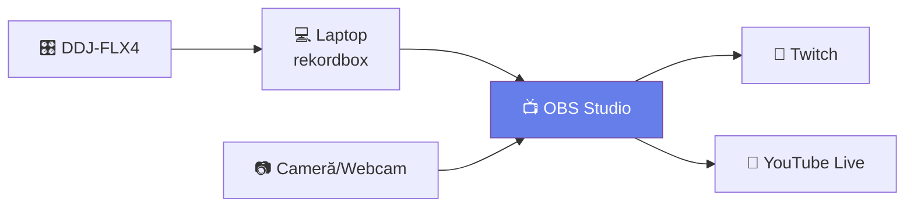

# 🔴 Streaming & Recording Profesional

> ⚠️ **Context**: streaming cu **rekordbox + OBS**. MMO are vizualizări auto-reactive perfect pentru OBS Browser Source → [`docs/aplicatie/visualizations.md`](../aplicatie/visualizations.md).

[🏠 Home](../../README.md) · [🗺️ Navigare](../../NAVIGARE.md) · [🔴 Profesional](../../README.md#-profesional)

| ← Prev | Next → |
|:---|---:|
| [← Backup & Recovery](05-backup-disaster.md) | [Pregătire Club →](07-preparare-club.md) |

---

> **Pe scurt:** Cum faci streaming live și recording profesional al seturilor tale.

---

## 🎥 Streaming Live (Twitch/YouTube)



### Setup OBS + Rekordbox:

1. Instalează **OBS Studio** (gratuit)
2. **Audio Source:** Adaugă "Audio Output Capture" → selectează DDJ-FLX4
3. **Video Source:** Adaugă Webcam sau cameră
4. **Overlay:** Adaugă text cu numele tău, genul, track-ul curent
5. **Stream:** Conectează la Twitch/YouTube cu stream key

### Setări Recomandate:

| Setare | Valoare |
|--------|---------|
| Resolution | 1920×1080 |
| FPS | 30 |
| Bitrate Video | 4500 kbps |
| Bitrate Audio | 320 kbps |
| Audio Format | AAC |

---

## 🎙️ Recording Profesional

### Opțiunea 1: Direct din Rekordbox

Cea mai simplă. Apasă REC → mixi → STOP.

### Opțiunea 2: Prin Audio Interface

```
DDJ-FLX4 Out → Audio Interface → DAW (Ableton/FL Studio/Audacity)
```

Avantaj: Recording separat de rekordbox = calitate maximă, opțiuni de mastering.

### Opțiunea 3: Multi-Track Recording

```
DDJ Deck A → Ch 1/2 (audio interface)
DDJ Deck B → Ch 3/4 (audio interface)
CT → Ch 5/6 (audio interface)
= Fiecare sursă pe canal separat = post-edit total
```

---

## ⚠️ Copyright & Legalitate

| Platformă | DJ Mixes | Risc Copyright |
|-----------|----------|----------------|
| **Mixcloud** | ✅ Legal (licențiat) | Minim |
| **SoundCloud** | ⚠️ Risc takedown | Mediu |
| **YouTube** | ⚠️ Content ID claims | Mare |
| **Twitch** | ⚠️ DMCA strikes | Mare |

> **💡 Mixcloud** = platforma cea mai sigură pentru DJ mixes.

---

## ✅ Checklist

- [ ] OBS instalat și configurat
- [ ] Audio routing corect (DDJ → OBS)
- [ ] Știu diferența între platforme (copyright)
- [ ] Am încercat cel puțin o înregistrare completă

---

| ← Prev | Next → |
|:---|---:|
| [← Backup & Recovery](05-backup-disaster.md) | [Pregătire Club →](07-preparare-club.md) |

[🏠 Home](../../README.md) · [🗺️ Navigare](../../NAVIGARE.md)
