# 🔴 Pregătire Club/Festival — Checklist Gig

> ⚠️ **Context**: preparare cu **rekordbox + CDJ**. Aplicabil și cu MMO + USB export → [`docs/aplicatie/playlists.md`](../aplicatie/playlists.md).

[🏠 Home](../../README.md) · [🗺️ Navigare](../../NAVIGARE.md) · [🔴 Profesional](../../README.md#-profesional)

| ← Prev | Next → |
|:---|---:|
| [← Streaming & Recording](06-streaming-live.md) | [📁 Organizare →](../../organizare/README.md) |

---

> **Pe scurt:** Checklist complet pentru un gig real.
> De la pregătirea cu o săptămână înainte, până la debrief.

---

## 📅 Timeline Pregătire

```mermaid
gantt
    title 📅 Pregătire Gig
    dateFormat  X
    axisFormat %s

    section Săptămâna dinainte
    Finalizare playlist          :a1, 0, 2
    Test tranziții (Dual Players):a2, 2, 4
    Export USB (2×)              :a3, 4, 5
    
    section Ziua dinainte
    Verificare USB pe echipament :b1, 5, 6
    Backup USB                   :b2, 6, 7
    Pregătire bag (cabluri etc.) :b3, 7, 8
    
    section Ziua gig-ului
    Verificare echipament venue  :c1, 8, 9
    Sound check (dacă e posibil):c2, 9, 10
    PERFORMANCE                  :crit, c3, 10, 13
    
    section După gig
    Save Play History            :d1, 13, 14
    Debrief & notes              :d2, 14, 15
```

---

## 📋 Checklist — Săptămâna Dinainte

- [ ] Playlist-ul setului finalizat (15-25 track-uri per oră)
- [ ] Toate track-urile cu cue points setate
- [ ] Toate tranzițiile testate în Dual Players
- [ ] Energy flow planificat
- [ ] Track-uri de backup pregătite (în caz că schimbi planul)
- [ ] 2× USB-uri exportate și testate

---

## 📋 Checklist — Ziua Dinainte

- [ ] USB-urile verificate (play test pe laptop)
- [ ] Baterie laptop 100%
- [ ] Încărcător laptop în geantă
- [ ] Cabluri: USB-C, RCA, jack 3.5mm, jack 6.3mm
- [ ] Căști DJ funcționale
- [ ] DDJ-FLX4 (dacă e nevoie)
- [ ] Circuit Tracks + alimentator (dacă setup hibrid)

---

## 📋 Checklist — La Venue

- [ ] Verifică echipamentul booth-ului (CDJ/XDJ/Mixer)
- [ ] Testează USB-ul pe echipament
- [ ] Verifică monitoare booth
- [ ] Verifică volume levels
- [ ] Câștigă timp: întreabă DJ-ul dinaintea ta ce BPM/gen joacă
- [ ] Pregătește primul track

---

## 📋 Checklist — După Gig

- [ ] Salvează Play History ca playlist
- [ ] Notează ce a mers bine / ce de îmbunătățit
- [ ] Track-uri care au funcționat → marcare ⭐⭐⭐⭐⭐
- [ ] Track-uri care NU au funcționat → notează de ce
- [ ] Idei noi de fuziune sau tranziții

---

## 🎒 Kit-ul de Gig

| Item | Obligatoriu | Note |
|------|-------------|------|
| 💾 USB Principal | ✅ | FAT32, exportat din rekordbox |
| 💾 USB Backup | ✅ | Identic cu principalul |
| 🎧 Căști DJ | ✅ | Cu adapter jack dacă e nevoie |
| 🔌 Cablu USB-C | ✅ | Pentru DDJ-FLX4 (dacă aduci) |
| 💻 Laptop + Încărcător | ⚠️ | Dacă folosești Performance Mode |
| 🎛️ DDJ-FLX4 | ⚠️ | Dacă venue-ul nu are echipament |
| 🎹 Circuit Tracks | ⚠️ | Dacă faci setup hibrid |
| 🔌 Cabluri RCA | 🟡 | Backup |
| 🔌 Adaptor jack | 🟡 | 3.5mm → 6.3mm |
| 📱 Telefon | 🟡 | Shazam, note, backup playlist |

---

## 🎯 Troubleshooting Rapid la Venue

| Problemă | Soluție |
|----------|---------|
| USB nu e detectat | Încearcă celălalt port USB / celălalt USB |
| Waveform nu apar | Re-export cu "Export Waveforms" activat |
| BPM greșit pe CDJ | Re-analyze în rekordbox, re-export |
| Sound cuts out | Verifică cablu, verifică channel fader |
| No sound in monitors | Verifică Booth Out pe mixer |
| Track-uri lipsă | Verifică că toate s-au exportat |

---

## ✅ Ești Pregătit pentru Gig!

Dacă ai bifat toate checklist-urile de mai sus, ești **pregătit**.

> **Regula finală:** Relaxează-te și bucură-te. Pregătirea e 90% din succes.
> Restul de 10% e să citești crowd-ul și să te distrezi.

---

| ← Prev | Next → |
|:---|---:|
| [← Streaming & Recording](06-streaming-live.md) | [📁 Organizare →](../../organizare/README.md) |

[🏠 Home](../../README.md) · [🗺️ Navigare](../../NAVIGARE.md)
