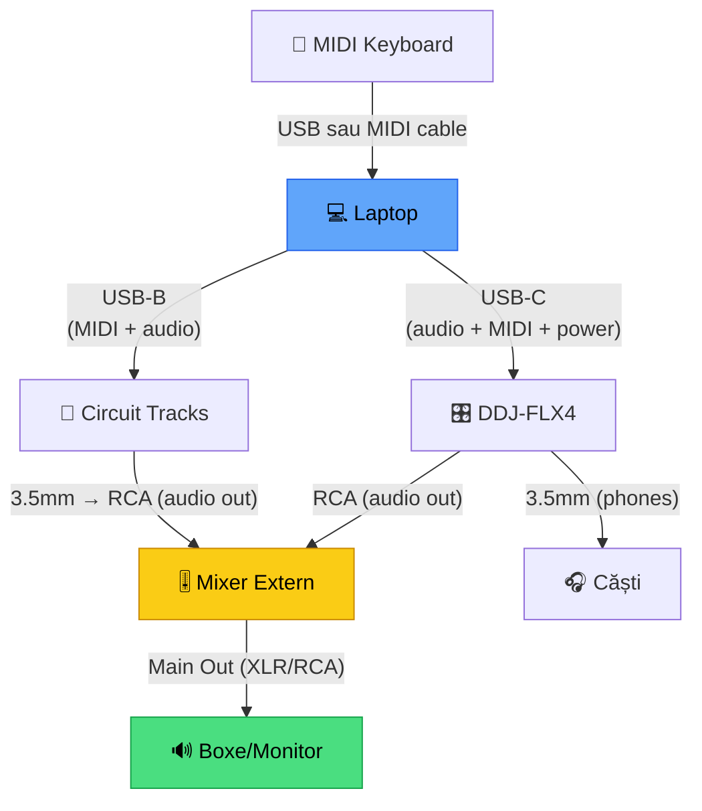

# 🔌 Cabluri & Conexiuni — Signal Flow

[🏠 Home](../README.md) · [🔌 Echipament](../README.md#-echipament)

---

> **Pe scurt:** Ce cabluri ai nevoie, cum circulă semnalul audio/MIDI,
> și cum le conectezi corect.

---

## 🔄 Signal Flow Complet

---

## 🔌 Cabluri Necesare

### Setup Actual (DDJ-FLX4 + Laptop):

| Cablu | De la → La | Lungime | Ai? |
|-------|-----------|---------|-----|
| **USB-C to USB-C** | Laptop → DDJ-FLX4 | 1.5m | ✅ (inclus cu DDJ) |
| **RCA → RCA** | DDJ → Boxe/Mixer | 1.5m | Nevoie |
| **3.5mm → 3.5mm** | DDJ → Căști | 1.2m | ✅ (căștile tale) |

### Setup Extended (+ Circuit Tracks):

| Cablu | De la → La | Lungime | Ai? |
|-------|-----------|---------|-----|
| **USB-B to USB-A/C** | CT → Laptop | 1.5m | ✅ (inclus cu CT) |
| **3.5mm TRS → 2× RCA** | CT Audio Out → Mixer | 1.5m | Nevoie |
| **3.5mm TRS → 3.5mm TRS** | CT MIDI Out → DDJ MIDI In | 1m | Opțional |

### Setup Full (+ MIDI Keyboard + Mixer):

| Cablu | De la → La | Lungime |
|-------|-----------|---------|
| **USB (keyboard)** | MIDI Keyboard → Laptop | 2m |
| **XLR sau RCA** | Mixer → Boxe | 2m |
| **Prelungitor** | Priză | 3m+ |

---

## 📊 Tipuri de Conectori

| Conector | Semnal | Când |
|----------|--------|------|
| **USB-C** | Digital (audio + MIDI + power) | DDJ → Laptop |
| **USB-B** | Digital (audio + MIDI) | CT → Laptop |
| **RCA** | Analog (stereo audio) | DDJ → Mixer/Boxe |
| **3.5mm TRS** | Analog (stereo audio) sau MIDI | CT out, Căști |
| **XLR** | Analog (balanced audio) | Mixer → Boxe pro |
| **MIDI DIN 5-pin** | Digital MIDI | Setup-uri mai vechi |

---

## ⚠️ Sfaturi

| Regulă | De Ce |
|--------|-------|
| **Cabluri scurte** | Zgomot mai mic, mai puțin haos |
| **USB-C cu clip/siguranță** | Să nu se deconecteze în timpul gig-ului |
| **Backup cablu USB** | USB-C se strică frecvent la capete |
| **Etichete pe cabluri** | Știi ce e ce în întuneric |
| **Cable ties / velcro** | Management cabluri = aspect pro |

---

[🏠 Home](../README.md) · [🔌 Echipament](../README.md#-echipament)
