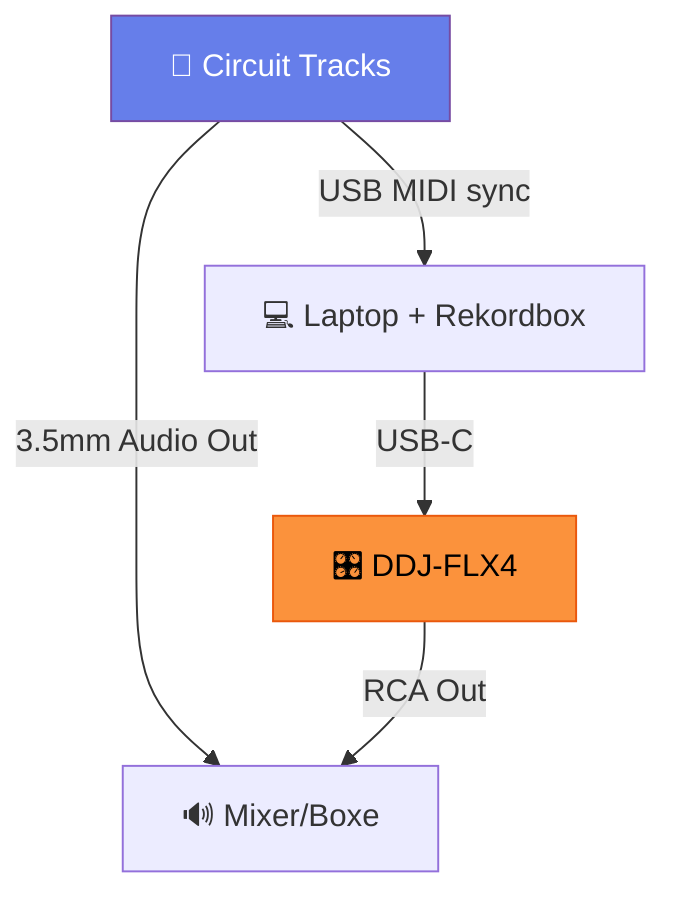
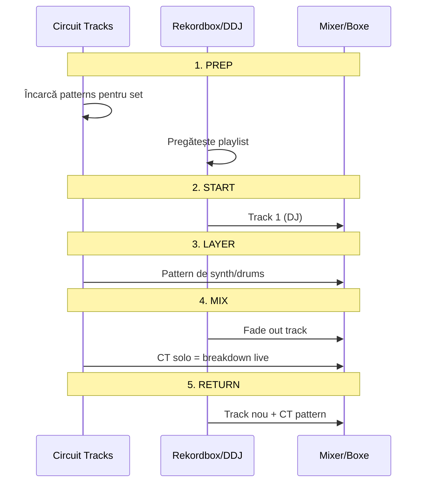

# 🎹 Circuit Tracks — Integrare cu Rekordbox

[🏠 Home](../README.md) · [🔌 Echipament](../README.md#-echipament)

---

> **Pe scurt:** Cum folosești Circuit Tracks (Novation) în tandem cu rekordbox
> pentru performanță live hibridă.

---

## 📋 Circuit Tracks

| Specificație | Valoare |
|-------------|---------|
| **Tip** | Groovebox & Sequencer |
| **Synth Tracks** | 2 (polifonic 6 voci per track) |
| **Drum Tracks** | 4 (sample-based) |
| **MIDI Tracks** | 0 intern (trimite prin USB/MIDI Out) |
| **Sample Slots** | 64 |
| **Sequencer** | 64 steps, 8 patterns per track |
| **Conectivitate** | USB Type-B, MIDI In/Out (3.5mm TRS) |
| **Audio Out** | 2× 3.5mm stereo (headphones + master) |

---

## 🔗 Conexiuni cu Rekordbox/DDJ-FLX4

### Setup-uri posibile:

**Setup A — Direct:** CT → Mixer, DDJ → Mixer (cel mai simplu)

**Setup B — Prin Laptop:** CT USB → Laptop (Ableton/audio routing) → DDJ

**Setup C — MIDI Sync Only:** CT MIDI Out → DDJ MIDI In (sync tempo, CT face sunet separat)

---

## 🔄 MIDI Clock Sync

Circuit Tracks poate fi **clock master** sau **slave**:

### CT ca Master (recomandat):
1. CT trimite MIDI Clock prin USB/MIDI Out
2. Rekordbox primește clock → sincronizează BPM
3. Tu controlezi tempo-ul de pe CT

### CT ca Slave:
1. Rekordbox/DDJ trimite MIDI Clock
2. CT se sincronizează
3. Tu controlezi tempo-ul din rekordbox

> **📋 Documentație completă CT:**
> [circuit-tracks-mwrty](https://github.com/mwrty/circuit-tracks-mwrty)

---

## 🎵 Workflow Hibrid

---

## 🎯 Genuri unde CT + RB funcționează cel mai bine

| Gen | Cum folosești CT | Efect |
|-----|-----------------|-------|
| **Techno** | Synth loops, 909 drums | Layer-uri adaugate live |
| **Acid** | TB-303 style bassline (Synth 1) | Acid lines live pe track DJ |
| **Tech House** | Percussion loops, hi-hat patterns | Extra groove |
| **Psy** | Arpeggiator patterns, FX riser | Build-up-uri live |
| **Bounce** | Lead synth stabs, energy builds | Peak moments |

---

## ✅ Checklist Integrare

- [ ] CT și DDJ conectate ambele la laptop
- [ ] Audio routing configurat (CT audio separat de RB)
- [ ] MIDI Clock sync testat
- [ ] Patterns CT pregătite per gen
- [ ] Volum CT calibrat cu DDJ output
- [ ] Test complet înainte de gig

---

[🏠 Home](../README.md) · [🔌 Echipament](../README.md#-echipament)
